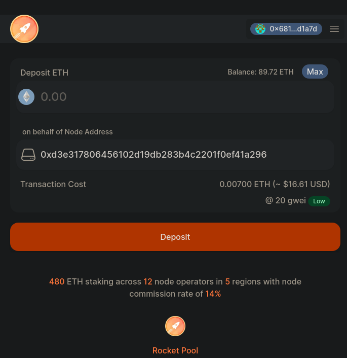

import { Tab, Tabs } from "@rspress/core/theme";
import mmNetwork from "./images/mm_network.png";
import mmNetworkMain from "./images/mm_network_main.png";

# ETH im Namen eines Nodes staken

RPIP-32 ermöglicht es einem Account, [ETH im Namen](https://rpips.rocketpool.net/RPIPs/RPIP-32) eines im Protokoll registrierten Rocket Pool Nodes zu staken. Dies unterstützt verschiedene Situationen, in denen der Node-Betreiber das ETH nicht direkt bereitstellt:

- Verbesserte Sicherheit für Node-Betreiber, da sie direkt von ihrer Hardware-Wallet staken können, ohne vorher Geld an den Node transferieren zu müssen.
- Staking-as-a-Service-Anbieter, bei denen die Verwahrung der Mittel von einem vertrauenswürdigen Verwalter verwaltet wird.
- Protokollintegrationen, bei denen die Verwahrung der Mittel von Smart Contracts verwaltet wird.
- DAOs oder Organisationen, bei denen die Verwahrung der Mittel von einer Schatzkammer verwaltet wird.

Während das Hauptziel dieser Funktion darin besteht, Szenarien mit einem einzelnen Einzahler zu ermöglichen, ist zu beachten, dass auch mehrere unabhängige Einzahler diese Fähigkeit nutzen können, indem sie Smart Contracts darüber erstellen. Rocket Pool hat auch die Möglichkeit eingeführt, [RPL im Namen](../../node-staking/create-validator#whitelisting-an-address-to-stake-on-behalf) eines Nodes zu staken, bereits in unserem vorherigen Atlas-Release.

### Voraussetzung

Stellen Sie sicher, dass Sie die [primäre Withdrawal-Adresse](../../node-staking/prepare-node#setting-your-primary-withdrawal-address) des Nodes, den Sie finanzieren möchten, ordnungsgemäß konfiguriert haben. Folgen Sie dem obigen Link für eine Anleitung, wie Withdrawal-Adressen nach Houston funktionieren.

::: tip HINWEIS
Überspringen Sie diesen Schritt nicht! Alle ETH-Bonds/Belohnungen werden an die primäre Withdrawal-Adresse abgehoben. Mit anderen Worten, die Adresse, die ETH für einen Node bereitstellt, sollte als primäre Withdrawal-Adresse verwendet werden! Stellen Sie bitte sicher, dass die primäre Withdrawal-Adresse des Nodes auf eine Wallet gesetzt ist, über die Sie die Kontrolle haben.
:::

Der Prozess ist für das Hoodi Testnet und Mainnet etwas unterschiedlich. Wählen Sie daher das Netzwerk aus, das Sie interessiert, aus den folgenden Tabs.

<div className="p-3">
  <Tabs>
    <Tab label="Vorbereitung im Hoodi Testnet">

      <p className="rspress-directive danger">
        <p className="rspress-directive-title">WARNUNG</p>
        Wenn Sie das Staking im Testnetzwerk üben, **müssen Sie während dieses Prozesses kein echtes ETH bereitstellen**.
        Stattdessen wird Ihnen **gefälschtes Test-ETH** zur Verfügung gestellt.

        **Versuchen Sie nicht, Ihr echtes ETH vom Mainnet ins Testnet zu verschieben, sonst verlieren Sie es dauerhaft!**
      </p>

      Installieren Sie zunächst [MetaMask](https://metamask.io/), falls Sie dies noch nicht getan haben.
      Folgen Sie den Anweisungen auf ihrer Website, um die Erweiterung zu installieren, ein Konto zu erstellen und sich anzumelden.

      Öffnen Sie als Nächstes das MetaMask-Panel über das Symbol in Ihrer Browser-Symbolleiste.

      Sie müssen das Hoodi Testnet zu MetaMask hinzufügen.

      Klicken Sie auf das Dropdown-Menü oben links und klicken Sie auf die Schaltfläche "Netzwerk hinzufügen".

      Sie sehen eine Liste von Netzwerken. Hoodi ist nicht in dieser Liste, also klicken Sie auf die Schaltfläche "Netzwerk manuell hinzufügen".

      Füllen Sie die folgenden Details aus:

      ```
      Network Name: Hoodi
      New RPC Url: https://rpc.hoodi.ethpandaops.io
      Chain ID: 560048
      Currency Symbol: ETH
      Block Explorer Url: https://hoodi.etherscan.io
      ```

      Klicken Sie dann auf Speichern. Sie sollten jetzt das Hoodi-Netzwerk im Dropdown-Menü oben links sehen.

      Klicken Sie auf das **Netzwerk-Dropdown** oben links in der Metamask-Erweiterung und wählen Sie **Hoodi Test Network**:

      

      Jetzt, da Sie eine Wallet-Adresse in MetaMask haben, müssen Sie sie mit etwas Test-ETH füllen.
      Gehen Sie zur Seite [Üben mit dem Testnetzwerk](../../node-staking/testnet/overview#getting-test-eth-on-hoodi) für eine kurze Anleitung, wie Sie einen Testnet-Faucet verwenden, um etwas Test-ETH auf Hoodi zu erhalten.

      Sobald Sie etwas Hoodi-ETH zum Testen haben, gehen Sie zu [https://testnet.node.rocketpool.net/deposit-eth-on-behalf-of-node](https://testnet.node.rocketpool.net/deposit-eth-on-behalf-of-node).

      Wenn Sie eine Benachrichtigung sehen, dass ein Web3-Browser erforderlich ist oder die aktuelle Netzwerk-ID nicht unterstützt wird, stellen Sie sicher, dass Sie die vorherigen Schritte korrekt abgeschlossen haben, bevor Sie fortfahren.
    </Tab>
    <Tab label="Vorbereitung im Ethereum Mainnet">
      Installieren Sie zunächst [MetaMask](https://metamask.io/), falls Sie dies noch nicht getan haben.

      Folgen Sie den Anweisungen auf ihrer Website, um die Erweiterung zu installieren, ein Konto zu erstellen und sich anzumelden.

      Öffnen Sie als Nächstes das MetaMask-Panel über das Symbol in Ihrer Browser-Symbolleiste.

      Klicken Sie auf das **Netzwerk-Dropdown** in der Symbolleiste oben und stellen Sie sicher, dass **Ethereum Mainnet** ausgewählt ist:

      

      Jetzt, da Sie eine Wallet-Adresse in MetaMask haben, müssen Sie etwas ETH hinein übertragen.

      Sie müssen dies von einer bestehenden Wallet bereitstellen oder ETH an einer Börse kaufen.

      Sobald Sie etwas ETH zum Staken haben, gehen Sie zu [https://node.rocketpool.net/deposit-eth-on-behalf-of-node](https://node.rocketpool.net/deposit-eth-on-behalf-of-node).

      Wenn Sie eine Benachrichtigung sehen, dass ein Web3-Browser erforderlich ist oder die aktuelle Netzwerk-ID nicht unterstützt wird, stellen Sie sicher, dass Sie die vorherigen Schritte korrekt abgeschlossen haben, bevor Sie fortfahren.
    </Tab>

  </Tabs>
</div>

Sobald Sie auf der Website sind, klicken Sie auf die Schaltfläche **Wallet verbinden**. Bitte lesen Sie die Nutzungsbedingungen und Datenschutzrichtlinie durch und akzeptieren Sie sie. Dies ermöglicht verschiedene Verbindungsmöglichkeiten. Klicken Sie dann auf **MetaMask verbinden**.

MetaMask fordert Sie auf, ein Konto auszuwählen, das mit der Website verbunden werden soll.
Wählen Sie eines aus und bestätigen Sie einige Berechtigungen. Sie sehen eine Übersicht Ihrer Guthaben, indem Sie auf das Wallet-Symbol oben rechts im Fenster klicken.

Von hier aus möchten Sie die Adresse des Nodes eingeben, für den Sie ETH einzahlen möchten. Die Seite sollte so aussehen:


Fügen Sie Ihre gewünschte Adresse in dieses Feld ein und klicken Sie auf Suchen. In diesem Beispiel verwenden wir `0xd3e317806456102d19db283b4c2201f0ef41a296`



Im ersten Feld geben Sie die Menge an ETH ein, die Sie im Namen des Nodes einzahlen möchten. Das zweite Feld zeigt an, für welche Adresse Sie ETH einzahlen. Bitte stellen Sie sicher, dass Sie die richtige Adresse und Einzahlung eingegeben haben. Wenn Sie zufrieden sind, klicken Sie auf Einzahlen und MetaMask öffnet ein Fenster, in dem Sie aufgefordert werden, Ihre Transaktion zu bestätigen.

Sobald Sie sie bestätigen, beginnt die Transaktion.
Wenn sie in einem Block enthalten und zur Chain hinzugefügt wurde, kann Ihr Delegierter den Befehl `rocketpool node status` in der Smartnode verwenden, um das neue Guthaben zu sehen. Dieses Guthaben kann auch über die Rocket Pool Staking-Website eingesehen werden.

```
The node has 0.000000 ETH in its credit balance and 8.000000 ETH staked on its behalf. 8.000000 can be used to make new minipools.
```

::: warning HINWEIS
Wenn ein Node-Betreiber Ihr ETH in einen Minipool einzahlt, können Sie seinen Minipool nicht ohne Zugriff auf seine Withdrawal-Anmeldedaten beenden, also beachten Sie dies! Sie können die Rocket Pool Staking-Website verwenden, um ETH, das im Namen eines Nodes gestakt wurde, abzuheben, wenn es nicht in einem Minipool verwendet wird.
:::

Das war's!
Sie staken jetzt mit Rocket Pool.

# ETH im Namen eines Nodes unstaken

<div className="p-3">
  <Tabs>
    <Tab label="Vorbereitung im Hoodi Testnet">
      Wenn Sie bereit sind, ETH abzuheben, das Sie im Namen eines Nodes gestakt haben, gehen Sie zu
      [https://testnet.node.rocketpool.net/withdraw-eth](https://testnet.node.rocketpool.net/withdraw-eth). Nach der Anmeldung als [primäre
      Withdrawal-Adresse](../../node-staking/prepare-node#setting-your-primary-withdrawal-address) des Nodes sollten Sie mit einem vertrauten Menü begrüßt werden. Sie werden aufgefordert, die
      Node-Adresse einzugeben, von der Sie abheben möchten:
    </Tab>
    <Tab label="Vorbereitung im Ethereum Mainnet">
      Wenn Sie bereit sind, ETH abzuheben, das Sie im Namen eines Nodes gestakt haben, gehen Sie zu [https://node.rocketpool.net/withdraw-eth](https://node.rocketpool.net/withdraw-eth). Nach der
      Anmeldung als [primäre Withdrawal-Adresse](../../node-staking/prepare-node#setting-your-primary-withdrawal-address) des Nodes sollten Sie mit einem vertrauten Menü begrüßt werden. Sie werden
      aufgefordert, die Node-Adresse einzugeben, von der Sie abheben möchten:
    </Tab>
  </Tabs>
</div>


Nach Eingabe einer Adresse und Klicken auf "Suchen" gelangen Sie zum nächsten Menü, wo Sie ETH abheben können, das Sie im Namen dieses Nodes gestakt haben.


Sie können oben rechts sehen, wie viel ETH zum Abheben verfügbar ist. Nachdem Sie Ihre gewünschte Menge eingegeben und die Node-Adresse bestätigt haben, klicken Sie auf die orangefarbene Schaltfläche **ETH abheben**, um die Transaktion an das Netzwerk zu senden.

Sobald die Transaktion bestätigt ist, sehen Sie die richtigen Guthaben in Ihrem Konto!

Das ist alles zum Staken von ETH im Namen eines Nodes! Wir hoffen, dass Sie den Prozess schnell und einfach fanden.

Schauen Sie gerne auf [unserem Discord-Server](https://discord.gg/G46XgK264a) vorbei, um uns mitzuteilen, was Sie davon halten, und bleiben Sie auf dem Laufenden über das Projekt, während es sich weiterentwickelt.
