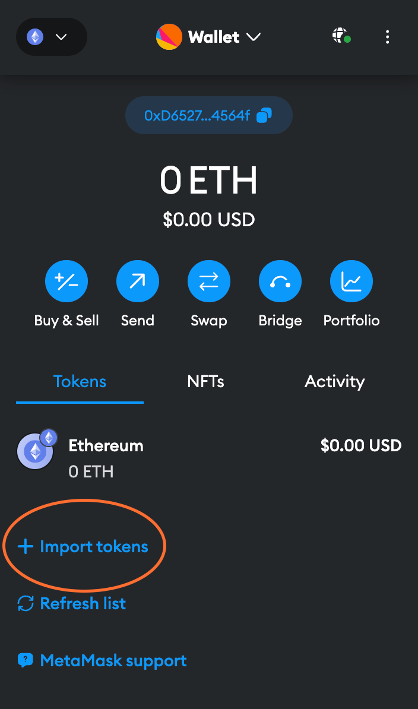

# Staking über eine dezentrale Börse im Ethereum-Netzwerk (Layer 1)

Zur Erinnerung: Sie müssen ETH nicht direkt über Rocket Pool gegen rETH tauschen, um die Vorteile des dezentralen Stakings zu genießen.
Alles, was Sie tun müssen, ist rETH zu halten, da es inhärent an Wert gewinnt - wie Sie es erhalten, spielt keine Rolle!

rETH ist auf mehreren dezentralen Börsen handelbar, wie [Balancer](https://docs.balancer.fi/) und [Uniswap](https://docs.uniswap.org/protocol/introduction).

Der **Balancer**-Pool ist eine spezielle Art von Pool, bekannt als [Metastable Pool](https://docs.balancer.fi/concepts/pools/composable-stable.html).
Metastable Pools sind ideal für Token wie rETH, weil **sie den vom Oracle DAO gemeldeten echten Wechselkurs berücksichtigen**.

Das bedeutet, dass der Austausch mit diesem Pool **viel geringeren Slippage** und **niedrigere Gebühren** hat als eine konventionelle dezentrale Börse, sodass Sie ein viel besseres Angebot beim Kauf oder Verkauf von rETH erhalten.
Andere dezentrale Börsen haben diese Eigenschaft nicht, sodass Sie feststellen können, dass ihr Wechselkurs etwas niedriger ist.

Unabhängig davon, welchen Pool Sie verwenden, haben sie alle die Tendenz, **niedrigere Gas-Gebühren** zu haben als das Staking über die offizielle Rocket Pool Website.
Das macht sie zu einer großartigen Wahl für Benutzer, die eine kleine Menge ETH staken möchten, obwohl es immer eine gute Idee ist, den Kurs, den Sie an einer Börse erhalten würden, mit dem Wechselkurs laut Rocket Pool zu vergleichen.

In den folgenden Beispielen zeigen wir, wie man ETH gegen rETH mit sowohl Balancer als auch Uniswap tauscht.

::: warning HINWEIS
Derzeit ist diese Methode nur auf dem Mainnet verfügbar.
Wenn Sie im Hoodi Testnet üben möchten, müssen Sie [direkt mit Rocket Pool tauschen](./via-rp).

**Der Rest dieses Leitfadens geht davon aus, dass Sie sich auf dem Mainnet befinden.**
:::

Dieser Prozess kann mit jeder web3-kompatiblen Wallet abgeschlossen werden.
Zu Demonstrationszwecken werden wir [MetaMask](https://metamask.io/) verwenden, da es eine der beliebtesten Wallet-Optionen ist.

**Sie sollten in der Lage sein, mit ähnlichen Schritten mit einer anderen Wallet zu folgen, wenn Sie dies wählen - finden Sie einfach die vergleichbare Funktion in Ihrer Wallet für jeden Schritt.**

## MetaMask einrichten

Beginnen Sie damit, [MetaMask](https://metamask.io/) zu installieren, falls Sie dies noch nicht getan haben.
Folgen Sie den Anweisungen auf ihrer Website, um die Erweiterung zu installieren, ein Konto zu erstellen und sich anzumelden.

Öffnen Sie als Nächstes das MetaMask-Panel über sein Symbol in Ihrer Browser-Symbolleiste.
Klicken Sie auf das **Netzwerk-Dropdown** in der Symbolleiste oben und stellen Sie sicher, dass **Ethereum Mainnet** ausgewählt ist:


Fügen Sie schließlich den rETH-Token zu MetaMask hinzu, damit Sie Ihr Guthaben sehen und für den Handel darauf zugreifen können.
Klicken Sie auf die Registerkarte **Assets** und dann auf **Add Token**:



Stellen Sie sicher, dass **Custom Token** in diesem Dialog ausgewählt ist.
Geben Sie in das Feld **Token Contract Address** den folgenden Wert ein:

```
0xae78736Cd615f374D3085123A210448E74Fc6393
```

Das **Token Symbol** sollte automatisch mit `rETH` ausgefüllt werden, und die **Decimals of Precision** sollten automatisch mit `18` ausgefüllt werden.

Akzeptieren Sie den Rest der Eingabeaufforderungen, und dann wird der rETH-Token in Ihrer Liste angezeigt.

Jetzt, da Sie eine Wallet-Adresse in MetaMask haben, müssen Sie etwas ETH darauf übertragen.
**Sie müssen dies von einer vorhandenen Wallet bereitstellen oder ETH an einer Börse kaufen.**

## Tausch gegen rETH über Balancer

Nachdem Ihre Wallet eingerichtet und finanziert ist, gehen Sie zu dieser URL, die Balancer öffnet und automatisch den Tausch von ETH gegen rETH anzeigt:

[https://app.balancer.fi/#/trade/ether/0xae78736Cd615f374D3085123A210448E74Fc6393](https://app.balancer.fi/#/trade/ether/0xae78736Cd615f374D3085123A210448E74Fc6393)

Die Seite wird zunächst so aussehen:


Klicken Sie auf die Schaltfläche `Connect wallet` in der oberen rechten Ecke.
Sie werden mit einem Bildschirm aufgefordert, der Sie fragt, welchen Wallet-Anbieter Sie verwenden möchten.
Wählen Sie für dieses Beispiel **MetaMask**.

::: tip HINWEIS
Wenn Sie MetaMask nicht verwenden, ist wahrscheinlich einer der anderen Anbieter wie WalletConnect mit Ihrer Wallet kompatibel.
:::

Beim Klicken auf diese Schaltfläche öffnet sich MetaMask mit einer Eingabeaufforderung, in der Sie aufgefordert werden, auszuwählen, welche Konten Sie verwenden möchten.
Wenn Sie nur eines haben, sollte Ihr Konto bereits ausgewählt sein.
Klicken Sie auf **Next**.

Es wird dann gefragt, ob Sie Balancer Zugriff auf die Adressen Ihrer Konten gewähren möchten:


Klicken Sie auf **Connect**, und nach einer kurzen Pause wird Ihre Wallet mit Balancer verbunden.
Sie sollten jetzt das ETH-Guthaben in der oberen linken Ecke des Bildschirms sehen.

Geben Sie nun die Menge ETH ein, die Sie tauschen möchten, und die Balancer-Benutzeroberfläche zeigt Ihnen die Menge rETH, die Sie als Gegenwert erhalten:


::: warning HINWEIS
Beachten Sie, dass die Menge rETH, die Sie erhalten, **geringer sein wird** als die Menge ETH, die Sie einsetzen.
Dies ist normal, weil **rETH mehr wert ist als ETH** und im Laufe der Zeit kontinuierlich an Wert gewinnt.
Sie können dies im Wechselkurs sehen, der rechts im Screenshot hervorgehoben ist.
:::

Klicken Sie auf **Preview**, um die Details des Handels anzuzeigen, einschließlich des Mindestbetrags, den Sie aufgrund von Slippage erhalten könnten.
Wenn Sie zufrieden sind, klicken Sie auf **Confirm trade**.
Dies sendet die Anfrage an MetaMask, wo Sie die gesamten Transaktionskosten überprüfen können, bevor Sie sie bestätigen:


::: warning HINWEIS
Achten Sie **genau** auf die geschätzte Gas-Gebühr hier, die rot hervorgehoben ist.
Wenn es ein erheblicher Betrag Ihrer Gesamttransaktion ist (hier sind es über 17%), dann wird es **sehr lange** dauern, bis Sie bei Staking-Belohnungen die Gewinnschwelle erreichen.

Wenn dies der Fall ist, sollten Sie entweder warten, bis der durchschnittliche Gas-Preis des Netzwerks sinkt, oder [erwägen Sie stattdessen eine Layer-2-Lösung zu verwenden](./via-l2).
:::

Wenn Sie mit den Gas-Gebühren im Verhältnis zur Gesamtmenge an rETH, die Sie erhalten werden, zufrieden sind, klicken Sie auf **Confirm**, um die Transaktion zu übermitteln.
Nach kurzer Zeit sollten Sie eine Benachrichtigung von MetaMask sehen, dass sie erfolgreich abgeschlossen wurde, und Sie werden nun den rETH-Token in Ihrer Wallet sehen.

Das war's! Sie staken jetzt mit Rocket Pool. Alles, was Sie tun müssen, ist Ihr rETH zu behalten, und Sie erhalten automatisch Ihre Staking-Belohnungen, wenn der Wert des rETH-Tokens steigt.

## Tausch gegen rETH über Uniswap

Obwohl wir empfehlen, über Balancer zu staken, weil es niedrigere Gebühren und einen genaueren ETH-rETH-Kurs hat, können Sie rETH auch über Uniswap tauschen, wenn die Notwendigkeit besteht.
Gehen Sie zu dieser URL, die Uniswap öffnet und automatisch den Tausch von ETH gegen rETH anzeigt:

[https://app.uniswap.org/#/swap?inputCurrency=eth&outputCurrency=0xae78736cd615f374d3085123a210448e74fc6393](https://app.uniswap.org/#/swap?inputCurrency=eth&outputCurrency=0xae78736cd615f374d3085123a210448e74fc6393)

::: warning HINWEIS
Sie werden möglicherweise zunächst mit einer Warnung aufgefordert, die so aussieht:


Dies ist nur eine vorübergehende Warnung, bis Uniswap rETH zu seiner kanonischen Token-Liste hinzufügt.
Solange die Token-Adresse `0xae78736cd615f374d3085123a210448e74fc6393` ist, können Sie sie sicher hinzufügen.
:::

Die Seite wird zunächst so aussehen:


Klicken Sie auf eine der `Connect Wallet`-Schaltflächen wie die hervorgehobene in der oberen rechten Ecke.
Sie werden mit einem Bildschirm aufgefordert, der Sie fragt, welchen Wallet-Anbieter Sie verwenden möchten.
Wählen Sie für dieses Beispiel **MetaMask**.

::: tip HINWEIS
Wenn Sie MetaMask nicht verwenden, ist wahrscheinlich einer der anderen Anbieter wie WalletConnect mit Ihrer Wallet kompatibel.
:::

Beim Klicken auf diese Schaltfläche öffnet sich MetaMask mit einer Eingabeaufforderung, in der Sie aufgefordert werden, auszuwählen, welche Konten Sie verwenden möchten.
Wenn Sie nur eines haben, sollte Ihr Konto bereits ausgewählt sein.
Klicken Sie auf **Next**.

Es wird dann gefragt, ob Sie Uniswap Zugriff auf die Adressen Ihrer Konten gewähren möchten:


Klicken Sie auf **Connect**, und nach einer kurzen Pause wird Ihre Wallet mit Uniswap verbunden.
Sie sollten jetzt das ETH-Guthaben in der oberen rechten Ecke des Bildschirms sehen.

Geben Sie nun die Menge ETH ein, die Sie tauschen möchten, und die Uniswap-Benutzeroberfläche zeigt Ihnen die Menge rETH, die Sie als Gegenwert erhalten:


::: warning HINWEIS
Beachten Sie, dass die Menge rETH, die Sie erhalten, **geringer sein wird** als die Menge ETH, die Sie einsetzen.
Dies ist normal, weil **rETH mehr wert ist als ETH** und im Laufe der Zeit kontinuierlich an Wert gewinnt.
Sie können dies im Wechselkurs sehen, der unten im Screenshot hervorgehoben ist.
:::

Klicken Sie auf **Swap**, um die Details des Handels anzuzeigen, einschließlich des Mindestbetrags, den Sie aufgrund von Slippage erhalten könnten.
Wenn Sie zufrieden sind, klicken Sie auf **Confirm Swap**.
Dies sendet die Anfrage an MetaMask, wo Sie die gesamten Transaktionskosten überprüfen können, bevor Sie sie bestätigen:


::: warning HINWEIS
Achten Sie **genau** auf die geschätzte Gas-Gebühr hier, die rot hervorgehoben ist.
Wenn es ein erheblicher Betrag Ihrer Gesamttransaktion ist (hier sind es über 17%), dann wird es **sehr lange** dauern, bis Sie bei Staking-Belohnungen die Gewinnschwelle erreichen.

Wenn dies der Fall ist, sollten Sie entweder warten, bis der durchschnittliche Gas-Preis des Netzwerks sinkt, oder [erwägen Sie stattdessen eine Layer-2-Lösung zu verwenden](./via-l2).
:::

Wenn Sie mit den Gas-Gebühren im Verhältnis zur Gesamtmenge an rETH, die Sie erhalten werden, zufrieden sind, klicken Sie auf **Confirm**, um die Transaktion zu übermitteln.
Nach kurzer Zeit sollten Sie eine Benachrichtigung von MetaMask sehen, dass sie erfolgreich abgeschlossen wurde, und Sie werden nun den rETH-Token in Ihrer Wallet sehen.

Das war's! Sie staken jetzt mit Rocket Pool. Alles, was Sie tun müssen, ist Ihr rETH zu behalten, und Sie erhalten automatisch Ihre Staking-Belohnungen, wenn der Wert des rETH-Tokens steigt.
