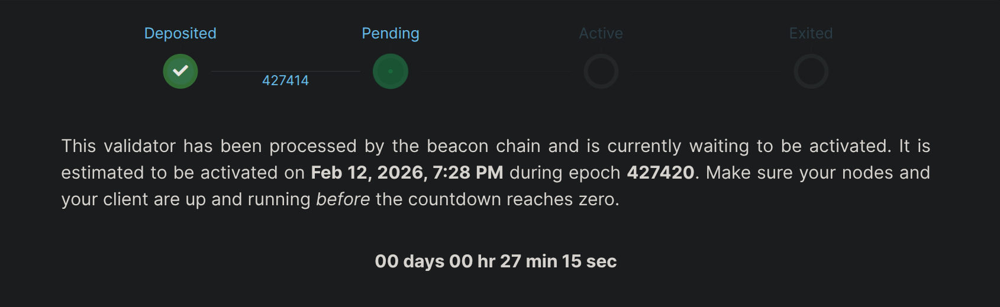

# Einen Megapool (Validator) erstellen

Willkommen bei Saturn 1! Ein Rocket Pool Megapool ist eine Smart-Contract-Instanz auf der Execution Layer.
Dein Node verwaltet einen Megapool, der als Ethereum-Withdrawal-Adresse für einen oder mehrere Validatoren dient.
Jeder Validator besteht aus einem Teil deines ETH, dem sogenannten Bond-Betrag, und einem Teil ETH aus dem rETH-Staking-Pool,
dem sogenannten geliehenen Betrag. Dein Megapool ist dafür verantwortlich, den Bond-Betrag und den geliehenen ETH-Betrag zu einem Gesamtbetrag von 32 ETH zusammenzuführen, der
dann an den Beacon Chain Deposit-Vertrag gesendet wird, um einen neuen Validator zu erstellen.

Dein Megapool wird automatisch beim ersten Validator-Deposit bereitgestellt. Danach kannst du denselben Megapool verwenden, um beliebig viele Validatoren zu verwalten! Du musst
nicht jedes Mal einen neuen Megapool bereitstellen, wenn du einen neuen Validator erstellst.

::: warning WARNUNG
Megapool-Validatoren müssen die Beacon Chain Queue zweimal durchlaufen.
1. Prestake (1 ETH). Wenn ETH aus dem Deposit Pool deinem Megapool-Validator zugewiesen wird, wird nur 1 ETH an die Beacon Chain gesendet. Zu diesem Zeitpunkt tritt dein Validator in die Beacon Chain Queue ein.
2. Stake (31 ETH). Nachdem der Validator von der Beacon Chain verarbeitet wurde, überprüft das Rocket Pool Protokoll die Withdrawal-Credentials des Validators und stakt die verbleibenden 31 ETH auf der Beacon Chain. Zu diesem Zeitpunkt tritt der Validator ein zweites und letztes Mal in die Beacon Chain Queue ein.

Bisher war bei Minipools das [Oracle DAO (oDAO)](/de/odao/overview#the-rocket-pool-oracle-dao) für die Überprüfung der Withdrawal-Credentials jedes Minipool-Validators zuständig. Dieses neue System verlängert die Queue-Zeit, entfernt jedoch eine durch das oDAO durchgesetzte Vertrauensanforderung.

[validatorqueue.com](https://www.validatorqueue.com/) ist ein hilfreiches Tool zur Überwachung der Länge der Beacon Chain Queue. Bitte berücksichtige diesen Faktor bei der Migration deines Minipool-Stakes zu einem Megapool.

:::


::: tip HINWEIS

Die Validator-Erstellung wird durch zwei Queues gesteuert.

1. Die erste ist die Rocket Pool Deposit Queue. Wir gehen in einem anderen Abschnitt näher darauf ein, aber im Wesentlichen wird diese Queue vom Rocket Pool Protokoll verwaltet und bestimmt, wann dein Validator sein geliehenes ETH erhält.
   Es muss ETH im Deposit Pool verfügbar sein, um deine 4 ETH mit 28 ETH aus dem Deposit Pool abzugleichen und den Validator zu erstellen.

2. Die zweite ist die Beacon Chain Queue, die von der Ethereum Beacon Chain verwaltet wird und bestimmt, wann dein Validator aktiv wird.
   Bitte beachte, dass die Zeit, die dein Validator benötigt, um aktiv zu werden, je nach deiner Position in jeder Queue und dem aktuellen Zustand des Netzwerks stark variieren kann.

Die Rocket Pool Deposit Queue verfügt über ein Express-Queue-System, um bestehenden Node-Operatoren bei der Migration ihres Minipool-Validator-ETH zu Megapool-Validator-ETH zu helfen.

:::

::: tip Nützliche Links
[saturn-1.net/queue](https://saturn-1.net/queue) ist ein von der Community unterstütztes Dashboard, erstellt von Steely! Diese Seite gibt dir eine Vorstellung davon, wie lang die Rocket Pool Deposit Queue ist.

[validatorqueue.com](https://www.validatorqueue.com/) ist eine hilfreiche Seite zur Überprüfung der Länge der Beacon Chain Queue. Diese Queue hängt von der Menge an ETH ab, die in die Beacon Chain ein- und austritt. Sie wird mit einer Rate von `256 ETH pro Epoche` abgearbeitet.

[rocketpool.net/node-staking/rpl-fee-switch](https://rocketpool.net/node-staking/rpl-fee-switch) modelliert die Auswirkungen des Fee-Switch von Saturn 1 auf deine Staking-Belohnungen.

:::

## Rocket Pool Deposit Queue und Express Queue

Innerhalb der Rocket Pool Deposit Queue gibt es zwei Arten von Queues: die Express Queue und die Standard Queue.

Die Deposit Queue verfügt über ein Express-Queue-System, um bestehenden Node-Operatoren bei der Migration ihres Minipool-Validator-ETH zu Megapool-Validator-ETH zu helfen. Es schafft auch vorhersehbarere Deposit-Zeiträume für Deposits über die Express Queue.

Die Express Queue wird in einem Verhältnis von 4:1 abgearbeitet, was bedeutet, dass 4 Validatoren aus der Express Queue für jeden 1 Validator aus der Standard Queue abgeglichen werden. Anders ausgedrückt: 4 Validatoren aus der Express Queue werden abgeglichen, dann 1 aus der Standard Queue, dann wieder 4 aus der Express Queue und so weiter.

Bestehende Node-Operatoren erhalten Express-Queue-Tickets basierend auf ihrem gebondeten ETH in Legacy-Minipools: ein Ticket pro 4 ETH gebondet.
Zum Beispiel erhält ein Node-Operator mit einem 8-ETH-Legacy-Minipool 2 Express-Queue-Tickets. Das reicht aus, um vollständig zu zwei 4-ETH-Megapool-Validatoren über die Express Queue zu migrieren.
[RPIP-59: Deposit Mechanics](https://rpips.rocketpool.net/RPIPs/RPIP-59#deposit-queue) geht auf die Details der Deposit-Abwicklung ein.

Dein Node erhält ein Express-Queue-Ticket zurückerstattet, wenn du dich entscheidest, [deinen Validator aus der Express Queue zu entfernen](./create-megapool-validator#exit-a-validator-from-the-rocket-pool-deposit-queue).

## ETH einzahlen und einen Validator erstellen

Wenn dies der erste Megapool-Validator deines Nodes ist, wird der Megapool deines Nodes gleichzeitig automatisch bereitgestellt. Bitte denke daran, dass der Megapool deines Nodes einen oder mehrere Validatoren verwalten kann, daher erfolgt die Megapool-Bereitstellung nur einmal pro Node!

Sobald du bereit bist, dein ETH in einen Megapool einzuzahlen und einen Beacon Chain Validator zu erstellen, kannst du dies mit folgendem Befehl tun:

```
rocketpool megapool deposit
```

::: danger WARNUNG

Obwohl die CLI viele der nächsten Schritte für dich automatisiert, empfehlen wir <strong>dringend</strong>, deinen Node und die Transaktionen zu überwachen, um einen erfolgreichen Übergang von `prelaunch` zu `staking` sicherzustellen.

Fehlgeschlagene Transaktionen (aufgrund angepasster Gas-Einstellungen, unzureichendem ETH für Gas oder einem Node, der 28 Tage nach dem ersten Deposit offline ist) könnten deinen Megapool-Validator in den `dissolved`-Zustand versetzen, was du vermeiden möchtest.

Wenn ein Prelaunch-Validator innerhalb von 365 Tagen nicht stakt, wird der Validator aufgelöst. Die 1 ETH (von einem 4-ETH-Bond), die während des Prelaunch-Prozesses an die Beacon Chain gesendet wurde, ist **nicht erstattungsfähig**.
Der Node-Operator erhält die verbleibenden 3 ETH aus seinem Bond (abzüglich einer 0,05-ETH-Auflösungsstrafe als Schulden) als Erstattung in seinem Megapool, für eine Nettoerstattung von 2,95 ETH.
Dies kann mit `rocketpool megapool claim` oder `rocketpool claims claim-all` beansprucht werden.

[Erfahre mehr darüber, wie du einen erfolgreichen Stake bestätigst](./create-megapool-validator#confirming-a-successful-stake)

:::

Die erste Eingabeaufforderung fragt, wie viele Validatoren du erstellen möchtest. Du kannst bis zu 35 in derselben Einzahlung erstellen, aber wir gehen für den Rest unserer Demonstration von 1 Validator aus. Tippe `1` und drücke `Enter`, um 1 Validator zu erstellen.

```
Your eth2 client is on the correct network.

How many validators would you like to create? (max: 35)
1
```

Die zweite Eingabeaufforderung zeigt einige Informationen darüber an, wie viel ETH dein Node derzeit gebondet hat, sowie den gesamten Bond-Bedarf für die Anzahl der von dir ausgewählten Validatoren. Der Node in unserer Demonstration hat keine Megapool-Validatoren, daher `0.00 ETH bonded`. Der aktuelle Bond-Bedarf beträgt `4 ETH`.
Nachdem du die angezeigten Informationen gelesen und verstanden hast, tippe `y` und drücke `Enter`, um zur nächsten Eingabeaufforderung zu gelangen.

```
The node is currently bonded with 0.00 ETH.
The total bond requirement is 4.00 ETH.

NOTE: You are about to create 1 new megapool validator(s), requiring a total of: 4.00 ETH.
Would you like to continue? [y/n]
y
```

Die nächste Eingabeaufforderung zeigt den Status der [Rocket Pool Deposit Queue](/de/node-staking/megapools/create-megapool-validator#rocket-pool-deposit-queue-and-express-queue) an.
Dies zeigt, wie viele Validatoren vor dir warten, um mit ETH abgeglichen zu werden. Die Express Queue ist hauptsächlich für bereits bestehende Node-Operatoren gedacht, da neue Nodes keine Express-Queue-Tickets haben. `The express queue rate is 4` bedeutet, dass 4 Validatoren aus der Express Queue für jeden 1 Validator in der Standard Queue abgeglichen werden.

```
There are 1 validator(s) on the express queue.
There are 12 validator(s) on the standard queue.
The express queue rate is 4 (4 express validators assigned per 1 standard).
A new express validator would be at queue position 3.
A new standard validator would be at queue position 14.
```

::: tip HINWEIS
Wenn du ein zurückkehrender Node-Operator bist und Express-Queue-Tickets für diese Einzahlung verfügbar hast, wirst du an dieser Stelle aufgefordert, diese zu verwenden.
Gib `1` ein und drücke `Enter`, um mit der Verwendung eines Express-Queue-Tickets für diese einzelne Megapool-Validator-Einzahlung fortzufahren.

```
How many express tickets would you like to use? (max: 7)
1
```

Wenn du dein Express-Queue-Ticket(s) aufsparen und in der Standard Queue fortfahren möchtest, tippe einfach `0` und drücke `Enter`, um zur nächsten Eingabeaufforderung zu wechseln.
:::

Wenn du [Deposit-Guthaben](/de/node-staking/megapools/credit) für einen Validator einlösen möchtest, wirst du hier dazu aufgefordert. Andernfalls wird dich dieser Schritt mit den aktuellen Gas-Preisvorschlägen des Netzwerks auffordern.

```
Your credit balance is 0.00 ETH. (Credit in addition to ETH staked on your behalf).
Your consensus client is synced, you may safely create a megapool validator.
+================ Suggested Gas Prices ================+
| Avg Wait Time |   Max Fee    |     Total Gas Cost     |
| 15 Seconds    | 2.13120 gwei | 0.00160 to 0.00240 ETH |
| 1 Minute      | 1.96787 gwei | 0.00148 to 0.00222 ETH |
| 3 Minutes     | 1.00871 gwei | 0.00075 to 0.00113 ETH |
| >10 Minutes   | 1.00871 gwei | 0.00075 to 0.00113 ETH |
+======================================================+

These prices include a maximum priority fee of 0.010 gwei.
Please enter your max fee (including the priority fee) or leave blank for the default of 1.96787 gwei:

```

Nach Bestätigung deines Gas-Preises wird eine letzte abschließende Bestätigung zur Erstellung eines Megapool-Validators angezeigt.

```
Using a max fee of 1.968 gwei and a priority fee of 0.010 gwei.
You are about to deposit 4.000000 ETH to create 1 new megapool validator(s).
ARE YOU SURE YOU WANT TO DO THIS?
 [y/n]
y

Creating 1 megapool validator(s) ...
Transaction has been submitted with hash <tx-hash>.
You may follow its progress by visiting:
https://hoodi.etherscan.io/tx/<tx-hash>

Waiting for the transaction to be included in a block... you may wait here for it, or press CTRL+C to exit and return to the terminal.

The node deposit of 4.000000 ETH total was made successfully!
Validator pubkeys:
  1. <beacon-pubkey>

The 1 new megapool validators have been created.
Once your validators progress through the queue, ETH will be assigned and a 1 ETH prestake submitted for each.
After the prestake, your node will automatically perform a stake transaction for each validator, to complete the progress.
To check the status of your validators use `rocketpool megapool validators`
To monitor the stake transactions use `rocketpool service logs node`

```

Sobald die Transaktion abgeschlossen ist, erhältst du eine Bestätigung deiner Einzahlung als Etherscan-Transaktions-Hash sowie den erwarteten Beacon Chain Pubkey, sobald dein Megapool-Validator online geht. Du kannst den Befehl `rocketpool megapool status` verwenden, um den Status deines Megapools zu prüfen, oder `rocketpool megapool validators`, um den Status deines spezifischen Validators zu überprüfen. Dein Validator befindet sich im Zustand `initialized`, während er die Rocket Pool Deposit Queue durchläuft. Bitte beachte, dass der Pubkey deines Megapool-Validators erst dann auf der Beacon Chain registriert wird, wenn er von der Rocket Pool Deposit Queue verarbeitet und ETH zugewiesen wurde.

An diesem Punkt hast du es geschafft! Herzlichen Glückwunsch zu deinem Megapool-Validator. Du solltest unbedingt den Abschnitt [Monitoring und Wartung](/de/node-staking/maintenance/overview) unserer Anleitungen lesen, um zu erfahren, wie du deinen Node in bestem Zustand halten kannst. Lies auch den nächsten Abschnitt zur Bestätigung eines erfolgreichen Stakes, um sicherzustellen, dass dein `initialized`-Validator reibungslos zu `staking` wechselt, ohne Strafen zu erhalten.

## Einen erfolgreichen Stake bestätigen

::: danger WARNUNG

Obwohl die CLI viele der nächsten Schritte für dich automatisiert, empfehlen wir <strong>dringend</strong>, deinen Node und die Transaktionen zu überwachen, um einen erfolgreichen Übergang von `prelaunch` zu `staking` sicherzustellen.

Fehlgeschlagene Transaktionen (aufgrund angepasster Gas-Einstellungen, unzureichendem ETH für Gas oder einem Node, der 28 Tage nach dem ersten Deposit offline ist) könnten deinen Megapool-Validator in den `dissolved`-Zustand versetzen, was du vermeiden möchtest.

Wenn ein Prelaunch-Validator innerhalb von 365 Tagen nicht stakt, wird der Validator aufgelöst. Die 1 ETH (von einem 4-ETH-Bond), die während des Prelaunch-Prozesses an die Beacon Chain gesendet wurde, ist **nicht erstattungsfähig**.
Der Node-Operator erhält die verbleibenden 3 ETH aus seinem Bond (abzüglich einer 0,05-ETH-Auflösungsstrafe als Schulden) als Erstattung in seinem Megapool, für eine Nettoerstattung von 2,95 ETH.
Dies kann mit `rocketpool megapool claim` oder `rocketpool claims claim-all` beansprucht werden.

:::

Stelle sicher, dass dein Node während des gesamten Prozesses online bleibt! Er wird eine Reihe von vollautomatischen Schritten ausführen, um sicherzustellen, dass dein Validator reibungslos durch die unten erklärten Phasen fortschreitet:

Dein neuer Megapool-Validator befindet sich im Zustand `initialized`. Er verbleibt in diesem Zustand, bis er die Rocket Pool Deposit Queue durchläuft und 28 ETH aus dem Deposit Pool zugewiesen bekommt. Verwende den Befehl `rocketpool megapool validators`, um den Status deines Validators zu überprüfen. Es sollte ungefähr so aussehen:

```
1 Initialized validator(s):

--------------------

Megapool Validator ID:        7
Expected pubkey:              <expected-pubkey>
Validator active:             no
Validator Queue Position:     14
Express Ticket Used:          no
```

Sobald deinem Validator ETH aus der [Rocket Pool Deposit Queue](/de/node-staking/megapools/create-megapool-validator#rocket-pool-deposit-queue-and-express-queue) zugewiesen wurde, wird er in den Zustand `Prelaunch` versetzt. Zu diesem Zeitpunkt wird 1 ETH aus deinem Megapool-Guthaben auf der Beacon Chain hinterlegt. Der Pubkey deines Validators wird ebenfalls auf der Beacon Chain registriert, was bedeutet, dass du den Status deines `Prelaunch`-Validators auf einem Explorer wie https://beaconcha.in/ (oder https://hoodi.beaconcha.in/ wenn du das Testnet verwendest) einsehen kannst.
Du kannst deinen Validator beobachten, indem du den Pubkey auf https://beaconcha.in/ suchst oder diesen Link im Format besuchst: `https://beaconcha.in/validator/<dein-validator-pubkey>`

```
1 Prelaunch validator(s):

--------------------

Megapool Validator ID:        7
Validator pubkey:             <pubkey>
Validator active:             no
Express Ticket Used:          no

```


Nachdem dein `Prelaunch`-Validator von der Beacon Chain verarbeitet und die anfängliche 1-ETH-Einzahlung gutgeschrieben wurde, führt dein Node automatisch eine `stake`-Transaktion durch, um die vollständige 32-ETH-Beacon-Chain-Einzahlung abzuschließen. Die `stake`-Transaktion versetzt deinen `Prelaunch`-Validator in einen `Staking`-Validator. Zu diesem Zeitpunkt hat dein `Staking`-Validator: – 32 ETH auf der Beacon Chain hinterlegt – eine Validator-Indexnummer erhalten – steht auf der Beacon Chain zur Aktivierung an

```
1 Staking validator(s):

Megapool Validator ID:        1
Validator pubkey:             <pubkey>
Validator active:             no
Validator index:              <index>
Beacon status:                pending_queued
Express Ticket Used:          no

```



Den aktuellen Status der Beacon Chain Validator Queue findest du hier: https://www.validatorqueue.com/. Sobald dein `Staking`-Validator auf der Beacon Chain aktiviert wird, siehst du `Beacon status:                active_ongoing` im Menü `rocketpool megapool validators`, was bestätigt, dass er aktiviert wurde und bereit ist, Attestierungen vorzunehmen.

```
1 Staking validator(s):

--------------------

Megapool Validator ID:        0
Validator pubkey:             <pubkey>
Validator active:             yes
Validator index:              <index>
Beacon status:                active_ongoing
Express Ticket Used:          no
```


Jetzt bist du startklar! Herzlichen Glückwunsch! Du hast offiziell einen Megapool-Validator mit Rocket Pool erstellt! Schau dir die Anleitungen zu [Monitoring und Wartung](/de/node-staking/maintenance/overview) an, um zu erfahren, wie du deinen Node überwachst und in Topform hältst.

## Einen Validator aus der Rocket Pool Deposit Queue entfernen

Wenn ein Validator in der Queue wartet (Express ODER Standard) und du die Queue verlassen möchtest, kannst du dies tun! Deine 4-ETH-Einzahlung wird als Guthaben erstattet, das gegen einen gleichwertigen Betrag in rETH eingelöst werden kann. Die Schritte sind recht einfach:

Überprüfe zunächst `rocketpool megapool validators`, um zu bestimmen, welchen Validator du aus der Queue entfernen möchtest. Du möchtest sicherstellen, dass der Validator, den du aus der Queue entfernst, sich im Zustand `Initialized` befindet. Notiere dir seinen Pubkey. Nachdem deinem Validator ETH zugewiesen wurde, kannst du ihn nicht mehr aus der Queue entfernen.

```
1 Initialized validator(s):

--------------------

Megapool Validator ID:        6
Expected pubkey:              <beacon-pubkey>
Validator active:             no
Validator Queue Position:     14
Express Ticket Used:          no
```

Verwende den folgenden Befehl, um einen Validator aus der Queue zu entfernen, und fahre dann mit der Auswahl fort:

```
staker@node:~$ rocketpool megapool exit-queue

Please select a validator to exit the queue:
1: Pubkey: <beacon-pubkey>
```

Sobald du deine Auswahl getroffen und bestätigt hast, dass dein Validator die Rocket Pool Deposit Queue verlassen hat, kannst du den folgenden Befehl verwenden, um das Guthaben als rETH einzulösen:

```
staker@node:~$ rocketpool node withdraw-credit

You have 4.000000 ETH of credit that you can withdraw, receiving the equivalent amount in rETH. Would you like to withdraw the maximum amount of credit? [y/n]
```

Und das war's! Wenn du einen weiteren Validator einzahlen möchtest, kann dieses Guthaben auch als Validator-Deposit eingelöst werden, zusätzlich zur Einlösung als rETH.
Wenn du ein Express-Queue-Ticket für deinen aus der Queue entfernten Validator verwendet hast, wird dieses Express-Queue-Ticket deinem Node erstattet.

## Mehrere Megapool-Validatoren erstellen

Der Megapool deines Nodes kann beliebig viele Validatoren verwalten. Wenn du einen weiteren Validator erstellen möchtest (oder mehrere Validatoren in derselben Transaktion erstellen möchtest, um Transaktionsgebühren zu sparen), kannst du dies mit dem Befehl `rocketpool megapool deposit` tun. Angesichts des aktuellen Block-Gas-Limits beträgt die maximale Anzahl von Validatoren, die du in einer Transaktion erstellen kannst, 35.

## Nächste Schritte

Jetzt, da du einen Megapool-Validator eingerichtet hast, werden die nächsten Schritte dich durch die Überwachung des Zustands deines Nodes, das Suchen und Anwenden von Updates und die Wartung über die gesamte Laufzeit führen.

Lies bitte als Nächstes den Abschnitt [Monitoring und Wartung](/de/node-staking/maintenance/overview), um mehr über diese Themen zu erfahren.
