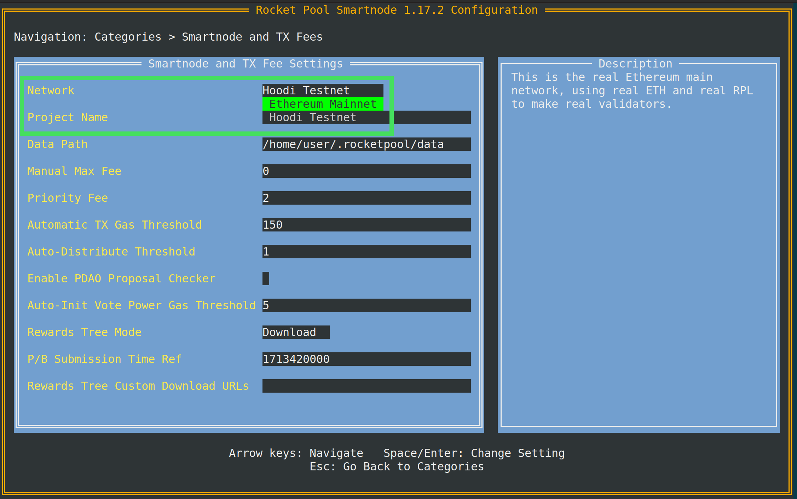

import { Tab, Tabs } from "@rspress/core/theme";

# Migration vom Testnetzwerk zum Mainnet

Wenn Sie Rocket Pool bereits in unserem Hoodi-Testnetzwerk verwendet haben, mit seinen Funktionen vertraut sind und bereit sind, echtes ETH zu staken oder einen Node in der Ethereum-Hauptkette zu betreiben, dann ist diese Anleitung für Sie!
Hier finden Sie Anweisungen, wie Sie einen bestehenden Smartnode-Stack vom Hoodi-Testnetzwerk zu einem mit dem Ethereum-Mainnet verbundenen Stack migrieren können, bereit zum Staken Ihrer eigenen echten ETH und RPL.

## Pool-Staking im Mainnet

Pool-Staking ist im Mainnet weitgehend derselbe Prozess wie im Testnetz.
Die URL ist unterschiedlich und die Adresse des rETH-Tokens kann anders sein, aber es gibt keine wesentlichen Änderungen im Arbeitsablauf.
Folgen Sie der [Staking-Anleitung](../../liquid-staking/overview), die mit Anweisungen für das Mainnet aktualisiert wurde.

### Unterschiede zwischen Testnetz und Mainnet

- Der Testnet-Smartnode verfügt über einen Faucet für Test-ETH. Der Mainnet-Smartnode **hat keinen Faucet**. Sie müssen Ihr eigenes ETH bereitstellen, um zu staken.
- Mainnet unterstützt viele Ethereum-Wallets über WalletConnect, sodass Sie andere Wallets verwenden können, die Sie im Testnetz nicht verwenden konnten. **Sie sind nicht mehr auf die Verwendung von Metamask zum Staken beschränkt**.

## Smartnode-Betrieb im Mainnet

::: danger HINWEIS
**Nichts** aus dem Testnetzwerk kann zum Mainnet migriert werden.
Die Chain-Daten sind sowohl für Execution als auch Consensus unterschiedlich, daher müssen Sie die alten Chain-Daten entfernen und die Mainnet-Chains von Grund auf neu synchronisieren.
Ihre Validatoren im Testnetz werden nicht zum Mainnet übertragen.
Aus Sicherheits-, Kompatibilitäts- und Sicherheitsgründen **müssen Sie außerdem ein neues Wallet im Mainnet erstellen!**
**Verwenden Sie Ihr Testnetz-Node-Wallet nicht im Mainnet!**

**Die folgenden Schritte löschen alle Ihre Testnetz-Daten.**
Wenn Sie Ihr Testnetzwerk-Setup beibehalten möchten, sollten Sie Ihre Festplatte sichern oder auf einen zweiten Rechner verschieben.
:::

### Unterschiede zwischen Testnetz und Mainnet

- Der Testnet-Smartnode verfügt über einen Faucet für ETH und RPL. Der Mainnet-Smartnode **hat keinen Faucet**. Sie müssen Ihr eigenes ETH und Ihr eigenes RPL bereitstellen.
- Wenn Sie Geth verwenden, wird die Arbeitslast Ihres Nodes **erheblich höher** sein. Geth benötigt etwa 40-mal so viel Speicherplatz wie Hoodi und erfordert mehr CPU-Leistung und RAM zur Verarbeitung. Wenn Sie das Rocket Pool Grafana-Dashboard verwenden, seien Sie auf eine viel höhere Auslastung vorbereitet.
  Ein vollständiger Geth-Node verwendet 1,4 TB (Stand 2025-09-19). [Das Ablaufen von Blockdaten vor der Merge](../maintenance/history-expiry) kann die Speichernutzung um etwa 300-500 GB reduzieren.
- Ihre Beacon-Chain-Peers (und damit Ihre Attestation-Effektivität) werden **höher** sein als im Testnetz. Peers im Mainnet sind wesentlich vielfältiger und tendenziell von höherer Qualität als im Testnetz.
- Der RPL-Belohnungs-Checkpoint erfolgt alle **28 Tage** statt alle 2 Tage, um hohe Gaskosten auszugleichen.
- Der vom Rocket Pool-Netzwerk verwendete RPL-Preis (und damit Ihr Collateral-Level) zusammen mit dem gesamten effektiv gestakten RPL im Netzwerk werden **einmal alle 24 Stunden** statt einmal pro Stunde gemeldet.

### Automatische Migration (nur Docker-Modus)

Für Docker-Modus-Benutzer kann der Smartnode die Migration zum Mainnet automatisch durchführen.

**Während Sie noch das Testnetz konfiguriert haben**, beenden Sie Ihre Validatoren auf Hoodi:

```
rocketpool minipool exit
```

Wählen Sie `1: All available minipools` aus der Liste der Optionen und warten Sie, bis der Vorgang abgeschlossen ist.
Dies hilft, das Netzwerk aufzuräumen, indem Sie Ihre Validatoren entfernen, anstatt sie ständig bei Attestations scheitern zu lassen und die Gesundheit von Hoodi zu schwächen (da sie nicht mehr online sind).

Sobald das erledigt ist, öffnen Sie den Settings Manager:

```
rocketpool service config
```

Öffnen Sie als Nächstes die Kategorie **Smartnode and TX Fees** und ändern Sie das **Network**-Dropdown von `Hoodi Testnet` zu `Ethereum Mainnet`:



Wenn Sie speichern und beenden, werden Sie mit einer Benachrichtigung aufgefordert, dass alles gelöscht wird, und einem Bestätigungsdialog:

```
WARNING: You have requested to change networks.

All of your existing chain data, your node wallet, and your validator keys will be removed.

Please confirm you have backed up everything you want to keep, because it will be deleted if you answer `y` to the prompt below.

Would you like the Smartnode to automatically switch networks for you? This will destroy and rebuild your `data` folder and all of Rocket Pool's Docker containers. [y/n]
```

Sichern Sie alles, was Sie behalten möchten (wie Ihren `data`-Ordner, der Ihr Node-Wallet und Validator-Schlüssel enthält), und drücken Sie dann `y` und `Enter`, wenn Sie bereit sind.
Der Smartnode übernimmt die Umstellung automatisch.

Wenn es fertig ist, haben Sie eine frische Installation auf dem Mainnet.
Alle Ihre Einstellungen (wie die Client-Auswahl) werden beibehalten, aber Sie müssen ein neues Wallet erstellen. Außerdem haben Sie wahrscheinlich keine _Checkpoint Sync URL_ im Mainnet und sollten eine einrichten, wie [hier](../config-docker#beacon-chain-checkpoint-syncing) erklärt; andernfalls dauert es lange, die Mainnet-Beacon-Chain zu synchronisieren.

### Manuelle Migration

Wenn Sie aus irgendeinem Grund den automatischen Migrationsprozess des Smartnode nicht nutzen können, können Sie es in wenigen einfachen Schritten manuell durchführen:

<div className="p-3">
  <Tabs>
    <Tab label="Docker">
      1. **Während Sie noch das Testnetz konfiguriert haben**, beenden Sie Ihre Validatoren auf Hoodi:

      ```shell
      rocketpool minipool exit
      ```

      Wählen Sie `1: All available minipools` aus der Liste der Optionen und warten Sie, bis der Vorgang abgeschlossen ist.
      Dies hilft, das Netzwerk aufzuräumen, indem Sie Ihre Validatoren entfernen, anstatt sie ständig bei Attestations scheitern zu lassen und die Gesundheit von Hoodi zu schwächen (da sie nicht mehr online sind).

      2. Fahren Sie das Testnetz herunter:

      ```shell
      rocketpool service stop
      ```

      3. Löschen Sie Ihre Testnetz-Chain-Daten und Docker-Container:

      ```shell
      rocketpool service terminate
      ```

      4. Löschen Sie Ihren Rocket Pool-Konfigurationsordner:

      ```shell
      sudo rm -rf ~/.rocketpool
      ```

      5. (Optional) Löschen Sie Ihr Rocket Pool CLI:

      ```shell
      rm ~/bin/rocketpool
      ```
      Sie werden dies sowieso mit der neuesten Version des CLI überschreiben, aber wenn Sie gründlich sein möchten, können Sie zuerst das alte entfernen.

      An diesem Punkt wurde Ihre Testnetz-Installation bereinigt, und Sie können sicher zu einer neuen Mainnet-Installation migrieren.
      Folgen Sie sorgfältig der Anleitung [Node mit Docker erstellen](../docker), um es einzurichten.
    </Tab>
    <Tab label="Native Mode">
      1. **Während Sie noch das Testnetz konfiguriert haben**, beenden Sie Ihre Validatoren auf Hoodi:

      ```shell
      rocketpool minipool exit
      ```

      Wählen Sie `1: All available minipools` aus der Liste der Optionen und warten Sie, bis der Vorgang abgeschlossen ist.
      Dies hilft, das Netzwerk aufzuräumen, indem Sie Ihre Validatoren entfernen, anstatt sie ständig bei Attestations scheitern zu lassen und die Gesundheit von Hoodi zu schwächen (da sie nicht mehr online sind).

      2. Stoppen Sie alle Rocket Pool- und Ethereum-Dienste (z. B. mit `geth` und `lighthouse`; ersetzen Sie sie durch die Dienste, die Sie während der Installation erstellt haben):

      ```shell
      sudo systemctl stop rp-node rp-watchtower geth lh-bn lh-vc
      ```

      3. Löschen Sie alle Testnetz-Chain-Daten (z. B. mit `geth` und `lighthouse` auf x64; ersetzen Sie sie durch Ihre eigene Konfiguration):

      ```shell
      sudo rm -rf /srv/geth/geth_data
      sudo rm -rf /srv/lighthouse/lighthouse_data
      ```

      4. Löschen Sie den Rocket Pool-Konfigurationsordner:

      ```shell
      sudo rm -rf /srv/rocketpool
      ```

      5. (Optional) Entfernen Sie die Rocket Pool CLI- und Daemon-Binärdateien:
      ```shell
      sudo rm /usr/local/bin/rocketpool /usr/local/bin/rocketpoold
      ```
      Sie werden diese sowieso mit den neuesten Versionen überschreiben, aber wenn Sie gründlich sein möchten, können Sie zuerst die alten entfernen.

      <p className="rspress-directive warning">
        <p className="rspress-directive-title">HINWEIS</p>
        Der Einfachheit halber enthalten diese Anweisungen _nicht_ einige Schritte wie das Entfernen der `eth1`- und `eth2`-Benutzer oder das Entfernen der zuvor gestoppten Dienste.
        Sie können sie wiederverwenden und die entsprechenden Einrichtungsschritte in der Installationsanleitung ignorieren.

        Sie müssen einige der Installationsschritte wiederholen, darunter:

        - Erstellen Sie den `/srv/rocketpool`-Ordner und sein Gerüst und setzen Sie die Berechtigungen richtig
        - Holen Sie sich die neuesten Release-Versionen der Execution- und Consensus- sowie Validator-Client-Binärdateien
        - Setzen Sie die **`ExecStart`-Zeichenfolge** in den Diensten (**verwenden Sie die in der Installationsanleitung definierte Mainnet-Konfiguration!**)
        - Holen Sie sich die neuesten CLI- und Daemon-Binärdateien
            - Holen Sie sich die neuesten Konfigurationsdateien aus dem Installer-Archiv, legen Sie sie in `/srv/rocketpool` ab und passen Sie sie an die Einrichtung Ihres Nodes an
      </p>

      An diesem Punkt sind Sie bereit zur Migration gemäß der [nativen Installationsanleitung](../native).
    </Tab>

  </Tabs>
</div>
