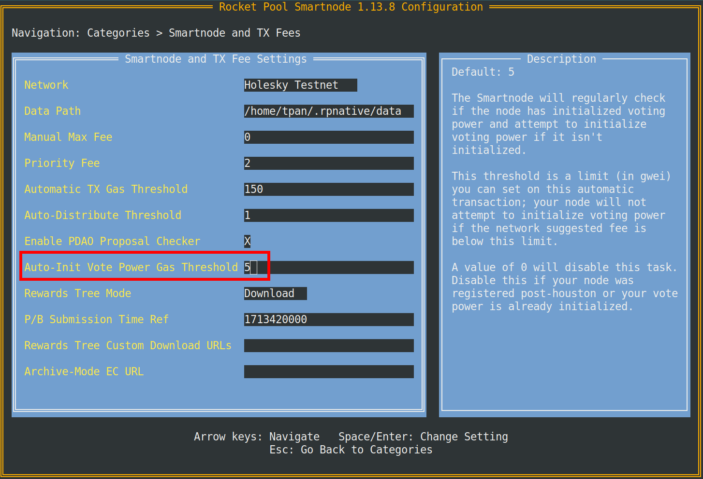
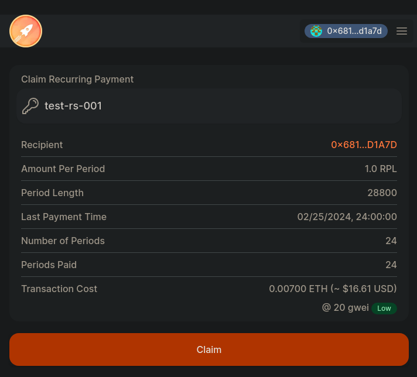

import { Tab, Tabs } from "@rspress/core/theme";

# Teilnahme an on-chain pDAO Vorschlägen

Jeder Knoten mit einer Stimmkraft ungleich Null kann jederzeit einen pDAO Vorschlag einreichen oder daran teilnehmen. Vorschläge können einen der
folgenden Typen haben:

- Änderung von pDAO Einstellungen
- Einmalige Treasury-Ausgaben
- Wiederkehrende Treasury-Ausgaben (Verwaltungsausschüsse)
- Security Council Mitgliedschaft

Für weitere Details und Begründungen siehe [Vorschlagstypen](https://rpips.rocketpool.net/RPIPs/RPIP-33#proposal-types).
Es ist wichtig zu verstehen, dass ein pDAO Vorschlag eine on-chain Entität ist, die existiert, um Änderungen auf Protokollebene
auszuführen.

## Governance-Prozess

Ein Vorschlag sollte durch den Governance-Prozess angekündigt werden, bevor er on-chain endet.

Änderungen am Rocket Pool Protokoll werden unter Verwendung eines strengen, aber transparenten Governance-Prozesses
vorgeschlagen, abgestimmt und ausgeführt. Der Prozess beginnt mit einer informellen Diskussion einer Idee innerhalb der Discord-Community. Diese Idee
entwickelt sich dann zu formellen Diskussionen im
[#governance](https://discordapp.com/channels/405159462932971535/774497904559783947) Kanal auf Discord und
im [DAO Forum](https://dao.rocketpool.net/), wo sie in Vorbereitung auf einen [Rocket Pool Improvement Proposal (RPIP)](https://rpips.rocketpool.net/) gründlicher Forschung, Modellierung und Prüfung unterzogen wird. Anschließend wird ein RPIP-Entwurf
vorbereitet und von designierten RPIP-Reviewern überprüft, um seine Qualität und Bereitschaft für die Präsentation vor der DAO sicherzustellen.
Der Entwurf wird dann der DAO im Forum zur weiteren Überprüfung, Rückmeldung und Einarbeitung notwendiger
Änderungen vorgestellt. Sobald der Vorschlag auf Basis des Community-Inputs verfeinert wurde, wird eine Umfrage im DAO Forum
gestartet, um die Bereitschaft zur Finalisierung des RPIP-Texts zu prüfen. Wenn die Umfrage bestanden wird und die Zustimmung der Community anzeigt, wird der RPIP als
final markiert und ist bereit für eine off-chain Protocol DAO Abstimmung auf [RocketDash](https://rocketdash.net/vote), um zu bestimmen, ob der Vorschlag
implementiert werden soll. RocketDash hat Snapshot für diese Abstimmungen ersetzt.

Von hier aus wird die Oracle DAO einen on-chain Vorschlag einreichen. Es gibt ein Zeitfenster, in dem die Protocol DAO, Oracle DAO und
Community den Vorschlag überprüfen können. Wenn Konsens erreicht wird, wird der Vorschlag ausgeführt und Änderungen werden auf das
Protokoll angewendet.

Eine praktische visuelle Darstellung dieses Prozesses finden Sie auf
der [Rocket Pool Website](https://rocketpool.net/governance/process).

## Voraussetzung

Bitte lesen Sie den [Lebenszyklus eines Vorschlags](./pdao#lebenszyklus-eines-pdao-vorschlags), bevor Sie fortfahren. Dies erklärt
die Unterschiede zwischen allen Abstimmungsperioden und den Aktionen, die während jeder Periode durchgeführt werden können.

Der Rest dieser Seite führt Sie durch die Schritte, die für die Teilnahme an on-chain pDAO Vorschlägen erforderlich sind.

## Initialisierung der Abstimmung

Wenn Sie ein Node Operator sind, der sich vor dem Houston Upgrade registriert hat, müssen Sie die Abstimmung initialisieren, um die Stimmkraft
freizuschalten. Beachten Sie, dass mindestens ein minipool erforderlich ist, um Stimmkraft zu haben.

```shell
rocketpool pdao initialize-voting
```

Dieser Befehl zeigt die folgende Eingabeaufforderung an. Bitte lesen Sie sie sorgfältig:

```
Thanks for initializing your voting power!

You have two options:

1. Vote directly (delegate vote power to yourself)
   This will allow you to vote on proposals directly,
   allowing you to personally shape the direction of the protocol.

2. Delegate your vote
   This will delegate your vote power to someone you trust,
   giving them the power to vote on your behalf. You will have the option to override.

You can see a list of existing public delegates at https://delegates.rocketpool.net,
however, you can delegate to any node address.

Learn more about how this all works via: /de/pdao/participate#participating-in-on-chain-pdao-proposals

Please type `direct` or `delegate` to continue:
```

- Wenn Sie mit `direct` antworten, wird die Stimmkraft auf Ihren Knoten initialisiert und Sie können direkt über
  Protocol DAO Vorschläge abstimmen.
- Wenn Sie mit `delegate` antworten, haben Sie die Möglichkeit, etwas Gas zu sparen, indem Sie die Abstimmung initialisieren
  und [einen Delegierten festlegen](./participate#delegierung-der-stimmkraft) innerhalb derselben Transaktion.

Sie müssen dies nur einmal tun. Es konfiguriert die anfänglichen snapshot Informationen für einen Knoten. Nachdem Sie die Abstimmung initialisiert haben,
aktualisiert jede durchgeführte Aktion die snapshot Informationen Ihres Knotens. Sobald Ihre Stimmkraft initialisiert ist, können Sie
überprüfen, wie viel Sie haben, mit folgendem Smart Node-Befehl:

```shell
rocketpool pdao status
```

:::tip HINWEIS
Immer wenn ein neuer Vorschlag erstellt wird, wird ein Abstimmungsbaum erstellt, der einen snapshot der Stimmkraft des Netzwerks und Delegierungsinformationen
darstellt, zusammen mit dem neuen Vorschlag. Das bedeutet, dass die Stimmkraft Ihres Knotens nicht in einem Vorschlag enthalten ist, wenn
dieser eingereicht wurde, bevor Sie die Abstimmung initialisiert haben. `rocketpool pdao status` zeigt die Stimmkraft Ihres Knotens im
neuesten Block an, was möglicherweise nicht repräsentativ für Ihre Stimmkraft bei einem bestimmten Vorschlag ist.
:::

## Auto Initialize Vote Power

Smart Node Version `1.13.8` führt eine neue Funktion **Auto Initialize Vote Power** ein, die darauf ausgelegt ist, automatisch
die Stimmkraft auf Knoten zu initialisieren, die dies noch nicht getan haben. Automatisch initialisierte Stimmkraft ist selbst-delegiert.
Diese Funktion kann in den Smart Node-Einstellungen konfiguriert werden, indem Sie `rocketpool service config` ausführen und zum Abschnitt \*
\*Smart Node and TX Fees\*\* navigieren.



Der **Auto-Init Vote Power Gas Threshold** ist ein Limit (in gwei) für diese automatische Transaktion. Sie können diese
Aufgabe deaktivieren, indem Sie den Schwellenwert auf 0 setzen. Fühlen Sie sich frei, sich abzumelden, wenn Ihr Knoten nach dem Houston Upgrade registriert wurde oder wenn
die Stimmkraft bereits aktiviert ist.

<span id="setting-your-snapshot-signalling-address"></span>

## Ihre Signalling Address festlegen

Das Festlegen Ihrer Signalling Address ermöglicht Ihnen, von einem Browser oder Mobilgerät aus an off-chain Governance-Abstimmungen auf
[RocketDash](https://rocketdash.net/vote) teilzunehmen, ohne Knotenschlüssel einer Hot Wallet aussetzen zu müssen.

:::tip HINWEIS
RocketDash hat Snapshot für die off-chain Governance-Abstimmungen von Rocket Pool ersetzt. Ihre Signalling Address wird on-chain gespeichert.
Wenn Sie bereits eine für Snapshot festgelegt haben, verwendet RocketDash diese ebenfalls und Sie müssen sie nicht erneut festlegen.
:::

Ihre Signalling Address kann auf RocketDash abstimmen und die Stimme Ihres Delegierten überschreiben, aber sie kann Ihren Delegierten nicht ändern.
Informationen zum Delegieren finden Sie unter [Delegierung der Stimmkraft](#delegierung-der-stimmkraft).

Es gibt ein paar Dinge vorzubereiten:

- Die Adresse Ihres Knotens
- Eine Adresse, die Sie für off-chain Abstimmungen verwenden möchten (Signalling Address)

Sie signieren eine Nachricht, die besagt, dass die Adresse Ihres Knotens an die neue Adresse delegieren kann. Diese Nachricht drückt Ihre
Absicht aus, Ihre Wallet-Adresse als Signalling Address zu verwenden.

Wählen Sie in den folgenden Tabs das Netzwerk aus, das Sie verwenden.

<div className="p-3">
  <Tabs>
    <Tab label="Hoodi Testnet">Wenn Sie dies auf dem Hoodi Testnet ausprobieren, können Sie auf dieser Seite signieren: https://testnet.node.rocketpool.net/signalling-address</Tab>
    <Tab label="Mainnet">Wenn Sie bereit sind, dies auf Mainnet zu konfigurieren, gehen Sie stattdessen hierhin: https://node.rocketpool.net/signalling-address</Tab>
  </Tabs>
</div>

:::danger WARNUNG
Laden Sie den privaten Schlüssel Ihres Knotens nicht in eine Hot Wallet. Bitte wählen Sie ein anderes Konto als Ihre Signalling Address.
Nachdem Sie die Signalling Address festgelegt haben, können Sie damit auf RocketDash mit der Stimmkraft Ihres Knotens abstimmen.
:::

Beginnen Sie damit, **die Adresse, die Sie als Signalling Address verwenden möchten**, über MetaMask,
WalletConnect oder eine der anderen von der Website unterstützten Methoden mit der Website zu verbinden. Ihnen wird dann dieser Dialog angezeigt, um Ihre
Knotenadresse nachzuschlagen.

Als Nächstes geben Sie Ihre Knotenadresse ein und klicken auf die orangefarbene Schaltfläche „Find". Dies prüft, ob die Adresse ein registrierter
Knoten ist, und führt Sie dann zum nächsten Schritt.

:::tip TIPP
**Stellen Sie sicher, dass Sie die richtige Knotenadresse haben, bevor Sie dies tun!** Wenn Sie Ihre Knotenadresse bestätigen müssen, können Sie
sie schnell über die CLI mit dem Befehl `rocketpool node status` abrufen.
:::

Sobald Sie sich angemeldet und Ihre Knotenadresse bestätigt haben, sehen Sie Ihre **Signalling Address**. Sie sollte
mit dem Konto übereinstimmen, mit dem Sie sich auf der Website angemeldet haben. Überprüfen Sie dies, bevor Sie fortfahren. Sobald Sie
sicher sind, dass Sie mit dem gewünschten Konto angemeldet sind, klicken Sie auf die orangefarbene Schaltfläche „Sign Message". Sie sehen in
Ihrer Wallet-Erweiterung eine Aufforderung, die folgende Nachricht zu signieren:

```
`node address` may delegate to me for Rocket Pool governance
```

Das Signieren kostet Sie kein Gas, aber das Festlegen schon. Nachdem Sie signiert haben, gibt Ihnen das Frontend einen Befehl, den Sie in den
Smart Node einfügen können. Fügen Sie ihn in die CLI Ihres Smart Nodes ein und folgen Sie den angezeigten Schritten. Der Befehl sollte
ungefähr so aussehen:

```shell
rocketpool pdao set-signalling-address
`signalling address`
`signature`
```

Wenn Sie diese Nachricht in Ihrer CLI sehen, sind Sie fertig!

```
The node's signalling address was successfully set to `signalling address`
```

:::tip TIPP
Machen Sie sich keine Sorgen, wenn Sie die Website versehentlich schließen oder den Befehl verlieren. Sie können die Schritte einfach wiederholen und **erneut
mit derselben Knotenadresse und Signalling Address signieren**. Das Frontend verwendet `signer.Signmessage()` aus der ethers-
Bibliothek, was bedeutet, dass Ihre Signatur bei gleicher Eingabe deterministisch ist.
Klicken Sie [hier](https://docs.ethers.org/v6/api/providers/#cid_865), um mehr zu erfahren.
:::

Das Löschen Ihrer Signalling Address ist ziemlich einfach. Verwenden Sie einfach diesen Befehl in der CLI:

```shell
rocketpool pdao clear-signalling-address
```

## Zulassen von RPL Locking

Sie können diesen Schritt ignorieren, wenn Sie nur an der Abstimmung über einen Vorschlag interessiert sind. Das Zulassen von RPL Locking ist nur für
diejenigen erforderlich, die einen Vorschlag einreichen oder anfechten möchten.

RPL Locking ist für das Einreichen und Anfechten erforderlich. Standardmäßig ist das Sperren von RPL für jeden Zweck deaktiviert. Node
Operators werden sich für die Durchführung von Governance-Aktivitäten entscheiden, indem sie das Sperren von RPL von ihrem Knoten oder ihrer primären
Auszahlungsadresse aktivieren. Sie können dies mit diesem Befehl im Smart Node tun:

```shell
rocketpool node allow-rpl-locking
```

Dies fordert Sie auf, das Sperren von RPL beim Erstellen oder Anfechten von Governance-Vorschlägen zuzulassen. Umgekehrt können Sie
den folgenden Befehl verwenden, um RPL Locking zu deaktivieren:

```shell
rocketpool node deny-rpl-locking
```

::: tip HINWEIS
Gesperrtes RPL verhält sich für die Zwecke von Belohnungen, Abstimmungen und Sicherheitsanforderungen genauso wie regulär gestaktes RPL.
Gesperrtes RPL wird nicht auf Schwellenwerte für die Abhebung von RPL angerechnet.
:::

## Delegierung der Stimmkraft

Ein Node Operator kann seine Stimmkraft an einen anderen Node Operator delegieren. Die einzige Voraussetzung ist, dass Ihr
Delegierter ein registrierter Knoten ist.

Um Ihre Stimmkraft an einen anderen Knoten zu delegieren, führen Sie diesen Befehl auf Ihrem Knoten aus:

```shell
rocketpool pdao set-voting-delegate `address`
```

Ihr Delegierter stimmt sowohl bei on-chain Vorschlägen als auch bei off-chain Abstimmungen auf [RocketDash](https://rocketdash.net/vote) für Sie ab.
Die Delegierung kann nur von Ihrem Knoten aus festgelegt werden. Sie können weder von Ihrer Signalling Address noch auf RocketDash delegieren.

::: tip HINWEIS
Wenn Sie Ihre Stimmkraft an einen anderen Node Operator delegiert haben, können Sie dies zurücksetzen, indem Sie die Delegiertenadresse auf
die Adresse Ihres eigenen Knotens setzen.
:::

### Wann abstimmen

On-chain Vorschläge haben zwei Abstimmungsphasen. In welcher Phase Sie abstimmen sollten, hängt davon ab, ob Sie Ihre
Stimmkraft delegiert haben. Diese Phasen gelten nur für on-chain Vorschläge. Off-chain Abstimmungen auf RocketDash haben sie nicht.

- **Pending:** Noch kann niemand abstimmen.
- **Phase 1:** Wenn Sie Ihre Stimme nicht delegiert haben, stimmen Sie in dieser Phase ab. Wenn Sie ein Delegierter sind, zählt Ihre Stimme auch
  für jeden Knoten, der an Sie delegiert hat. Stimmen Sie daher in Phase 1 ab. Andernfalls zählt deren Stimmkraft nur, wenn sie
  in Phase 2 selbst abstimmen. Wenn Sie Ihre Stimme delegiert haben, stimmt Ihr Delegierter in dieser Phase für Sie ab.
- **Phase 2:** Wenn Sie Ihre Stimme delegiert haben und mit der Stimme Ihres Delegierten nicht einverstanden sind oder Ihr Delegierter nicht abgestimmt hat,
  können Sie jetzt selbst abstimmen. Ihre Stimme ersetzt nur für Ihren Anteil die Stimme Ihres Delegierten. Wer noch nicht abgestimmt hat,
  kann ebenfalls in Phase 2 abstimmen, doch die Stimme zählt nur die eigene Stimmkraft – auch bei einem Delegierten.

Im Mainnet befindet sich ein neuer Vorschlag **eine Woche** lang im Status Pending. Anschließend dauern Phase 1 und Phase 2 jeweils **eine Woche**.
Diese Zeiträume sind pDAO Einstellungen und können durch eine Abstimmung geändert werden. Mit `rocketpool pdao settings` können Sie die aktuellen Werte anzeigen.

Ein Knoten kann über einen Vorschlag nur einmal abstimmen, entweder in Phase 1 oder in Phase 2.

| Sie sind ...                                                                                      | Wann Sie abstimmen sollten                                                                                                                                     |
| ------------------------------------------------------------------------------------------------- | -------------------------------------------------------------------------------------------------------------------------------------------------------------- |
| Sie stimmen für sich selbst ab (Standardeinstellung)                                              | Phase 1. Wenn Sie sie verpassen, können Sie noch in Phase 2 abstimmen.                                                                                         |
| Ein Delegierter                                                                                   | **Phase 1.** Wenn Sie Phase 1 verpassen, wird die an Sie delegierte Stimmkraft nicht gezählt. Ihre Delegierenden können in Phase 2 weiterhin selbst abstimmen. |
| Sie haben an einen anderen Knoten delegiert und stimmen seiner Entscheidung zu                    | Sie müssen nicht abstimmen.                                                                                                                                    |
| Sie haben an einen anderen Knoten delegiert und sind anderer Meinung oder er hat nicht abgestimmt | Phase 2.                                                                                                                                                       |

Um zu sehen, in welcher Phase sich ein Vorschlag befindet und ob Sie oder Ihr Delegierter abgestimmt haben, führen Sie Folgendes aus:

```shell
rocketpool pdao proposals details <proposal-id>
```

Prüfen Sie die Zeilen `State`, `Phase 1 end`, `Phase 2 end`, `Node has voted` und `Delegate has voted`. Sie können die
Phase jedes Vorschlags auch auf [RocketDash](https://rocketdash.net/pdao-proposals) sehen.

Wenn Sie mit `rocketpool pdao proposals vote` abstimmen, gibt der Smart Node automatisch die richtige Art von Stimme für die aktuelle Phase ab.

## Abstimmen über einen Vorschlag

Während einer Abstimmungsperiode können **Node Operators** und **Delegates** mit einer von vier Optionen abstimmen:

```
1. Abstain: The voter's voting power is contributed to quorum but is neither for nor against the proposal.
2. For: The voter votes in favor of the proposal being executed.
3. Against: The voter votes against the proposal being executed.
4. Veto: The voter votes against the proposal as well as indicating they deem the proposal as spam or malicious.
```

Ihre Stimmkraft wird auf die gewählte Option angewendet. Die Stimmkraft ist eine Funktion des „effektiven RPL Stake".
Eine ausführlichere Beschreibung finden Sie im
[rocketpool-research Repo](https://github.com/rocket-pool/rocketpool-research/blob/master/Protocol%20DAO/kane/pDAO%20Replacement/pDAO.md#overview-of-on-chain-voting).

::: tip HINWEIS
Ein Knoten kann über einen Vorschlag nur einmal abstimmen. Wählen Sie daher sorgfältig. Welche Phase für Sie die richtige ist, erfahren Sie unter
[Wann abstimmen](#wann-abstimmen).
:::

Verwenden Sie diesen Befehl, um eine Stimme abzugeben:

```shell
rocketpool pdao proposals vote
```

Sie werden aufgefordert, einen Vorschlag auszuwählen, über den Sie abstimmen möchten, wenn sich mindestens ein Vorschlag in einer aktiven Abstimmungsphase befindet.
Das Menü sollte alle Vorschläge anzeigen, über die Ihr Knoten abstimmen kann:

```
1: proposal 71 (message: 'invite test-member', payload: proposalSecurityInvite(test-member,0xBdbcb42DD8E39323a395B2B72d2c8E7039f1F145), phase 1 end: 14 Mar 24 05:40 UTC, vp required: 0.00, for: 0.00, against: 0.00, abstained: 0.00, veto: 0.00, proposed by: 0x681B8BBf08708e64694005c7Dc307b381b4D1A7D)
2: proposal 72 (message: 'replace langers-not-his-eoa (0xaC1396c21Eaf6630113516C69d63b7CB59B98b3E) on the security council with tpan (0x6E9E4Cc0A8172349E049128574E1fb85B8D3CE9E)', payload: proposalSecurityReplace(0xaC1396c21Eaf6630113516C69d63b7CB59B98b3E,tpan,0x6E9E4Cc0A8172349E049128574E1fb85B8D3CE9E), phase 1 end: 14 Mar 24 05:40 UTC, vp required: 0.00, for: 0.00, against: 0.00, abstained: 0.00, veto: 0.00, proposed by: 0xe2fC31d61E28BB16c0857D4682AB3616FA7A793d)
3: proposal 73 (message: 'set proposal.vote.delay.time', payload: proposalSettingUint(rocketDAOProtocolSettingsProposals,proposal.vote.delay.time,60), phase 1 end: 14 Mar 24 05:41 UTC, vp required: 0.00, for: 0.00, against: 0.00, abstained: 0.00, veto: 0.00, proposed by: 0x681B8BBf08708e64694005c7Dc307b381b4D1A7D)
```

Nach Auswahl einer Option werden Sie gefragt, wie Sie Ihre Stimme abgeben möchten.

```
How would you like to vote on the proposal?
1: Abstain
2: In Favor
3: Against
4: Veto
```

Die Auswahl einer Option zeigt dann Ihre Stimmkraft an und fordert Sie auf, die Transaktion zu senden:

```
Your current voting power: 20123617964

+============== Suggested Gas Prices ==============+
| Avg Wait Time |  Max Fee  |    Total Gas Cost    |
| 15 Seconds    | 76 gwei   | 0.0176 to 0.0265 ETH |
| 1 Minute      | 56 gwei   | 0.0127 to 0.0190 ETH |
| 3 Minutes     | 56 gwei   | 0.0127 to 0.0190 ETH |
| >10 Minutes   | 56 gwei   | 0.0127 to 0.0190 ETH |
+==================================================+
These prices include a maximum priority fee of 2.00 gwei.
Please enter your max fee (including the priority fee) or leave blank for the default of 56 gwei:
```

Sie haben erfolgreich über den Vorschlag abgestimmt, sobald die Transaktion in den Block aufgenommen wurde! An diesem Punkt können Sie
`rocketpool pdao proposal details <proposal-id>` verwenden, um den Status des Vorschlags anzuzeigen. Ein Vorschlag muss
`proposal.quorum` **Stimmkraft erforderlich** erreichen und eine Mehrheit **Stimmkraft für** haben, um erfolgreich zu sein.

```
Voting power required:  140970562215
Voting power for:       197980809837
Voting power against:   0
Voting power abstained: 0
Voting power against:   0
Node has voted:         In Favor
```

Damit das obige Beispiel besteht, muss die Stimmkraft ein Quorum von `140970562215` Stimmkraft überschreiten. Es gibt
`197980809837` Stimmkraft dafür und keine Stimmen dagegen oder Enthaltungen. Der Vorschlag ist auf Erfolgskurs und bereit
für die Ausführung bis zum Ende von `proposal.vote.phase2.time`.

## Anzeigen des Status eines Vorschlags

Jedem Vorschlag wird eine `proposalID` zugewiesen. In diesem Fall wird unser Vorschlag, `0xBdbc...` zum Security Council einzuladen, mit
`ID 71` dargestellt. Es gibt einige Möglichkeiten, den Status des Vorschlags anzuzeigen. Eine Methode zeigt eine Liste von
jedem pDAO Vorschlag zusammen mit seinem Status an (ausstehend, erfolgreich, ausgeführt usw.). Die zweite Methode zeigt detaillierte
Details zu einem bestimmten Vorschlag an.

<div className="p-3">
  <Tabs>
    <Tab label="Anzeigen einer Liste von Vorschlägen">
      Um alle Vorschläge aufzulisten, verwenden Sie den folgenden Befehl:

      ```shell
      rocketpool pdao proposals list
      ```

      Dies zeigt eine Liste aller Vorschläge und ihren Status an

      ```
      1 Pending proposal(s):

      71: invite test-member (0xBdbcb42DD8E39323a395B2B72d2c8E7039f1F145) to the security council - Proposed by:
      0x681B8BBf08708e64694005c7Dc307b381b4D1A7D

      Succeeded proposal(s):

      Executed proposal(s):

      Destroyed proposal(s):

      Quorum not Met proposal(s):

      Defeated proposal(s):

      Expired proposal(s):

      ```

      Hier können wir sehen, dass unser Vorschlag `invite test-member` eine ID von 71 hat und sich im ausstehenden Zustand befindet. In diesem Zustand
      können [Challengers](/de/pdao/pdao#challenge-process) die Gültigkeit des
      Merkle Pollard (zur Berechnung der Stimmkraft) anfechten, der vom Proposer bereitgestellt wurde. Wenn `proposal.vote.delay.time` endet,
      geht der Vorschlag in aktive Abstimmungsphasen über. Lesen Sie gerne den [Lebenszyklus eines
      Vorschlags](./pdao#lebenszyklus-eines-pdao-vorschlags) zur Auffrischung.
    </Tab>
    <Tab label="Anzeigen von Vorschlagsdetails">
      Jetzt, da Sie die Vorschlags-ID haben, können Sie den Status Ihres Vorschlags mit diesem Befehl anzeigen:

      ```shell
      rocketpool pdao proposals details `proposal-id`
      ```

      Hier können Sie alle Informationen in Bezug auf einen bestimmten Vorschlag anzeigen. Zum Beispiel die Ausführungs-
      Payload, in welcher Phase sich der Vorschlag befindet und die Abstimmungsrichtung.

      ```
      Proposal ID: 71
      Message: invite test-member (0xBdbcb42DD8E39323a395B2B72d2c8E7039f1F145) to the security council
      Payload: proposalSecurityInvite(test-member,0xBdbcb42DD8E39323a395B2B72d2c8E7039f1F145)
      Payload (bytes):
      f944c19f0000000000000000000000000000000000000000000000000000000000000040000000000000000000000000bdbcb42dd8e39323a395b2b72d2c8e7039f1f145000000000000000000000000000000000000000000000000000000000000000b746573742d6d656d626572000000000000000000000000000000000000000000
      Proposed by: 0x681B8BBf08708e64694005c7Dc307b381b4D1A7D
      Created at: 12 Mar 24 06:15 UTC
      State: Pending
      Voting start: 12 Mar 24 06:20 UTC
      Challenge window: 30m0s
      Voting power required: 90943818825
      Voting power for: 0
      Voting power against: 0
      Voting power abstained: 0
      Voting power against: 0
      Node has voted: no
      ```

      <p className="rspress-directive tip">
        <p className="rspress-directive-title">HINWEIS</p>
        Der Status dieses Beispielvorschlags ist `Pending`. Dies zeigt an, dass der Vorschlag angefochten werden kann, bevor
        er zu `Active (Phase 1)` übergeht. Während des Status `Pending` kann keine Abstimmung stattfinden.
      </p>
    </Tab>

  </Tabs>
</div>

## Erstellen eines Vorschlags

Um berechtigt zu sein, einen Vorschlag einzureichen, muss ein Knoten einige Anforderungen erfüllen:

- Im Snapshotting enthalten (entweder durch [Initialisierung der Abstimmung](./participate#initialisierung-der-abstimmung) oder durch
  Registrierung nach Houston)
- Muss mindestens einen minipool haben
- Hat eine Stimmkraft ungleich Null
- Hat [RPL Locking](./participate#zulassen-von-rpl-locking) zugelassen
- Hat einen RPL Stake (abzüglich bereits gesperrtem RPL) größer als die Vorschlagsbindung

Vorschläge existieren, um Parameter zu ändern und Code auf Protokollebene auszuführen! Es sollte Diskussion und Konsens
durch den [Governance](./participate#governance-prozess) Prozess geben, bevor ein Vorschlag on-chain erstellt wird.

Verwenden Sie den Befehl `rocketpool pdao propose`, um ein Menü mit Optionen aufzurufen

```
COMMANDS:
   rewards-percentages, rp      Propose updating the RPL rewards allocation percentages for node operators, the Oracle DAO, and the Protocol DAO
   one-time-spend, ots          Propose a one-time spend of the Protocol DAO's treasury
   recurring-spend, rs          Propose a recurring spend of the Protocol DAO's treasury
   recurring-spend-update, rsu  Propose an update to an existing recurring spend plan
   security-council, sc         Modify the security council
   setting, s                   Make a Protocol DAO setting proposal
   submit-batch, sb            Submit a single proposal that changes multiple Protocol DAO settings from a JSON file
```

Jeder dieser Befehle fordert Sie mit einer Liste von Eingaben auf, um Ihren gewünschten Vorschlag zu erstellen. Die Befehle für Einstellungsvorschläge akzeptieren `--to-json`, um eine Einstellungsänderung in eine JSON-Datei zu schreiben oder anzuhängen, anstatt eine Transaktion einzureichen. Wenn die Datei fertig ist, reichen Sie sie mit `rocketpool pdao propose submit-batch` ein.

In diesem Leitfaden werden wir
einen Knoten zum Security Council einladen, um als Beispiel zu dienen. Um einen Vorschlag einzureichen, einen Knoten zum Security
Council einzuladen, würden Sie den Befehl verwenden:

```shell
rocketpool pdao propose security-council invite
```

Beachten Sie, dass dieser Schritt je nach Art des Vorschlags leicht variieren wird. Dieser spezielle Befehl:
`rocketpool pdao propose security-council invite` fordert Sie auf, eine ID gefolgt von einer Mitgliedsadresse einzugeben.

```
Please enter an ID for the member you'd like to invite: (no spaces)
test-member

Please enter the member's address:
0xBdbcb42DD8E39323a395B2B72d2c8E7039f1F145

... gas estimations ...

Are you sure you want to propose inviting test-member (0xBdbcb42DD8E39323a395B2B72d2c8E7039f1F145) to the security council? [y/n]
```

Nachdem dies in einen Block aufgenommen wurde, wird ein pDAO Vorschlag erstellt! Der Vorschlag tritt
bei Erstellung in die [Vote Delay Period](./pdao#vote-delay-period) ein.

## Ausführen eines erfolgreichen Vorschlags

Herzlichen Glückwunsch! Ihr Vorschlag wurde angenommen! Jetzt müssen Sie nur noch den Vorschlag ausführen. Beachten Sie, dass jeder
der Executor eines Vorschlags sein kann. Um einen erfolgreichen Vorschlag auszuführen, geben Sie den Befehl ein:

```shell
rocketpool pdao execute
```

Die Auswahl einer Option fordert Sie auf, eine Transaktion zu senden. Sobald diese Transaktion in einen Block aufgenommen wurde, wird die Änderung
auf das Rocket Pool Protokoll angewendet!

```
Please select a proposal to execute:
1: All available proposals
2: proposal 71 (invite test-member (0xBdbcb42DD8E39323a395B2B72d2c8E7039f1F145) to the security council)',
proposalSecurityInvite(test-member,0xBdbcb42DD8E39323a395B2B72d2c8E7039f1F145)
```

## Anfordern von Bonds und Belohnungen

Proposer oder Challengers können ihre Bonds bei Abschluss eines Vorschlags anfordern. Abhängig vom Ergebnis eines Vorschlags kann
ein Proposer oder Challenger seine `proposal.bond` und `proposal.challenge.bond` anfordern oder nicht.

Hier sind einige Regeln, die die Bedingungen bestimmen, unter denen Bonds angefordert werden können:

- Wenn ein Vorschlag abgelehnt wird, verwirkt der Proposer seine Bindung, die proportional unter den Challengers aufgeteilt wird,
  die zur Niederlage des Vorschlags beigetragen haben. Alle anderen Challengers erhalten nur ihre Bindung zurück.
- Zur Niederlage eines Vorschlags beizutragen bedeutet, dass ein Challenger einen Index eingereicht hat, der später als
  falsch erwiesen wurde, durch die Unfähigkeit des Proposers, auf eine Herausforderung zu antworten. Es ist möglich, dass es mehrere falsche Indizes gibt, aber nur
  diejenigen, die zur Niederlage des Vorschlags geführt haben, teilen die Belohnung. Alle anderen Challengers erhalten nur ihre Bindung zurück.
- Wenn ein Challenger einen Knoten anficht, der Proposer antwortet und der Vorschlag nicht abgelehnt wird, kann der Proposer
  die Challenge Bonds von den ungültigen Challenges anfordern.
- Wenn ein Vorschlag abgelehnt wird, verwirkt der Proposer seine Bindung, die proportional unter den Challengers aufgeteilt wird,
  die zur Niederlage des Vorschlags beigetragen haben.

Verwenden Sie diesen Befehl, um Bonds anzufordern:

```shell
rocketpool pdao claim-bonds
```

Dies zeigt jeden Vorschlag an, von dem Sie berechtigt sind, Bonds anzufordern. Sie können entweder Bonds von einem bestimmten
Vorschlag anfordern, oder Sie können Bonds und Belohnungen von allen berechtigten Vorschlägen anfordern.

```
Please select a proposal to unlock bonds / claim rewards from:
1: All available proposals
2: Proposal 42 (proposer: true, unlockable: 21.00 RPL, rewards: 0.00 RPL)
3: Proposal 43 (proposer: true, unlockable: 21.00 RPL, rewards: 0.00 RPL)
4: Proposal 44 (proposer: true, unlockable: 21.00 RPL, rewards: 0.00 RPL)
5: Proposal 46 (proposer: true, unlockable: 21.00 RPL, rewards: 0.00 RPL)
6: Proposal 47 (proposer: true, unlockable: 21.00 RPL, rewards: 0.00 RPL)
7: Proposal 48 (proposer: true, unlockable: 21.00 RPL, rewards: 0.00 RPL)
8: Proposal 49 (proposer: true, unlockable: 21.00 RPL, rewards: 0.00 RPL)
```

Sobald Sie eine Option ausgewählt haben, werden Ihnen die aktuellen Gaskostenempfehlungen des Netzwerks angezeigt; bestätigen Sie Ihre
Gaspreisauswahl und folgen Sie den restlichen Eingabeaufforderungen.

```
+============== Suggested Gas Prices ==============+
| Avg Wait Time |  Max Fee  |    Total Gas Cost    |
| 15 Seconds    | 26 gwei   | 0.1591 to 0.2387 ETH |
| 1 Minute      | 21 gwei   | 0.1261 to 0.1891 ETH |
| 3 Minutes     | 21 gwei   | 0.1261 to 0.1891 ETH |
| >10 Minutes   | 21 gwei   | 0.1261 to 0.1891 ETH |
+==================================================+

These prices include a maximum priority fee of 2.00 gwei.
Please enter your max fee (including the priority fee) or leave blank for the default of 21 gwei:


Using a max fee of 21.00 gwei and a priority fee of 2.00 gwei.
Are you sure you want to claim bonds and rewards from 7 proposals? [y/n]
```

Beachten Sie, dass wenn Sie die erste Option auswählen, um alle verfügbaren Vorschläge anzufordern, diese jeweils einzeln und nicht
als eine Transaktion ausgeführt werden.

## Erstellen einer wiederkehrenden Treasury-Ausgabe

Sie müssen einige Eingaben vorbereiten, um eine wiederkehrende Treasury-Ausgabe zu erstellen:

- Einen Vertragsnamen
- Die Adresse des Empfängers
- Menge an RPL, die pro Periode gesendet werden soll
- Die Startzeit für die wiederkehrende Zahlung (als UNIX-Zeitstempel)
- Die Länge jeder Zahlungsperiode in Stunden / Minuten / Sekunden (z.B. 168h0m0s)
- Anzahl der Zahlungsperioden

::: tip INFO
Der Empfänger muss sich den Vertragsnamen notieren, um Zahlungen anzufordern. Keine Sorge, da diese
Informationen gespeichert sind und mit dem Befehl `rocketpool pdao proposals details <proposal-id>` abgerufen werden können
:::

Um einen Vorschlag zur Einrichtung einer wiederkehrenden Treasury-Ausgabe einzureichen, verwenden Sie den folgenden Smart Node-Befehl und folgen Sie den Eingabeaufforderungen:

```shell
rocketpool pdao propose recurring-spend
```

So sieht das alles zusammen aus:

```
Please enter a contract name for this recurring payment:
test-recurring-spend

Please enter a recipient address for this recurring payment:
0x681B8BBf08708e64694005c7Dc307b381b4D1A7D

Please enter an amount of RPL to send to 0x681B8BBf08708e64694005c7Dc307b381b4D1A7D per period:
1

Your value will be multiplied by 10^18 to be used in the contracts, which results in:

[1000000000000000000]

Please make sure this is what you want and does not have any floating-point errors.

Is this result correct? [y/n]
y

Please enter the time that the recurring payment will start (as a UNIX timestamp):
1717935233

The provided timestamp corresponds to 2024-06-09 12:13:53 +0000 UTC - is this correct? [y/n]
y

Please enter the length of each payment period in hours / minutes / seconds (e.g., 168h0m0s):
720h

Please enter the total number of payment periods:
24
```

Sobald Sie alle erforderlichen Eingaben eingegeben haben, wird ein Vorschlag zur Erstellung einer wiederkehrenden Zahlung eingereicht. Wenn die pDAO
diesen Vorschlag annimmt und ausführt, werden dem Empfänger `1 RPL` zugeteilt, beginnend am `2024-06-09 12:13:53 +0000 UTC`
alle
`720 Stunden` für insgesamt `24 Zahlungen`.

## Anfordern einer wiederkehrenden Treasury-Ausgabe

Das Anfordern wiederkehrender Zahlungen sollte ziemlich einfach sein! Navigieren Sie zu unserem Frontend-
Tool [hier](https://node.rocketpool.net/claim-recurring-payments), um dies zu tun. Wenn Sie dies auf
Hoodi
Testnet ausprobieren, verwenden Sie stattdessen [diesen](https://testnet.node.rocketpool.net/stake-rpl-on-behalf-of-node) Link.

Sobald Sie auf der Website sind, klicken Sie auf die Schaltfläche **connect wallet**. Bitte lesen Sie die Nutzungsbedingungen &
Datenschutzrichtlinie durch und akzeptieren Sie sie, dies ermöglicht verschiedene Verbindungsmöglichkeiten, klicken Sie dann auf **metamask** verbinden.

MetaMask fordert Sie auf, ein Konto auszuwählen, um sich mit der Website zu verbinden. Nachdem Sie sich angemeldet haben, müssen Sie den
**Vertragsnamen** eingeben. Dadurch werden alle relevanten Details angezeigt. Stellen Sie sicher, dass Sie die Adresse des Empfängers noch einmal überprüfen.
Jeder kann die Claim-Funktion aufrufen, aber jeder Zahlungsvertrag hat einen designierten Empfänger, an den RPL
verteilt wird.



Sie können Ihre Zahlungen jederzeit anfordern, Sie erhalten nur das gesamte nicht angeforderte RPL bis zur letzten Periode.
Alternativ können Sie warten, bis alle Perioden vergangen sind, um alles auf einmal zu sammeln und Gas zu sparen.

Drücken Sie einfach die große orangefarbene Claim-Schaltfläche, wenn Sie bereit sind, und überprüfen Sie die Transaktion in Metamask (oder Ihrer bevorzugten
Wallet). Sobald das erledigt ist, sind Sie fertig!
