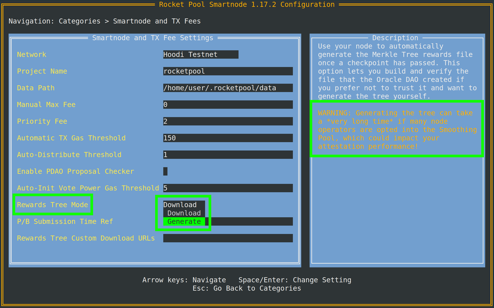

# Das Rocket Pool Redstone Update

Das nächste große Update von Rocket Pool mit dem Titel **Redstone** wurde für Betatests in den Ropsten- und Holesky-Testnetzwerken veröffentlicht.
Diese Seite beschreibt die wichtigsten Änderungen, die Redstone mit sich bringt, einschließlich Updates sowohl für den Smartnode-Stack als auch für das Rocket Pool-Protokoll im Allgemeinen.

Bitte lesen Sie diese Seite gründlich durch, um alle Unterschiede zwischen der vorherigen Version von Rocket Pool und Redstone zu verstehen.

::: tip ACHTUNG
Für detaillierte Informationen darüber, wie Sie Ihren Node für das Upgrade vorbereiten und was nach dem Upgrade zu tun ist, lesen Sie bitte die folgenden Anleitungen:

- [Anleitung für Docker-Modus](./docker-migration.mdx)
- [Anleitung für Hybrid-Modus](./hybrid-migration.mdx)
- [Anleitung für Native-Modus](./native-migration.mdx)

:::

## Client-Änderungen und The Merge

Ropsten (und in Kürze Holesky) haben erfolgreich **The Merge der Execution- und Consensus-Layer** durchlaufen.
Es verwendet nicht mehr Proof-of-Work; stattdessen sind Validatoren auf Ropsten jetzt für das Erstellen und Vorschlagen von Blöcken auf beiden Chains verantwortlich.
Während dies einige aufregende finanzielle Vorteile mit sich bringt (die später besprochen werden), bringt es auch einige wichtige Änderungen in der Funktionsweise von Validatoren mit sich.

Nachfolgend finden Sie eine kurze Zusammenfassung der Änderungen am Client-Verhalten im Rahmen von The Merge:

- Ihr Execution Client verwendet jetzt drei API-Ports:
  - Einen für HTTP-Zugriff auf seine API (**Standard 8545**)
  - Einen für Websocket-Zugriff auf seine API (**Standard 8546**)
  - Einen für die neue **Engine API**, die von Consensus Clients nach The Merge verwendet wird (**Standard 8551**)

- Execution Clients benötigen jetzt einen Consensus Client, um zu funktionieren, und Consensus Clients benötigen jetzt einen Execution Client, um zu funktionieren.
  - **Keiner von beiden kann mehr isoliert arbeiten.**

- Ein Execution Client muss mit einem, und nur einem, Consensus Client verbunden sein (und umgekehrt).
  - Sie können nicht mehr mehrere Execution Clients mit einem einzelnen Consensus Client oder mehrere Consensus Clients mit einem einzelnen Execution Client verbinden.
  - Aus diesem Grund sind **Fallback-Execution-Clients für Rocket Pool Node Operators nicht mehr verfügbar**.

- **Vollständige Execution Clients** sind erforderlich.
  - Remote-Anbieter (wie Infura und Pocket) können von keinem Validator mehr verwendet werden, weder von Rocket Pool noch von anderen.

## Fee Recipients und Ihr Distributor

Da Validatoren jetzt für die Erstellung von Blöcken verantwortlich sind, bedeutet dies, dass sie die **Prioritätsgebühren** (auch bekannt als **Tips**) erhalten, die an jede Transaktion angehängt sind.
Diese Gebühren werden in ETH bezahlt und werden Ihnen jedes Mal direkt zur Verfügung gestellt, wenn einer Ihrer Minipool-Validatoren einen Block vorschlägt.
Im Gegensatz zum auf der Beacon Chain gesperrten ETH **müssen Sie nicht auf Withdrawals warten, um auf Ihre Prioritätsgebühren zuzugreifen**!
Sie werden Ihnen einfach als Teil des Block-Proposal-Prozesses zuerkannt.

Damit Ihr Validator Client weiß, wohin die Gebühren gesendet werden sollen, benötigt er einen zusätzlichen Parameter, der als `fee recipient` bekannt ist.
Dies ist die Adresse auf der Execution Layer (ETH1), an die alle Prioritätsgebühren gesendet werden, die Ihr Node während Block-Proposals verdient.

Rocket Pool ist so konzipiert, dass es diese Belohnungen fair verteilt, genauso wie es Ihre Beacon Chain-Belohnungen fair verteilt: Die Hälfte aller Prioritätsgebühren, die Ihre Minipool-Validatoren verdienen, geht an Sie (plus die durchschnittliche Kommission aller Ihrer Minipools), und die andere Hälfte geht an die Pool-Staker (minus Ihre durchschnittliche Kommission).

Zu diesem Zweck setzt der Smartnode den `fee recipient` Ihres Validator Clients automatisch auf eine spezielle Adresse, die als **Fee Distributor** Ihres Nodes bekannt ist.
Ihr Fee Distributor ist ein eindeutiger Vertrag auf der Execution Layer, der **spezifisch für Ihren Node** ist.
Er hält alle Prioritätsgebühren, die Sie im Laufe der Zeit verdient haben, und enthält die erforderliche Logik, um sie fair aufzuteilen und zu verteilen.
Dieser Verteilungsprozess wird von Ihnen (dem Node Operator) gesteuert und kann nach Belieben durchgeführt werden.
Er hat kein Zeitlimit.

Die Adresse für den Fee Distributor Ihres Nodes ist **deterministisch auf Ihrer Node-Adresse basierend**.
Das bedeutet, sie ist im Voraus bekannt, bevor der Fee Distributor überhaupt erstellt wird.
**Der Smartnode wird diese Adresse als Ihren Fee Recipient verwenden.**

::: tip HINWEIS
Standardmäßig wird Ihr Fee Recipient auf die **rETH-Adresse** gesetzt, wenn Sie Smartnode v1.5.0 installieren (falls die Redstone-Vertrags-Updates noch nicht bereitgestellt wurden).
Der Smartnode wird dies automatisch auf die Fee Distributor-Adresse Ihres Nodes aktualisieren, sobald das Redstone-Update bereitgestellt wurde.

Eine Ausnahme von dieser Regel besteht, wenn Sie in den **Smoothing Pool** aufgenommen sind - siehe den Abschnitt am Ende dieser Seite für weitere Informationen dazu.
:::

Neue Rocket Pool-Nodes werden den Distributor-Vertrag ihres Nodes automatisch bei der Registrierung initialisieren.
Bestehende Nodes müssen diesen Prozess manuell durchführen.
Dies muss nur einmal ausgeführt werden.

Eine interessante Folge davon ist, dass die Adresse Ihres Distributors möglicherweise ein Guthaben ansammelt, **bevor** Sie Ihren Node-Distributor-Vertrag initialisiert haben.
Das ist in Ordnung, denn Ihr Distributor erhält Zugriff auf dieses gesamte vorhandene Guthaben, sobald Sie ihn initialisieren.

Sie können das Guthaben Ihres Fee Distributors als Teil von:

```shell
rocketpool node status
```

anzeigen. Die Ausgabe sieht so aus:


Um den Distributor Ihres Nodes zu initialisieren, führen Sie einfach diesen neuen Befehl aus:

```shell
rocketpool node initialize-fee-distributor
```

::: warning HINWEIS
Nach dem Redstone-Update müssen Sie diese Funktion aufrufen, bevor Sie neue Minipools mit `rocketpool node deposit` erstellen können.
:::

Wenn Ihr Distributor initialisiert wurde, können Sie sein gesamtes Guthaben mit folgendem Befehl beanspruchen und verteilen:

```shell
rocketpool node distribute-fees
```

Dies sendet Ihren Anteil der Belohnungen an Ihre **Withdrawal-Adresse**.

## Änderungen am Rocket Pool-Protokoll

Zusätzlich zu den Änderungen an Execution- und Consensus-Clients und den neuen Prioritätsgebühren hat das Rocket Pool-Protokoll selbst einige wichtige Änderungen erfahren, die Sie kennen sollten.

### Neues Belohnungssystem

Eine der bedeutendsten Änderungen, die mit dem Redstone-Update eingeführt wurden, ist das **neue Belohnungssystem**.
Dies ist eine vollständige Überarbeitung der Art und Weise, wie Node Operators ihre RPL-Belohnungen (und ETH aus dem Smoothing Pool - später besprochen) erhalten.

Das _alte_ Belohnungssystem hatte folgende Nachteile:

- Das Beanspruchen kostete etwa 400k Gas, was ziemlich teuer ist.
- Node Operators mussten die Belohnungen in jedem Intervall (alle 28 Tage) beanspruchen oder verloren sie. Dies bedeutete, dass die Gaskosten für Node Operators mit kleinen RPL-Mengen unerschwinglich teuer werden konnten.
- Belohnungen wurden zum Zeitpunkt des _Anspruchs_ bestimmt, nicht zum Zeitpunkt des Checkpoints. Wenn ein Benutzer zwischen dem Checkpoint und Ihrem Anspruch eine erhebliche Menge RPL gestakt hat, könnten Ihre Belohnungen verwässert werden und Sie würden weniger RPL erhalten als erwartet.

Das _neue_ Anspruchssystem löst alle diese Probleme.

Bei jedem Intervall erstellt das Oracle DAO gemeinsam einen **echten Snapshot** des Zustands der Node Operators im Rocket Pool-Netzwerk, einschließlich aller ihrer effektiven Stake-Beträge.
Diese Informationen werden in einem [Merkle Tree](https://en.wikipedia.org/wiki/Merkle_tree) zusammengestellt - eine äußerst effiziente Methode, um alle Details für Smart Contracts verfügbar zu machen.
Der Merkle Tree wird in eine JSON-Datei eingebettet und auf dem [InterPlanetary File System (IPFS)](https://en.wikipedia.org/wiki/InterPlanetary_File_System) gehostet, und die Wurzel des Merkle Tree wird an die Verträge übermittelt.

Dieses neue System hat folgende Eigenschaften:

- Sie können jetzt **Belohnungen so lange ansammeln lassen**, wie Sie möchten. Kein Zeitlimit mehr, bis wann Sie beanspruchen müssen.
- Sie können **mehrere Intervalle** auf einmal beanspruchen.
- Ihre erste Anspruchstransaktion verbraucht etwa 85k Gas. Jede nachfolgende Anspruchstransaktion kostet etwa 55k Gas.
  - Wenn Sie mehrere Intervalle auf einmal beanspruchen, kostet jedes zusätzliche Intervall **6k Gas**, daher ist es am kosteneffektivsten, so viele wie möglich auf einmal zu beanspruchen.
- Ihre RPL-Belohnungen **werden nicht mehr verwässert** - Ihre RPL-Belohnungen werden zum Zeitpunkt des Snapshots festgelegt, und Sie haben immer Anspruch auf diesen Betrag.
- Sie können **einige (oder alle) Ihrer RPL-Belohnungen als Teil der Anspruchstransaktion erneut staken**, was die Gasanforderungen im Vergleich zu heute weiter reduziert.
- Derzeit **müssen alle Ihre Ansprüche auf Mainnet erfolgen**, aber wir haben die Infrastruktur, um die Möglichkeit zu schaffen, zu einem späteren Zeitpunkt auf Layer 2-Netzwerken zu beanspruchen.

Wenn Ihr Node einen neuen Belohnungs-Checkpoint erkennt, lädt er die JSON-Datei für dieses Intervall automatisch herunter.
Sie können dann Ihre Belohnungen mit folgendem Befehl überprüfen:

```shell
rocketpool node claim-rewards
```

Wenn Intervalle vergehen und Sie Belohnungen ansammeln, sieht die Ausgabe so aus:


Hier können Sie schnell sehen, wie viele Belohnungen Sie in jedem Intervall verdient haben, und entscheiden, welche Sie beanspruchen möchten.
Beachten Sie, dass **die Intervallzeit von Ropsten auf 1 Tag eingestellt ist, um Tests zu erleichtern.**

Sie können auch einen Betrag angeben, den Sie während dieses Anspruchs erneut staken möchten:


Auf diese Weise können Sie Ihre RPL-Belohnungen in einer Transaktion aufzinsen und dabei wesentlich weniger Gas verbrauchen als heute.

::: tip HINWEIS
Wenn Sie den Belohnungs-Checkpoint lieber manuell erstellen möchten, anstatt den vom Oracle DAO erstellten herunterzuladen, können Sie diese Einstellung in der TUI von `Download` auf `Generate` ändern:



Wie der Tipp andeutet, benötigen Sie dafür Zugriff auf einen Archiv-Node.
Wenn Ihr lokaler Execution Client kein Archiv-Node ist, können Sie einen separaten (wie Infura oder Alchemy) im Feld `Archive-Mode EC URL` darunter angeben.
Diese URL wird nur beim Generieren von Merkle Trees verwendet; sie wird nicht für Validierungsaufgaben verwendet.
:::

::: danger WARNUNG
Wenn Sie zum Zeitpunkt des Snapshots unter 10% RPL-Besicherung liegen, haben Sie keinen Anspruch auf Belohnungen für diesen Snapshot.
Im Gegensatz zum aktuellen System, in dem Sie einfach "auffüllen" können, bevor Sie beanspruchen, um wieder berechtigt zu werden, wird dies in diesem Snapshot für immer festgeschrieben und **Sie werden niemals Belohnungen für diesen Zeitraum erhalten**.
Sie **müssen** zum Zeitpunkt eines Snapshots über 10% Besicherung liegen, um Belohnungen für diesen Zeitraum zu erhalten.
:::

### Smoothing Pool

Ein letztes aufregendes neues Feature des Redstone-Updates ist der **Smoothing Pool**.
Der Smoothing Pool ist **ein Opt-in-Feature**, das die Prioritätsgebühren aller Mitglieder, die sich dafür entschieden haben, gemeinsam sammelt.
Während eines Belohnungs-Checkpoints wird das gesamte ETH-Guthaben des Pools in einen Pool-Staker-Teil und einen Node-Operator-Teil aufgeteilt.
Alle Belohnungen im Node-Operator-Teil werden **fair an jedes Mitglied des Pools verteilt**.

Im Wesentlichen ist der Smoothing Pool eine Möglichkeit, die Zufälligkeit, die mit Block-Proposals auf der Beacon Chain verbunden ist, effektiv zu eliminieren.
Wenn Sie jemals eine Pechsträhne hatten und monatelang ohne Proposal waren, finden Sie den Smoothing Pool möglicherweise sehr aufregend.

::: tip HINWEIS
Die Smoothing Pool-Belohnungen sind in den Merkle Tree eingebaut, der für RPL-Belohnungen verwendet wird, sodass Sie sie gleichzeitig mit RPL mit `rocketpool node claim-rewards` beanspruchen.
:::

Um die Details zu verdeutlichen, verwendet der Smoothing Pool folgende Regeln:

- Die Aufnahme in den Smoothing Pool erfolgt auf **Node-Ebene**. Wenn Sie sich anmelden, sind alle Ihre Minipools angemeldet.

- Der Gesamtanteil des Node Operators wird durch die durchschnittliche Kommission jedes Minipools in jedem Node bestimmt, der in den Smoothing Pool aufgenommen ist.

- Jeder kann sich jederzeit anmelden. Sie müssen ein vollständiges Belohnungsintervall (1 Tag auf Ropsten, 28 Tage auf Mainnet) warten, bevor sie sich abmelden können, um das System nicht zu manipulieren.
  - Nach der Abmeldung müssen Sie ein weiteres vollständiges Intervall warten, um sich wieder anzumelden.

- Der Smoothing Pool berechnet den "Anteil" jedes Minipools (Anteil am ETH des Pools für das Intervall), der jedem angemeldeten Node gehört.
  - Der Anteil ist eine Funktion der Leistung Ihres Minipools während des Intervalls (berechnet durch Betrachtung, wie viele Attestierungen Sie auf der Beacon Chain gesendet haben und wie viele Sie verpasst haben) und der Kommissionsrate Ihres Minipools.

- Der Gesamtanteil Ihres Nodes ist die Summe Ihrer Minipool-Anteile.

- Der Gesamtanteil Ihres Nodes wird durch die Zeit skaliert, in der Sie angemeldet waren.
  - Wenn Sie für das gesamte Intervall angemeldet waren, erhalten Sie Ihren vollen Anteil.
  - Wenn Sie für 30% eines Intervalls angemeldet waren, erhalten Sie 30% Ihres vollen Anteils.

Um sich für den Smoothing Pool anzumelden, führen Sie folgenden Befehl aus:

```shell
rocketpool node join-smoothing-pool
```

Dies zeichnet Sie in den Rocket Pool-Verträgen als angemeldet auf und ändert automatisch den `fee recipient` Ihres Validator Clients vom Distributor-Vertrag Ihres Nodes zum Smoothing Pool-Vertrag.

Um den Pool zu verlassen, führen Sie diesen Befehl aus:

```shell
rocketpool node leave-smoothing-pool
```

### Das Strafsystem

Um sicherzustellen, dass Node Operators nicht "betrügen", indem sie den Fee Recipient, der in ihrem Validator Client verwendet wird, manuell ändern, setzt Rocket Pool ein Strafsystem ein.

Das Oracle DAO überwacht ständig jeden Block, der von Rocket Pool Node Operators produziert wird.
Jeder Block, der einen Fee Recipient hat, der nicht eine der folgenden Adressen ist, wird als **ungültig** betrachtet:

- Die rETH-Adresse
- Die Smoothing Pool-Adresse
- Der Fee Distributor-Vertrag des Nodes (wenn nicht im Smoothing Pool)

Ein Minipool, der einen Block mit einem **ungültigen** Fee Recipient vorgeschlagen hat, erhält **einen Strike**.
Beim dritten Strike beginnt der Minipool **Verstöße** zu erhalten - jeder Verstoß wird **10% seines gesamten Beacon Chain-Guthabens, einschließlich ETH-Einnahmen**, abziehen und an die rETH-Pool-Staker senden, wenn Gelder aus dem Minipool abgehoben werden.

Verstöße erfolgen auf **Minipool**-Ebene, nicht auf **Node**-Ebene.

Die Smartnode-Software ist so konzipiert, dass ehrliche Benutzer niemals bestraft werden, selbst wenn sie den Validator Client dafür offline nehmen muss.
Wenn dies geschieht, hören Sie auf zu attestieren und sehen Fehlermeldungen in Ihren Logdateien darüber, warum der Smartnode Ihren Fee Recipient nicht korrekt setzen kann.

## Anleitungen für Pre- und Post-Upgrade

Für detaillierte Informationen darüber, wie Sie Ihren Node für das Upgrade vorbereiten und was nach dem Upgrade zu tun ist, lesen Sie bitte die folgenden Anleitungen:

- [Anleitung für Docker-Modus](./docker-migration.mdx)
- [Anleitung für Hybrid-Modus](./hybrid-migration.mdx)
- [Anleitung für Native-Modus](./native-migration.mdx)
