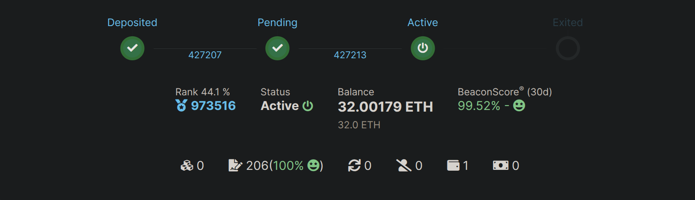

# Creating a Megapool (Validator)

Welcome to Saturn 1! A Rocket Pool Megapool is a smart contract instance on the execution layer. 
Your node will manage a Megapool that serves as an Ethereum withdrawal address for one or many validators.
Each validator is comprised of a portion of your ETH, known as the bond amount, and a portion of ETH from the rETH staking pool, 
known as the borrowed amount. Your Megapool is responsible for merging the bond amount and borrowed amount ETH to form 32 ETH total, which is 
then sent to the Beacon Chain deposit contract to create a new validator.
It's deployed at the time of your first validator deposit. Afterwards you'll be able to use the same Megapool to manage as many validators as you wish! You won't need 
to deploy a new Megapool every time you create a new validator. 


::: tip NOTE
The Beacon Chain validator queue activation (and exit) times can vary greatly depending on the current state of the network.

This is outside Rocket Pool's control and is a function of the Beacon Chain itself.

The following tool provides a good estimate of how long you can expect to wait:
[https://www.validatorqueue.com/](https://www.validatorqueue.com/)

Please review this tool to get an idea of how long you can expect to wait for your validator to become active.
:::

::: tip NOTE

Validator creation is governed by two queues.

1. The first is the Rocket Pool deposit queue. We'll go more into it in a different section, but essentially this queue is managed by the Rocket Pool protocol & determines when your validator will receive its borrowed ETH. 
There needs to be ETH available in the deposit pool to match your 4 ETH with 28 ETH in the deposit pool & create the validator.

2. The second is the Beacon Chain queue, which is managed by the Ethereum Beacon Chain & determines when your validator will become active.
Please be aware that the time it takes for your validator to become active can vary greatly depending on your position in each queue & the current state of the network.

The Rocket Pool deposit queue features an express queue system to help existing node operators migrate their megapool validator ETH
to megapool validator ETH. 

:::

## Rocket Pool Deposit Queue and Express Queue

There are two types of queues within Rocket Pool's deposit queue: express queue and standard queue. 

The deposit queue features an express queue system to help existing node operators migrate their megapool validator ETH
to megapool validator ETH. It also creates more predictable deposit timelines for deposits using the express queue.

The express queue is processed at a 4:1 ratio which means 4 validators from the express queue get matched for every 1 validator matched from
the standard queue. In other words: 4 validators from the express queue are matched, then 1 from the standard queue, then 4 from the express queue and so on.

Existing node operators receive express queue tickets based on their bonded ETH in legacy minipools: one ticket for every 4 ETH bonded. 
For example, a node operator with an 8 ETH legacy minipool gets 2 express queue tickets. This is enough tickets to fully migrate to two 4 ETH megapool validators using the express queue.
[RPIP-59: Deposit Mechanics](https://rpips.rocketpool.net/RPIPs/RPIP-59#deposit-queue) goes into the nitty gritty of how deposits are handled. 

Your node will be refunded an express queue ticket if you choose to [dequeue your validator from the express queue](./create-megapool-validator#exit-a-validator-from-the-rocket-pool-deposit-queue).

## Depositing ETH and Creating a Validator

If this is your node's first Megapool validator, your node's Megapool will also be deployed at the same time. Please remember that your node's Megapool can
manage one or many validators, so Megapool development only happens once per node!

Once you're ready to deposit your ETH into a Megapool and create a Beacon Chain validator, you can do so using the following command:

```
rocketpool megapool deposit
```
::: danger WARNING

While the CLI does automate a lot of the next steps for you, we <strong>strongly</strong> recommend monitoring your node & transactions to ensure a successful transition from `prelaunch` to `staking`.

Failed transactions (due to adjusted gas settings or insufficient ETH) could make your megapool validator transition to the `dissolved` state, which you want to avoid.

[Learn more about how to confirm a successful stake](./create-megapool-validator#confirming-a-successful-stake)

:::

The first prompt will ask how many validators you'd like to create. You can create up to 35 in the same deposit, but we'll go with 1 validator
for the rest of our demonstration here. Type `1` then hit `enter`
```
Your eth2 client is on the correct network.

How many validators would you like to create? (max: 35)
1
```

The second prompt will display a bit of information on how much ETH your node is currently bonded with, in addition
to the total bond requirement for the number of validators you've selected. The node in our demonstration has no 
megapool validators, hence `0.00 ETH bonded`. The current bond requirement is `4 ETH`.
After you've read and understood the information shown, type `y` then hit `enter` to continue to the next prompt.


```
The node is currently bonded with 0.00 ETH.
The total bond requirement is 4.00 ETH.

NOTE: You are about to create 1 new megapool validator(s), requiring a total of: 4.00 ETH.
Would you like to continue? [y/n]
y
```
The next prompt will display the status of the [Rocket Pool deposit queue](/node-staking/megapools/create-megapool-validator#rocket-pool-deposit-queue-and-express-queue).
This shows you how many validators waiting to be matched with ETH are ahead of you. The express queue is mainly for already existing node operators as new nodes won't have any express
queue tickets. `The express queue rate is 4` means 4 validators from the express queue are matched for every 1 validator in the standard queue.
```
There are 1 validator(s) on the express queue.
There are 12 validator(s) on the standard queue.
The express queue rate is 4 (4 express validators assigned per 1 standard).
A new express validator would be at queue position 3.
A new standard validator would be at queue position 14.
```
::: tip NOTE
If you are a returning node operator and have express queue tickets available for this deposit, you'll be prompted to use them at this point.
Enter `1` then hit `enter` to proceed with using one express queue ticket for this single megapool validator deposit.  
```
How many express tickets would you like to use? (max: 7)
1
```
If you'd like to save your express queue ticket(s) and proceed in the standard queue, simply type `0` then hit `enter` to move on to the next prompt. 
:::

If you have any [deposit credit](/node-staking/megapools/credit) to redeem on a validator, you'll be prompted to do so here. Otherwise, this step will prompt
you with the network's current gas price suggestions.
```
Your credit balance is 0.00 ETH. (Credit in addition to ETH staked on your behalf).
Your consensus client is synced, you may safely create a megapool validator.
+================ Suggested Gas Prices ================+
| Avg Wait Time |   Max Fee    |     Total Gas Cost     |
| 15 Seconds    | 2.13120 gwei | 0.00160 to 0.00240 ETH |
| 1 Minute      | 1.96787 gwei | 0.00148 to 0.00222 ETH |
| 3 Minutes     | 1.00871 gwei | 0.00075 to 0.00113 ETH |
| >10 Minutes   | 1.00871 gwei | 0.00075 to 0.00113 ETH |
+======================================================+

These prices include a maximum priority fee of 0.010 gwei.
Please enter your max fee (including the priority fee) or leave blank for the default of 1.96787 gwei:

```
After confirming your gas price, we'll make one last and final confirmation to create a megapool validator.
```
Using a max fee of 1.968 gwei and a priority fee of 0.010 gwei.
You are about to deposit 4.000000 ETH to create 1 new megapool validator(s).
ARE YOU SURE YOU WANT TO DO THIS? 
 [y/n]
y

Creating 1 megapool validator(s) ...
Transaction has been submitted with hash <tx-hash>.
You may follow its progress by visiting:
https://hoodi.etherscan.io/tx/<tx-hash>

Waiting for the transaction to be included in a block... you may wait here for it, or press CTRL+C to exit and return to the terminal.

The node deposit of 4.000000 ETH total was made successfully!
Validator pubkeys:
  1. <beacon-pubkey>

The 1 new megapool validators have been created.
Once your validators progress through the queue, ETH will be assigned and a 1 ETH prestake submitted for each.
After the prestake, your node will automatically perform a stake transaction for each validator, to complete the progress.
To check the status of your validators use `rocketpool megapool validators`
To monitor the stake transactions use `rocketpool service logs node`

```
Once the transaction completes, you'll have a confirmation of your deposit 
as an etherscan transaction hash along with the expected Beacon Chain pubkey once your megapool validator comes online. Feel free to use the command `rocketpool megapool status` to 
check the status of your megapool, or `rocketpool megapool validators` check the status of your specific validator. Your validator will be in the 
`initialized` state as it progresses through the Rocket Pool deposit queue. Please keep in mind that your megapool validator pubkey won't be registered on the Beacon Chain until it's been 
processed by the Rocket Pool deposit queue and assigned ETH. 

At this point, you've made it! Congrats on your megapool validator. You'll definitely want to check out the [Monitoring and Maintenance](/node-staking/maintenance/overview) section
of our guides to learn how to keep your node in the best shape possible. Also continue reading the next section on confirming a successful stake to ensure 
that your `initialized` validator smoothly progresses to `staking` without incurring any penalties. 

## Confirming a Successful Stake

Make sure your node stays online during this entire process! It will perform a handful of fully automatic steps to ensure that your validator smoothly advances 
between the various stages explained below: 

Your new megapool validator will be in the `initialized` state. It will be in this state until it progresses through the Rocket Pool deposit queue 
and is assigned 28 ETH from the deposit pool. Use the `rocketpool megapool validators` command to check the status of your validator. It should look something like this: 

```
1 Initialized validator(s):

--------------------

Megapool Validator ID:        7
Expected pubkey:              <expected-pubkey>
Validator active:             no
Validator Queue Position:     14
Express Ticket Used:          no
```
Once your validator is assigned ETH from the [Rocket Pool deposit queue](/node-staking/megapools/create-megapool-validator#rocket-pool-deposit-queue-and-express-queue), it will be moved into the `Prelaunch` state. At this point, 1 ETH from your megapool balance will be deposited
in the Beacon Chain. Your validator's pubkey will also be registered on the Beacon Chain, which means you can view the status of your `Prelaunch` validator on an explorer such as https://beaconcha.in/ (or https://hoodi.beaconcha.in/ if you are using testnet). 
You can observe your validator by searching the pubkey on https://beaconcha.in/ or visiting this link with the format: `https://beaconcha.in/validator/<your-validator-pubkey>`
```
1 Prelaunch validator(s):

--------------------

Megapool Validator ID:        7
Validator pubkey:             <pubkey>
Validator active:             no
Express Ticket Used:          no

```

After your `Prelaunch` validator is processed by the Beacon Chain and the initial 1 ETH deposit is credited. Your node will automatically perform a 
`stake` transaction to complete the full 32 ETH Beacon Chain deposit. The `stake` transaction will progress your `Prelaunch` validator
into a `Staking` validator. At this point your `Staking` validator has:
- 32 ETH deposited into the Beacon Chain 
- Assigned a validator index number 
- Pending activation on the Beacon Chain

```
1 Staking validator(s):

Megapool Validator ID:        1
Validator pubkey:             <pubkey>
Validator active:             no
Validator index:              <index>
Beacon status:                pending_queued
Express Ticket Used:          no

```


The current status of the Beacon Chain validator queue can be found here: https://www.validatorqueue.com/. Once your `Staking` validator is activated on the Beacon Chain, you'll
see `Beacon status:                active_ongoing` to confirm that it's been activated and ready to make attestations. 

```
1 Staking validator(s):

--------------------

Megapool Validator ID:        0
Validator pubkey:             <pubkey>
Validator active:             yes
Validator index:              <index>
Beacon status:                active_ongoing
Express Ticket Used:          no
```


At this stage you are all set! Congrats! You have officially created a megapool validator with Rocket Pool! Have a look at the [Monitoring and Maintenance](/node-staking/maintenance/overview) guides
to learn how to monitor your node and keep it in tip top condition.

## Exit a validator from the Rocket Pool Deposit Queue

If you've had a validator waiting in queue (express OR standard) and wish to exit the queue, you may do so! Your 4 ETH deposit will be refunded 
as credit redeemable for an equivalent amount in rETH. The steps are fairly simple: 

First, check `rocketpool megapool validators` to determine which validator to dequeue. You want to make sure
that the validator you are dequeueing is in the `Initialized` state. Take note of its pubkey. After your validator has been assigned ETH, you won't be able to dequeue it. 
```
1 Initialized validator(s):

--------------------

Megapool Validator ID:        6
Expected pubkey:              <beacon-pubkey>
Validator active:             no
Validator Queue Position:     14
Express Ticket Used:          no
```


Use the following command to exit a validator from the queue, then proceed with the selection: 
```
staker@node:~$ rocketpool megapool exit-queue

Please select a validator to exit the queue:
1: Pubkey: <beacon-pubkey>
```
Once you've made your selection and confirm that your validator has exited the Rocket Pool deposit queue, you can use the following command to redeem the credit as rETH:

```
staker@node:~$ rocketpool node withdraw-credit

You have 4.000000 ETH of credit that you can withdraw, receiving the equivalent amount in rETH. Would you like to withdraw the maximum amount of credit? [y/n]
```
And there you have it! If you would like to deposit another validator, this credit is also redeemable as a validator deposit in addition to being redeemable as rETH.
If you happen to have used an express queue ticket on your exited (dequeued) validator, your node will be refunded that express queue ticket.  

## Creating Multiple Megapool Validators

Your node's megapool can manage as many validators as you'd like. If you'd like to create an additional validator (or create multiple validators in the same transaction to save on transaction fees), 
you can do so using the `rocketpool megapool deposit` command. 

## Next Steps

Now that you have a megapool validator up and running, the next steps will walk you through how to monitor the health of your node, check for and apply updates, and maintain it throughout its life.

Please read through the [Monitoring and Maintenance](/node-staking/maintenance/overview) section next to learn more about these topics.

