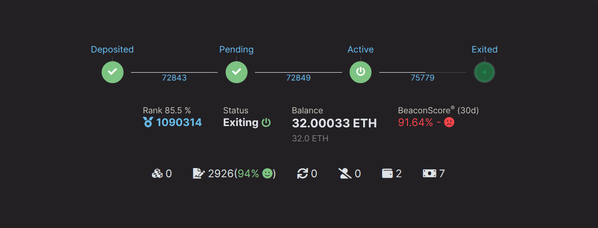

# Salir de un Validador Megapool

Si ya no deseas ejecutar un validador megapool y quieres acceder al saldo completo bloqueado en la Beacon Chain, deberás seguir
un par de pasos. Esta página sirve para guiarte a través del proceso de salida de un validador megapool.

1. Enviar una solicitud de salida voluntaria a la Beacon Chain (manual)
2. Notificar la salida del validador (automatizado por el Smart Node)
3. Notificar el saldo final (automatizado por el Smart Node)

## Enviar una Solicitud de Salida a la Beacon Chain

Para enviar una solicitud de salida a la Beacon Chain, usa el comando `rocketpool megapool exit-validator` en el Smart Node. Se te presentará una lista de validadores que pueden salir.

```
staker@node:~$ rocketpool megapool exit-validator

Please select a validator to EXIT:
1: ID: 1 - Index: 1269834 Pubkey: 0x9455594c2f02674922eb6dee40d096f3203dd1762aa7f1a988ab6c277a62418ec3abfb460b57f33f13a5922e9551d5cc
2: ID: 2 - Index: 1269835 Pubkey: 0xa188774e1adf42db768230541403347a8d2ebcd8386b7f5662bcf1004e17d8d53303889a7e527448cf29bff9bde34bb9
3: ID: 3 - Index: 1269851 Pubkey: 0xa3e211e95a542ffaf8467ba211a3d893b58c59204dab8c32df29f0cfda3f9ce485a3bc13a50e4c205f912613521ed203
4: ID: 7 - Index: 1274411 Pubkey: 0xb5369a5f8550daa07476378dc4864f08b74d4950e28c74844527b59b1e9dea9fd376ea3bd171ee8fba7de866cd4ea37e
5: ID: 8 - Index: 1275239 Pubkey: 0xa56660fa14f0cb7a7030ea0c68a075c7fd700d98ee3afb498030f2bafbadfbf29703bf8fe8ccc9e1f2332b96dcb51ee2
```

Una vez que hayas seleccionado un validador, el Smart Node hará un seguimiento con un prompt adicional. Confirma que has seleccionado el validador que tienes intención de salir, escribe `y` y luego presiona `enter` para enviar una solicitud de salida voluntaria a la Beacon Chain. Esta acción no requiere gas. Envía un mensaje firmado desde tu nodo a la Beacon Chain para salir voluntariamente del validador.

```
NOTE:
You are about to exit a validator. This will tell each validator to stop all activities on the Beacon Chain.
Please continue to run your validators until each one you've exited has been processed by the exit queue.
You can watch their progress on the https://beaconcha.in explorer.
Your funds will be locked on the Beacon Chain until they've been withdrawn, which will happen automatically (this may take a few days).
Once your funds have been withdrawn, you can run `rocketpool megapool notify-validator-exit` to distribute them to your withdrawal address.

Are you sure you want to EXIT validator id 1? [y/n]
y

Successfully requested to exit validator id 1.
```

Tu nodo envía una solicitud de salida voluntaria a la Beacon Chain. En este punto, tu validador debería estar en el estado `active_exiting` de la Beacon Chain. Puedes confirmar esto ejecutando el
comando `rocketpool megapool validators` y verificando el validador para el que acabas de solicitar la salida:

```

Megapool Validator ID:        1
Validator pubkey:             0x9455594c2f02674922eb6dee40d096f3203dd1762aa7f1a988ab6c277a62418ec3abfb460b57f33f13a5922e9551d5cc
Validator active:             yes
Validator index:              1269834
Beacon status:                active_exiting
Express Ticket Used:          no
```





::: tip NOTA
Tu validador continuará haciendo attestations hasta que sea procesado por la cola de salida de la Beacon Chain, ¡así que mantén tu nodo en línea durante este proceso! Podría tomar algunos días o más.
Este sitio web es bastante útil para verificar el tiempo actual de la cola: https://www.validatorqueue.com/
:::

## Notificar Salida del Validador

En la etapa anterior `active_exiting`, tu nodo estaba haciendo attestations mientras estaba sujeto a la cola de salida de la Beacon Chain. El tiempo varía dependiendo de
cuánto ETH está esperando para salir.

Después de que tu validador llega al final de esta cola, pasa al estado `exited_unslashed`. En esta etapa, tu Smart Node llamará automáticamente a `notify validator exit`, señalando
al protocolo Rocket Pool que tu validador ha salido y está casi disponible para retiro.

::: warning ADVERTENCIA
Este paso está completamente automatizado por el Smart Node dentro del bucle de tareas `rocketpool_node`. Es muy importante mantener tu nodo en línea durante el proceso, de lo contrario incurrirás en una multa de `0.05 ETH` por estar fuera de línea. La multa se descuenta
de tu saldo de retiro. Por favor monitorea el estado de tu nodo durante todo el proceso de salida del validador.
:::

```
Megapool Validator ID:        1
Validator pubkey:             0x9455594c2f02674922eb6dee40d096f3203dd1762aa7f1a988ab6c277a62418ec3abfb460b57f33f13a5922e9551d5cc
Validator active:             no
Validator index:              1269834
Beacon status:                exited_unslashed
Express Ticket Used:          no
```

El estado en beaconcha.in debería verse así:


Después de 256 épocas en la Beacon Chain, los 32 ETH completos junto con otras recompensas acumuladas serán enviados al megapool de tu nodo.

## Notificar Saldo Final

En este punto, tu validador ha salido completamente de la Beacon Chain y el retiro final se envía desde la Beacon Chain a tu megapool. Tu Smart Node llamará automáticamente a `notify final balance`.
Esta llamada finaliza completamente los deberes de tu validador megapool y también distribuye tu porción del saldo a la dirección de retiro de ETH de tu nodo. Si has mantenido tu nodo en línea y los deberes automáticos como `notify
validator exit` y `notify final balance` fueron realizados, no se requieren más pasos de tu parte.
