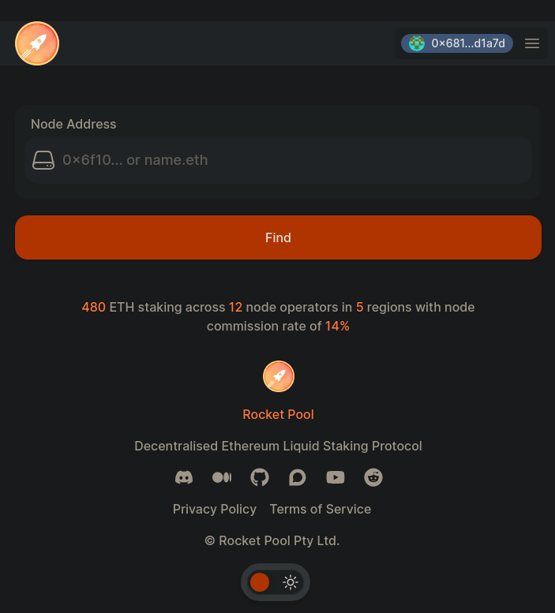

import { Tab, Tabs } from "@rspress/core/theme";
import mmNetwork from "./images/mm_network.png";
import mmNetworkMain from "./images/mm_network_main.png";

# Miser de l'ETH au nom d'un nœud

RPIP-32 permet à un compte de [miser de l'ETH au nom](https://rpips.rocketpool.net/RPIPs/RPIP-32) d'un nœud Rocket Pool enregistré dans le protocole. Cela prend en charge diverses situations où l'opérateur de nœud ne fournit pas directement l'ETH :

- Sécurité renforcée pour les opérateurs de nœuds, car ils peuvent miser directement depuis leur portefeuille matériel, éliminant le besoin de transférer des fonds au nœud au préalable.
- Fournisseurs de staking en tant que service où la garde des fonds est gérée par un dépositaire de confiance.
- Intégrations de protocole où la garde des fonds est gérée par des contrats intelligents.
- DAO ou organisations où la garde des fonds est gérée par une trésorerie.

Bien que l'objectif principal de cette fonctionnalité soit de faciliter les scénarios de déposant unique, il convient de noter que plusieurs déposants indépendants peuvent également tirer parti de cette capacité en créant des contrats intelligents superposés. Rocket Pool a également introduit la possibilité de [miser du RPL au nom](../../node-staking/create-validator#whitelisting-an-address-to-stake-on-behalf) d'un nœud lors de notre précédente version Atlas.

### Prérequis

Assurez-vous d'avoir correctement configuré [l'adresse de retrait principale](../../node-staking/prepare-node#setting-your-primary-withdrawal-address) du nœud que vous avez l'intention de financer. Suivez le lien ci-dessus pour un guide sur le fonctionnement des adresses de retrait après houston.

::: tip REMARQUE
Ne sautez pas cette étape ! Tous les ETH de caution/récompenses seront retirés vers l'adresse de retrait principale. En d'autres termes, l'adresse qui fournit l'ETH pour un nœud devrait être utilisée comme adresse de retrait principale ! Veuillez vous assurer que l'adresse de retrait principale du nœud est définie sur un portefeuille dont vous avez la garde.
:::

Le processus est légèrement différent pour le Hoodi Testnet et le Mainnet, alors choisissez le réseau qui vous intéresse dans les onglets ci-dessous.

<div className="p-3">
  <Tabs>
    <Tab label="Préparation sur le Hoodi Testnet">

      <p className="rspress-directive danger">
        <p className="rspress-directive-title">AVERTISSEMENT</p>
        Lors de la pratique du staking sur le réseau de test, vous **n'avez pas besoin de fournir vos vrais ETH** pendant ce processus.
        Vous recevrez **de faux ETH de test** à utiliser à la place.

        **N'essayez pas de déplacer vos vrais ETH du mainnet vers le testnet ou vous les perdrez définitivement !**
      </p>

      Commencez par installer [MetaMask](https://metamask.io/) si ce n'est pas déjà fait.
      Suivez les instructions sur leur site pour installer l'extension, créer un compte et vous connecter.

      Ensuite, ouvrez le panneau MetaMask en utilisant son icône dans la barre d'outils de votre navigateur.

      Vous devrez ajouter le Hoodi Testnet à MetaMask.

      Cliquez sur le menu déroulant en haut à gauche et cliquez sur le bouton "Ajouter un réseau".

      Vous verrez une liste de réseaux, Hoodi n'est pas dans cette liste alors cliquez sur le bouton "Ajouter un réseau manuellement".

      Remplissez les détails suivants :

      ```
      Nom du réseau : Hoodi
      Nouvelle URL RPC : https://rpc.hoodi.ethpandaops.io
      ID de chaîne : 560048
      Symbole de devise : ETH
      URL de l'explorateur de blocs : https://hoodi.etherscan.io
      ```

      Puis cliquez sur Enregistrer. Vous devriez maintenant voir le réseau Hoodi dans le menu déroulant en haut à gauche.

      Cliquez sur le **menu déroulant de réseau** en haut à gauche de l'extension Metamask et sélectionnez **Hoodi Test Network** :

      

      Maintenant que vous avez une adresse de portefeuille dans MetaMask, vous devez la remplir avec des ETH de test.
      Rendez-vous sur la page [Pratiquer avec le réseau de test](../../node-staking/testnet/overview#getting-test-eth-on-hoodi) pour un guide rapide sur l'utilisation d'un robinet testnet pour obtenir des ETH de test sur Hoodi.

      Une fois que vous avez des ETH Hoodi pour tester, rendez-vous sur [https://testnet.node.rocketpool.net/deposit-eth-on-behalf-of-node](https://testnet.node.rocketpool.net/deposit-eth-on-behalf-of-node).

      Si vous voyez un avis concernant un navigateur web3 requis, ou l'ID de réseau actuel non pris en charge, assurez-vous d'avoir correctement effectué les étapes précédentes avant de continuer.
    </Tab>
    <Tab label="Préparation sur l'Ethereum Mainnet">
      Commencez par installer [MetaMask](https://metamask.io/) si ce n'est pas déjà fait.

      Suivez les instructions sur leur site pour installer l'extension, créer un compte et vous connecter.

      Ensuite, ouvrez le panneau MetaMask en utilisant son icône dans la barre d'outils de votre navigateur.

      Cliquez sur le **menu déroulant de réseau** dans la barre d'outils en haut et assurez-vous que **Ethereum Mainnet** est sélectionné :

      

      Maintenant que vous avez une adresse de portefeuille dans MetaMask, vous devez y transférer des ETH.

      Vous devrez le fournir depuis un portefeuille existant ou acheter de l'ETH sur une plateforme d'échange.

      Une fois que vous avez de l'ETH à miser, rendez-vous sur [https://node.rocketpool.net/deposit-eth-on-behalf-of-node](https://node.rocketpool.net/deposit-eth-on-behalf-of-node).

      Si vous voyez un avis concernant un navigateur web3 requis, ou l'ID de réseau actuel non pris en charge, assurez-vous d'avoir correctement effectué les étapes précédentes avant de continuer.
    </Tab>

  </Tabs>
</div>

Une fois sur le site, cliquez sur le bouton **connecter le portefeuille**. Veuillez lire et accepter les Conditions d'utilisation et la Politique de confidentialité, cela activera différentes façons de se connecter, puis cliquez sur **connecter metamask**.

MetaMask vous invitera à sélectionner un compte à connecter au site web.
Choisissez-en un, confirmez quelques autorisations. Vous verrez un aperçu de vos soldes en cliquant sur l'icône du portefeuille située en haut à droite de la fenêtre.

À partir de là, vous voudrez saisir l'adresse du nœud pour lequel vous souhaitez déposer de l'ETH. La page devrait ressembler à ceci :



Allez-y et collez l'adresse souhaitée dans cette case et cliquez sur trouver. Dans cet exemple, nous utiliserons `0xd3e317806456102d19db283b4c2201f0ef41a296`


Dans la première case, entrez le montant d'ETH que vous souhaitez déposer au nom du nœud. La deuxième case indique l'adresse pour laquelle vous allez déposer de l'ETH. Veuillez vous assurer que vous avez saisi l'adresse et le dépôt corrects. Une fois satisfait, cliquez sur Déposer et MetaMask apparaîtra avec une fenêtre vous demandant de confirmer votre transaction.

Une fois que vous la confirmez, la transaction commencera.
Lorsqu'elle aura été incluse dans un bloc et ajoutée à la chaîne, votre délégué pourra utiliser la commande `rocketpool node status` dans smartnode pour voir le nouveau solde. Ce solde peut également être consulté via le site de staking Rocket Pool.

```
Le nœud a 0,000000 ETH dans son solde de crédit et 8,000000 ETH misés en son nom. 8,000000 peuvent être utilisés pour créer de nouveaux minipools.
```

::: warning REMARQUE
Si un opérateur de nœud dépose votre ETH dans un minipool, vous ne pourrez pas sortir de leur minipool sans accès à leurs informations d'identification de retrait, alors gardez cela à l'esprit ! Vous pouvez utiliser le site de staking Rocket Pool pour retirer l'ETH misé au nom d'un nœud s'il n'est pas utilisé dans un minipool.
:::

C'est tout !
Vous misez maintenant avec Rocket Pool.

# Retirer l'ETH misé au nom d'un nœud

<div className="p-3">
  <Tabs>
    <Tab label="Préparation sur le Hoodi Testnet">
      Lorsque vous êtes prêt à retirer l'ETH que vous avez misé au nom d'un nœud, rendez-vous sur [https://testnet.node.rocketpool.net/withdraw-eth](https://testnet.node.rocketpool.net/withdraw-eth).
      Après vous être connecté en tant [qu'adresse de retrait principale](../../node-staking/prepare-node#setting-your-primary-withdrawal-address) du nœud, vous devriez être accueilli par un menu
      familier. On vous demandera de saisir l'adresse du nœud duquel vous souhaitez retirer :
    </Tab>
    <Tab label="Préparation sur l'Ethereum Mainnet">
      Lorsque vous êtes prêt à retirer l'ETH que vous avez misé au nom d'un nœud, rendez-vous sur [https://node.rocketpool.net/withdraw-eth](https://node.rocketpool.net/withdraw-eth). Après vous être
      connecté en tant [qu'adresse de retrait principale](../../node-staking/prepare-node#setting-your-primary-withdrawal-address) du nœud, vous devriez être accueilli par un menu familier. On vous
      demandera de saisir l'adresse du nœud duquel vous souhaitez retirer :
    </Tab>
  </Tabs>
</div>


Après avoir saisi une adresse, cliquer sur "Trouver" vous amènera au menu suivant où vous pourrez retirer l'ETH que vous avez misé au nom de ce nœud.


Vous pourrez voir combien d'ETH est disponible pour le retrait en haut à droite. Après avoir saisi la quantité souhaitée et confirmé l'adresse du nœud, cliquez sur le bouton orange **Retirer ETH** pour envoyer la transaction au réseau.

Une fois la transaction confirmée, vous verrez les soldes appropriés dans votre compte !

C'est tout ce qu'il y a à faire pour miser de l'ETH au nom d'un nœud ! Nous espérons que vous avez trouvé le processus rapide et facile.

N'hésitez pas à passer sur [notre serveur Discord](https://discord.gg/G46XgK264a) pour nous faire savoir ce que vous en pensez et suivre l'évolution du projet.
