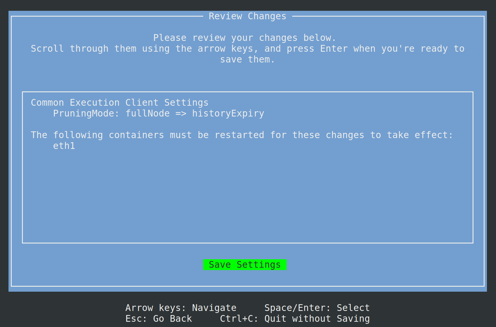

import { Tab, Tabs } from "@rspress/core/theme";

# Expiration de l'Historique du Client d'Exécution

Les clients d'exécution peuvent supprimer les anciens corps de blocs et reçus afin que les données de la chaîne conservent une taille gérable. Le paramètre **Pruning Mode** du Smartnode (Execution Client → Pruning Mode) contrôle ce comportement.

**Rolling History Expiry** est l'option par défaut. Nethermind, Besu, Reth et Erigon suppriment les corps et reçus datant de plus d'un an environ. Geth n'implémente pas encore ce mode et utilise à la place l'expiration de l'historique antérieure à Prague.

Les autres choix :

- **History Expiry** — supprime uniquement les corps et reçus _pré-fusion_ (expiration partielle [EIP-4444](https://eips.ethereum.org/EIPS/eip-4444)). Erigon ne prend pas en charge l'expiration limitée au pré-fusion.
- **Full node** — conserve les données habituelles d'un nœud complet, y compris les corps et les reçus. Le mode nœud complet d'Erigon conserve les reçus.
- **Archive** — conserve l'historique et l'état historique (ce qui nécessite beaucoup plus d'espace disque).

N'hésitez pas à lire cette présentation de l'expiration partielle de l'historique : https://blog.ethereum.org/2025/07/08/partial-history-exp

::: tip NOTE

Les nouvelles installations utilisent déjà Rolling History Expiry. Si vous aviez précédemment choisi un autre Pruning Mode, sélectionnez **Rolling History Expiry** dans le TUI et **resynchronisez** le client d'exécution pour que le changement prenne effet.

- **Nethermind, Reth et Erigon** — resynchronisez après avoir changé de mode (`rocketpool service resync-eth1`).
- **Geth** — élaguez avec `rocketpool service prune-eth1` ou resynchronisez ; Geth utilise toujours l'expiration antérieure à Prague plutôt que l'expiration glissante d'un an.
- **Besu** — reste en ligne.

:::

Les étapes suivantes pour supprimer l'historique pré-fusion sont uniquement pour les nœuds en mode Docker. Si vous utilisez un client externe en mode Hybride ou en mode Natif, veuillez vous référer à la documentation fournie par votre client d'exécution.

Commencez par ouvrir le gestionnaire de paramètres :

```shell
rocketpool service config
```

Pour modifier le mode d'élagage du client d'exécution, accédez au menu `Execution Client (ETH1)` et sélectionnez le paramètre `History Expiry` dans le menu déroulant pour `Pruning Mode`

Choisissez **Rolling History Expiry** sauf si vous avez une raison de conserver davantage d'historique.


Une fois que vous avez fait la sélection, appuyez sur `échap` pour revenir au menu principal, puis appuyez sur `tab` pour mettre en surbrillance le bouton `Review Changes and Save`. Appuyez sur la touche `entrée` pour continuer. Un menu s'affichera pour prévisualiser les modifications apportées aux paramètres de votre client d'exécution.



Appuyez sur la touche `entrée` sur `Save Settings` pour enregistrer et quitter le gestionnaire de paramètres, puis entrez `y` pour redémarrer votre conteneur `rocketpool_eth1`.

```shell
Your changes have been saved!
The following containers must be restarted for the changes to take effect:
	rocketpool_eth1
Would you like to restart them automatically now? [y/n]
```

À partir de ce moment, les étapes diffèrent selon le client d'exécution que vous utilisez :

<div className="p-3">
  <Tabs>

        <Tab label="Nethermind">
        Les nœuds Nethermind nécessitent une resynchronisation complète pour supprimer l'historique pré-fusion. Vous devez resynchroniser votre client d'exécution après avoir enregistré le paramètre `History Expiry` et redémarré votre conteneur `eth1`.

        ::: warning WARNING
        Si vous n'avez pas configuré de nœud de secours, votre nœud cessera de valider pendant une resynchronisation. Un nœud de secours permettra à votre nœud principal de continuer à attester et à proposer des blocs pendant un élagage ou une resynchronisation. Cliquez [ici](/fr/node-staking/fallback) pour apprendre comment configurer un nœud de secours.
        :::

        Utilisez la commande suivante pour resynchroniser votre client d'exécution :
        ```shell
        rocketpool service resync-eth1
        ```

        Vous êtes prêt ! Le nœud ne stockera plus les données pré-fusion, améliorant considérablement la faisabilité d'installer un nœud sur un disque de 2 To. Nous vous recommandons de surveiller la progression à l'aide de la commande suivante.
        ```shell
        rocketpool service logs eth1
        ```

    </Tab>

    <Tab label="Geth">

        Les nœuds Geth nécessitent un élagage hors ligne pour supprimer l'historique pré-fusion. Vous devez élaguer votre client d'exécution après avoir enregistré le paramètre `History Expiry` et redémarré votre conteneur `eth1`. Alternativement, vous pouvez choisir d'effectuer une resynchronisation complète pour supprimer l'historique pré-fusion.

        ::: tip NOTE
        Nous recommandons l'élagage plutôt qu'une resynchronisation complète. Si vous souhaitez repartir de zéro avec une nouvelle base de données Geth ou si vous avez un problème avec l'élagage, vous pouvez resynchroniser le client d'exécution en utilisant `rocketpool service resync-eth1`. Les deux options devraient aboutir à l'expiration de l'historique pré-fusion.
        :::

        ::: warning WARNING
        Si vous n'avez pas configuré de nœud de secours, votre nœud cessera de valider pendant un élagage ou une resynchronisation. Un nœud de secours permettra à votre nœud principal de continuer à attester et à proposer des blocs pendant un élagage ou une resynchronisation. Cliquez [ici](/fr/node-staking/fallback) pour apprendre comment configurer un nœud de secours.
        :::

        Veuillez exécuter la commande suivante pour élaguer votre client d'exécution :
        ```shell
        rocketpool service prune-eth1
        ```
        Vous pouvez cliquer [ici](/fr/node-staking/pruning#démarrer-un-élagage) pour en savoir plus sur l'élagage.

        Vous êtes prêt ! Le nœud ne stockera plus les données pré-fusion, améliorant considérablement la faisabilité d'installer un nœud sur un disque de 2 To. Nous vous recommandons de surveiller la progression à l'aide de la commande suivante.
        ```shell
        rocketpool service logs eth1
        ```

    </Tab>

    <Tab label="Besu">

        Vous êtes prêt ! Les nœuds Besu effectueront un élagage en ligne tout en continuant à attester et à proposer des blocs. Le nœud ne stockera plus les données pré-fusion, améliorant considérablement la faisabilité d'installer un nœud sur un disque de 2 To. Nous vous recommandons de surveiller la progression à l'aide de la commande suivante.
        ```shell
        rocketpool service logs eth1
        ```

    </Tab>

    <Tab label="Reth">

        Vous êtes prêt ! Les nœuds Reth effectueront un élagage en ligne tout en continuant à attester et à proposer des blocs. Sur le Mainnet, avec Rolling History Expiry sélectionné, Reth télécharge l'instantané officiel d'historique glissant au premier démarrage. Le nœud ne stockera plus les données pré-fusion, améliorant considérablement la faisabilité d'installer un nœud sur un disque de 2 To. Nous vous recommandons de surveiller la progression à l'aide de la commande suivante.
        ```shell
        rocketpool service logs eth1
         ```

    </Tab>

    <Tab label="Erigon">
        Les nœuds Erigon nécessitent une resynchronisation complète pour appliquer Rolling History Expiry. Vous devez resynchroniser votre client d'exécution après avoir enregistré le paramètre Pruning Mode et redémarré votre conteneur `eth1`.

        Utilisez la commande suivante pour resynchroniser votre client d'exécution :
        ```shell
        rocketpool service resync-eth1
        ```

        Vous êtes prêt ! Le nœud supprimera les corps et reçus datant de plus d'un an environ. Nous vous recommandons d'utiliser le Rescue Node pendant la resynchronisation et de surveiller la progression à l'aide de la commande suivante.
        ```shell
        rocketpool service logs eth1
        ```

    </Tab>

  </Tabs>
</div>
