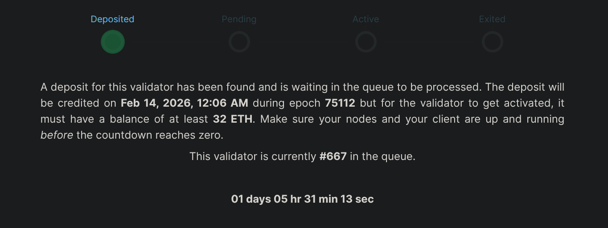

# Créer un Megapool (Validateur)

Bienvenue sur Saturn 1 ! Un megapool Rocket Pool est une instance de contrat intelligent sur la couche d'exécution.
Votre nœud gérera un megapool qui sert d'adresse de retrait Ethereum pour un ou plusieurs validateurs.
Chaque validateur est composé d'une partie de votre ETH, appelée le montant de bond, et d'une partie d'ETH provenant du pool de staking rETH,
appelée le montant emprunté. Votre megapool est responsable de fusionner le montant de bond et le montant emprunté pour former un total de 32 ETH, qui est
ensuite envoyé au contrat de dépôt de la Beacon Chain pour créer un nouveau validateur.

Votre megapool est automatiquement déployé au moment de votre premier dépôt de validateur. Ensuite, vous pourrez utiliser le même megapool pour gérer autant de validateurs que vous le souhaitez ! Vous n'aurez pas
besoin de déployer un nouveau megapool à chaque fois que vous créez un nouveau validateur.

::: tip NOTE
Les temps d'activation de la file d'attente des validateurs de la Beacon Chain (et de sortie) peuvent varier considérablement en fonction de l'état actuel du réseau.

Cela est hors du contrôle de Rocket Pool et est une fonction de la Beacon Chain elle-même.

L'outil suivant fournit une bonne estimation du temps d'attente :
[https://www.validatorqueue.com/](https://www.validatorqueue.com/)

Veuillez consulter cet outil pour avoir une idée du temps d'attente avant que votre validateur ne devienne actif.
:::

::: tip NOTE

La création de validateurs est régie par deux files d'attente.

1. La première est la file d'attente de dépôt Rocket Pool. Nous y reviendrons dans une autre section, mais cette file est essentiellement gérée par le protocole Rocket Pool et détermine quand votre validateur recevra son ETH emprunté.
   Il doit y avoir des ETH disponibles dans le pool de dépôt pour associer votre 4 ETH avec 28 ETH du pool de dépôt et créer le validateur.

2. La seconde est la file d'attente de la Beacon Chain, gérée par la Beacon Chain Ethereum, qui détermine quand votre validateur deviendra actif.
   Veuillez noter que le temps nécessaire pour que votre validateur devienne actif peut varier considérablement selon votre position dans chaque file d'attente et l'état actuel du réseau.

La file d'attente de dépôt Rocket Pool dispose d'un système de file express pour aider les opérateurs de nœuds existants à migrer leur ETH de validateur minipool
vers de l'ETH de validateur megapool.

:::

## File d'attente de dépôt Rocket Pool et file express

Il existe deux types de files d'attente au sein de la file d'attente de dépôt Rocket Pool : la file express et la file standard.

La file d'attente de dépôt dispose d'un système de file express pour aider les opérateurs de nœuds existants à migrer leur ETH de validateur minipool
vers de l'ETH de validateur megapool. Elle crée également des délais de dépôt plus prévisibles pour les dépôts utilisant la file express.

La file express est traitée selon un ratio de 4:1, ce qui signifie que 4 validateurs de la file express sont associés pour chaque validateur associé depuis
la file standard. En d'autres termes : 4 validateurs de la file express sont associés, puis 1 de la file standard, puis 4 de la file express, et ainsi de suite.

Les opérateurs de nœuds existants reçoivent des tickets de file express basés sur leur ETH bondé dans les anciens minipools : un ticket pour chaque 4 ETH bondés.
Par exemple, un opérateur de nœud avec un ancien minipool de 8 ETH obtient 2 tickets de file express. C'est suffisant pour migrer complètement vers deux validateurs megapool de 4 ETH en utilisant la file express.
[RPIP-59: Deposit Mechanics](https://rpips.rocketpool.net/RPIPs/RPIP-59#deposit-queue) entre dans les détails du traitement des dépôts.

Votre nœud sera remboursé d'un ticket de file express si vous choisissez de [retirer votre validateur de la file express](/fr/node-staking/megapools/create-megapool-validator#sortir-un-validateur-de-la-file-dattente-de-dépôt-rocket-pool).

## Déposer de l'ETH et créer un validateur

S'il s'agit du premier validateur megapool de votre nœud, le megapool de votre nœud sera également automatiquement déployé en même temps. N'oubliez pas que le Megapool de votre nœud peut
gérer un ou plusieurs validateurs, donc le déploiement du megapool n'a lieu qu'une seule fois par nœud !

Une fois que vous êtes prêt à déposer votre ETH dans un megapool et à créer un validateur sur la Beacon Chain, vous pouvez le faire avec la commande suivante :

```
rocketpool megapool deposit
```

::: danger AVERTISSEMENT

Bien que le CLI automatise beaucoup des prochaines étapes pour vous, nous recommandons <strong>vivement</strong> de surveiller votre nœud et vos transactions pour garantir une transition réussie de `prelaunch` à `staking`.

Des transactions échouées (en raison de paramètres de gas ajustés, d'ETH insuffisant pour le gas, ou du nœud hors ligne pendant 28 jours après le dépôt initial) pourraient faire passer votre validateur megapool à l'état `dissolved`, ce que vous souhaitez éviter.

Si un validateur en prelaunch ne parvient pas à staker dans les 28 jours, le validateur sera dissous. Le 1 ETH (sur un bond de 4 ETH) envoyé à la Beacon Chain pendant le processus de prelaunch n'est **pas récupérable**.
L'opérateur de nœud reçoit un [crédit](/fr/node-staking/megapools/credit) pour les 3 ETH restants de son bond, avec une pénalité de dissolution de 0,05 ETH appliquée en dette. Le crédit net pour un validateur dissous est de 2,95 ETH.

[En savoir plus sur la confirmation d'un stake réussi](/fr/node-staking/megapools/create-megapool-validator#confirmer-un-stake-réussi)

:::

La première invite vous demandera combien de validateurs vous souhaitez créer. Vous pouvez en créer jusqu'à 35 dans le même dépôt, mais nous utiliserons 1 validateur
pour le reste de cette démonstration. Tapez `1` puis appuyez sur `entrée` pour commencer à créer 1 validateur.

```
Your eth2 client is on the correct network.

How many validators would you like to create? (max: 35)
1
```

La deuxième invite affichera quelques informations sur le montant d'ETH actuellement bondé par votre nœud, ainsi que
l'exigence de bond total pour le nombre de validateurs sélectionnés. Le nœud de notre démonstration n'a pas de
validateurs megapool, d'où `0.00 ETH bonded`. L'exigence de bond actuelle est de `4 ETH`.
Après avoir lu et compris les informations affichées, tapez `y` puis appuyez sur `entrée` pour passer à l'invite suivante.

```
The node is currently bonded with 0.00 ETH.
The total bond requirement is 4.00 ETH.

NOTE: You are about to create 1 new megapool validator(s), requiring a total of: 4.00 ETH.
Would you like to continue? [y/n]
y
```

L'invite suivante affichera l'état de la [file d'attente de dépôt Rocket Pool](/fr/node-staking/megapools/create-megapool-validator#file-dattente-de-dépôt-rocket-pool-et-file-express).
Cela montre combien de validateurs attendent avant vous d'être associés avec des ETH. La file express est principalement destinée aux opérateurs de nœuds déjà existants, car les nouveaux nœuds n'auront pas de tickets de
file express. `The express queue rate is 4` signifie que 4 validateurs de la file express sont associés pour chaque validateur dans la file standard.

```
There are 1 validator(s) on the express queue.
There are 12 validator(s) on the standard queue.
The express queue rate is 4 (4 express validators assigned per 1 standard).
A new express validator would be at queue position 3.
A new standard validator would be at queue position 14.
```

::: tip NOTE
Si vous êtes un opérateur de nœud revenant et que vous avez des tickets de file express disponibles pour ce dépôt, vous serez invité à les utiliser à ce stade.
Entrez `1` puis appuyez sur `entrée` pour procéder en utilisant un ticket de file express pour ce dépôt unique de validateur megapool.

```
How many express tickets would you like to use? (max: 7)
1
```

Si vous souhaitez conserver vos tickets de file express et procéder dans la file standard, tapez simplement `0` puis appuyez sur `entrée` pour passer à l'invite suivante.
:::

Si vous avez un [crédit de dépôt](/fr/node-staking/megapools/credit) à utiliser sur un validateur, vous serez invité à le faire ici. Sinon, cette étape vous affichera
les suggestions de prix de gas actuelles du réseau.

```
Your credit balance is 0.00 ETH. (Credit in addition to ETH staked on your behalf).
Your consensus client is synced, you may safely create a megapool validator.
+================ Suggested Gas Prices ================+
| Avg Wait Time |   Max Fee    |     Total Gas Cost     |
| 15 Seconds    | 2.13120 gwei | 0.00160 to 0.00240 ETH |
| 1 Minute      | 1.96787 gwei | 0.00148 to 0.00222 ETH |
| 3 Minutes     | 1.00871 gwei | 0.00075 to 0.00113 ETH |
| >10 Minutes   | 1.00871 gwei | 0.00075 to 0.00113 ETH |
+======================================================+

These prices include a maximum priority fee of 0.010 gwei.
Please enter your max fee (including the priority fee) or leave blank for the default of 1.96787 gwei:

```

Après avoir confirmé votre prix de gas, nous effectuerons une dernière et ultime confirmation pour créer un validateur megapool.

```
Using a max fee of 1.968 gwei and a priority fee of 0.010 gwei.
You are about to deposit 4.000000 ETH to create 1 new megapool validator(s).
ARE YOU SURE YOU WANT TO DO THIS?
 [y/n]
y

Creating 1 megapool validator(s) ...
Transaction has been submitted with hash <tx-hash>.
You may follow its progress by visiting:
https://hoodi.etherscan.io/tx/<tx-hash>

Waiting for the transaction to be included in a block... you may wait here for it, or press CTRL+C to exit and return to the terminal.

The node deposit of 4.000000 ETH total was made successfully!
Validator pubkeys:
  1. <beacon-pubkey>

The 1 new megapool validators have been created.
Once your validators progress through the queue, ETH will be assigned and a 1 ETH prestake submitted for each.
After the prestake, your node will automatically perform a stake transaction for each validator, to complete the progress.
To check the status of your validators use `rocketpool megapool validators`
To monitor the stake transactions use `rocketpool service logs node`

```

Une fois la transaction terminée, vous aurez une confirmation de votre dépôt
sous forme de hash de transaction etherscan ainsi que la clé publique Beacon Chain attendue une fois que votre validateur megapool sera en ligne. N'hésitez pas à utiliser la commande `rocketpool megapool status` pour
vérifier l'état de votre megapool, ou `rocketpool megapool validators` pour vérifier l'état de votre validateur spécifique. Votre validateur sera dans l'état
`initialized` pendant sa progression dans la file d'attente de dépôt Rocket Pool. Veuillez garder à l'esprit que la clé publique de votre validateur megapool ne sera enregistrée sur la Beacon Chain qu'après avoir été
traitée par la file d'attente de dépôt Rocket Pool et l'attribution d'ETH.

À ce stade, vous y êtes ! Félicitations pour votre validateur megapool. Vous voudrez certainement consulter la section [Surveillance et maintenance](/fr/node-staking/maintenance/overview)
de nos guides pour apprendre à maintenir votre nœud dans le meilleur état possible. Continuez également à lire la section suivante sur la confirmation d'un stake réussi pour vous assurer
que votre validateur `initialized` passe sans encombre à l'état `staking` sans subir de pénalités.

## Confirmer un stake réussi

::: danger AVERTISSEMENT

Bien que le CLI automatise beaucoup des prochaines étapes pour vous, nous recommandons <strong>vivement</strong> de surveiller votre nœud et vos transactions pour garantir une transition réussie de `prelaunch` à `staking`.

Des transactions échouées (en raison de paramètres de gas ajustés, d'ETH insuffisant pour le gas, ou du nœud hors ligne pendant 28 jours après le dépôt initial) pourraient faire passer votre validateur megapool à l'état `dissolved`, ce que vous souhaitez éviter.

Si un validateur en prelaunch ne parvient pas à staker dans les 28 jours, le validateur sera dissous. Le 1 ETH (sur un bond de 4 ETH) envoyé à la Beacon Chain pendant le processus de prelaunch n'est **pas récupérable**.
L'opérateur de nœud reçoit un [crédit](/fr/node-staking/megapools/credit) pour les 3 ETH restants de son bond, avec une pénalité de dissolution de 0,05 ETH appliquée en dette. Le crédit net pour un validateur dissous est de 2,95 ETH.

:::

Assurez-vous que votre nœud reste en ligne tout au long de ce processus ! Il effectuera plusieurs étapes entièrement automatiques pour garantir que votre validateur progresse en douceur
entre les différentes étapes expliquées ci-dessous :

Votre nouveau validateur megapool sera dans l'état `initialized`. Il restera dans cet état jusqu'à ce qu'il progresse dans la file d'attente de dépôt Rocket Pool
et reçoive 28 ETH du pool de dépôt. Utilisez la commande `rocketpool megapool validators` pour vérifier l'état de votre validateur. Cela devrait ressembler à ceci :

```
1 Initialized validator(s):

--------------------

Megapool Validator ID:        7
Expected pubkey:              <expected-pubkey>
Validator active:             no
Validator Queue Position:     14
Express Ticket Used:          no
```

Une fois que votre validateur reçoit des ETH de la [file d'attente de dépôt Rocket Pool](/fr/node-staking/megapools/create-megapool-validator#file-dattente-de-dépôt-rocket-pool-et-file-express), il sera déplacé dans l'état `Prelaunch`. À ce stade, 1 ETH de votre solde megapool sera déposé
sur la Beacon Chain. La clé publique de votre validateur sera également enregistrée sur la Beacon Chain, ce qui signifie que vous pouvez voir l'état de votre validateur `Prelaunch` sur un explorateur tel que https://beaconcha.in/ (ou https://hoodi.beaconcha.in/ si vous utilisez le testnet).
Vous pouvez observer votre validateur en recherchant la clé publique sur https://beaconcha.in/ ou en visitant ce lien au format : `https://beaconcha.in/validator/<votre-clé-publique-validateur>`

```
1 Prelaunch validator(s):

--------------------

Megapool Validator ID:        7
Validator pubkey:             <pubkey>
Validator active:             no
Express Ticket Used:          no

```


Après que votre validateur `Prelaunch` est traité par la Beacon Chain et que le dépôt initial de 1 ETH est crédité, votre nœud effectuera automatiquement une transaction `stake` pour compléter le
dépôt complet de 32 ETH sur la Beacon Chain. La transaction `stake` fera progresser votre validateur `Prelaunch` vers un validateur `Staking`. À ce stade, votre validateur `Staking` a : - 32 ETH
déposés sur la Beacon Chain - Un numéro d'index de validateur attribué - Activation en attente sur la Beacon Chain

```
1 Staking validator(s):

Megapool Validator ID:        1
Validator pubkey:             <pubkey>
Validator active:             no
Validator index:              <index>
Beacon status:                pending_queued
Express Ticket Used:          no

```


L'état actuel de la file d'attente des validateurs de la Beacon Chain peut être consulté ici : https://www.validatorqueue.com/. Une fois que votre validateur `Staking` est activé sur la Beacon Chain, vous verrez
`Beacon status:                active_ongoing` dans le menu `rocketpool megapool validators` pour confirmer qu'il a été activé et est prêt à effectuer des attestations.

```
1 Staking validator(s):

--------------------

Megapool Validator ID:        0
Validator pubkey:             <pubkey>
Validator active:             yes
Validator index:              <index>
Beacon status:                active_ongoing
Express Ticket Used:          no
```


À ce stade, vous êtes prêt ! Félicitations ! Vous avez officiellement créé un validateur megapool avec Rocket Pool ! Consultez les guides [Surveillance et maintenance](/fr/node-staking/maintenance/overview)
pour apprendre à surveiller votre nœud et à le maintenir en parfait état.

## Sortir un validateur de la file d'attente de dépôt Rocket Pool

Si vous avez un validateur en attente dans la file (express OU standard) et souhaitez quitter la file, vous pouvez le faire ! Votre dépôt de 4 ETH sera remboursé
sous forme de crédit échangeable contre un montant équivalent en rETH. Les étapes sont assez simples :

Commencez par vérifier `rocketpool megapool validators` pour déterminer quel validateur retirer de la file. Assurez-vous que
le validateur que vous retirez est dans l'état `Initialized`. Notez sa clé publique. Après que votre validateur a reçu des ETH, vous ne pourrez plus le retirer de la file.

```
1 Initialized validator(s):

--------------------

Megapool Validator ID:        6
Expected pubkey:              <beacon-pubkey>
Validator active:             no
Validator Queue Position:     14
Express Ticket Used:          no
```

Utilisez la commande suivante pour sortir un validateur de la file, puis procédez à la sélection :

```
staker@node:~$ rocketpool megapool exit-queue

Please select a validator to exit the queue:
1: Pubkey: <beacon-pubkey>
```

Une fois votre sélection effectuée et après avoir confirmé que votre validateur a quitté la file d'attente de dépôt Rocket Pool, vous pouvez utiliser la commande suivante pour échanger le crédit en rETH :

```
staker@node:~$ rocketpool node withdraw-credit

You have 4.000000 ETH of credit that you can withdraw, receiving the equivalent amount in rETH. Would you like to withdraw the maximum amount of credit? [y/n]
```

Et voilà ! Si vous souhaitez déposer un autre validateur, ce crédit est également échangeable comme dépôt de validateur en plus d'être échangeable en rETH.
Si vous avez utilisé un ticket de file express sur votre validateur retiré (défilé), votre nœud sera remboursé de ce ticket de file express.

## Créer plusieurs validateurs megapool

Le megapool de votre nœud peut gérer autant de validateurs que vous le souhaitez. Si vous souhaitez créer un validateur supplémentaire (ou créer plusieurs validateurs dans la même transaction pour économiser sur les frais de transaction),
vous pouvez le faire en utilisant la commande `rocketpool megapool deposit`. Compte tenu de la limite de gas actuelle des blocs, le nombre maximum de validateurs que vous pouvez créer en une transaction est de 35.

## Prochaines étapes

Maintenant que vous avez un validateur megapool opérationnel, les prochaines étapes vous guideront sur la façon de surveiller la santé de votre nœud, de vérifier et appliquer les mises à jour, et de le maintenir tout au long de sa vie.

Veuillez lire la section [Surveillance et maintenance](/fr/node-staking/maintenance/overview) pour en savoir plus sur ces sujets.
