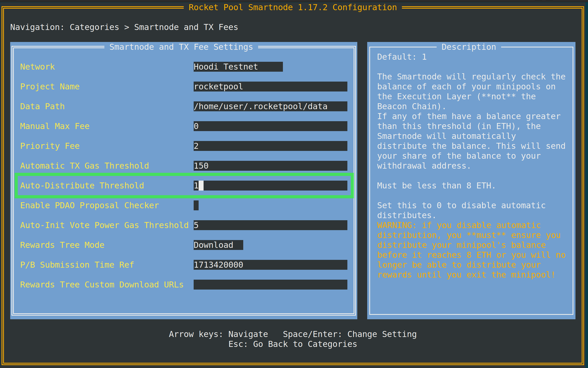

# Distribution des Récompenses Prélevées

Les récompenses ETH que vous recevez pour l'exécution d'un validateur pour Ethereum sont régulièrement envoyées à vos minipools dans un processus appelé "skimming".
La fréquence des prélèvements dépend du nombre de validateurs actifs sur la Beacon Chain. Au moment de la rédaction, le nombre de validateurs est d'environ
500 000, ce qui entraîne un prélèvement environ tous les 2-3 jours.

Les récompenses prélevées s'accumuleront dans chacun de vos minipools jusqu'à ce que vous les "distribuiez". Ce processus distribue les récompenses prélevées entre vous, en tant qu'opérateur de nœud, et les détenteurs de rETH
en fonction de votre taux de commission et du ratio d'ETH fourni et apporté.

::: warning REMARQUE
Afin d'accéder au solde de votre minipool, vous devrez d'abord passer au [délégué Atlas](./minipools/delegates).
L'ancien délégué Redstone ne peut pas être utilisé pour distribuer le solde du minipool.
:::

## Distribution Automatique

Par défaut, le Smartnode est configuré pour distribuer automatiquement n'importe lequel de vos minipools lorsque leurs soldes individuels atteignent **1 ETH**. Ce
seuil peut être configuré dans le TUI en suivant les étapes ci-dessous.

Exécutez :

```shell
rocketpool service config
```

Accédez au paramètre `Smartnode and TX Fee Settings > Auto Distribute Threshold` illustré ci-dessous.



Modifier ce paramètre ajustera le seuil auquel le Smartnode distribuera automatiquement vos minipools.
Définir le paramètre à 0 désactivera les distributions automatiques.

::: warning AVERTISSEMENT
Si vous décidez de désactiver la distribution automatique, il est important que vous effectuiez toujours une distribution manuelle régulièrement.
Lisez la [section distribution manuelle](#manual-distribution) qui suit pour savoir comment faire.

Après une longue période de temps, vos récompenses prélevées peuvent dépasser 8 ETH. Si cette situation se produit, vous ne pourrez plus
les distribuer et devrez sortir votre validateur pour accéder à vos récompenses accumulées.

Rocket Pool dispose d'une conception de sécurité intégrée qui permet à quiconque, après une longue période d'attente, de distribuer votre minipool lorsque
son solde dépasse 8 ETH. Pour protéger votre capital, le Smartnode surveille cette situation et sortira automatiquement
votre minipool si cela se produit.
:::

## Distribution Manuelle

Si vous avez désactivé la distribution automatique des récompenses prélevées, vous devrez les distribuer vous-même régulièrement
avec le processus suivant.

Vous pouvez également distribuer manuellement vos récompenses en utilisant ce processus à tout moment sans attendre le processus automatique ci-dessus.

Si votre minipool contient moins de 8 ETH, vous pouvez distribuer vos récompenses en utilisant la commande suivante :

```shell
rocketpool minipool distribute-balance
```

Cela vous montrera les minipools que vous avez qui sont éligibles à la distribution, combien d'ETH ils ont, et combien d'ETH vous (l'opérateur de nœud) recevrez :

```
WARNING: The following minipools are using an old delegate and cannot have their rewards safely distributed:
	0x7E5703fdA638CD86c316B9EbAF76927fF695ADC5
	0x7E5704aD2a63eb90880426Dcd4a3811246dF3cB0
	0x7E5705c149D11efc951fFc20349D7A96bc6b819C
	0x7E570625cE8F586c90ACa7fe8792EeAA79751778

Please upgrade the delegate for these minipools using `rocketpool minipool delegate-upgrade` in order to distribute their ETH balances.

Please select a minipool to distribute the balance of:
1: All available minipools
2: 0x7E5700bcd65B1770bA68abB288D3f53814d376aC (0.112307 ETH available, 0.031200 ETH goes to you plus a refund of 0.024419 ETH)
3: 0x7E570195026dC29f4B2DfF08B56c3b5D0FF988Ef (0.070754 ETH available, 0.000481 ETH goes to you plus a refund of 0.069399 ETH)
4: 0x7e5702a2cE66B5B35E59B9Ac00eEAAa547881e40 (0.122064 ETH available, 0.070187 ETH goes to you plus a refund of 0.000000 ETH)
5: 0x7E5700c82E38434C6c72890bb82f5B5305f4328a (0.102739 ETH available, 0.000000 ETH goes to you plus a refund of 0.000000 ETH)
6: 0xffCAB546539b55756b1F85678f229dd707328A2F (0.070989 ETH available, 0.025201 ETH goes to you plus a refund of 0.000000 ETH)
```

Tous les minipools utilisant le délégué de lancement d'origine seront mentionnés au début, vous informant que vous ne pouvez pas appeler `distribute-balance` sur eux jusqu'à ce que vous mettiez à niveau leurs délégués.
Ce délégué a été écrit avant que les retraits prélevés ne soient spécifiés et, en tant que tel, ne dispose pas d'un moyen de distribuer les récompenses prélevées.

Notez que pour les minipools éligibles, le **montant de remboursement** vous est également affiché.
Il s'agit d'un montant qui vous est dû directement (par exemple, parce que vous aviez un solde dans votre minipool avant de [migrer d'une caution de 16 ETH vers une caution de 8 ETH](./leb-migration.mdx) ou que vous avez [converti un validateur solo en minipool](./solo-staker-migration) avec des récompenses existantes).
Il ne sera pas partagé avec les détenteurs de rETH.

Entrez le numéro du minipool que vous souhaitez distribuer.
Vous serez invité avec le tableau des prix du gaz comme d'habitude, et demandé de confirmer votre décision.
Une fois que vous l'aurez fait, le solde de votre minipool sera distribué :

```
Using a max fee of 2.00 gwei and a priority fee of 2.00 gwei.
Are you sure you want to distribute the ETH balance of 1 minipools? [y/n]
y

Distributing balance of minipool 0x7E5700bcd65B1770bA68abB288D3f53814d376aC...
Transaction has been submitted with hash 0xb883eab903d9688b40d291c5c2030084f9bce19135837ebf96a5c1e8871cfbf9.
Waiting for the transaction to be included in a block... you may wait here for it, or press CTRL+C to exit and return to the terminal.

Successfully distributed the ETH balance of minipool 0x7E5700bcd65B1770bA68abB288D3f53814d376aC.
```

Comme vous pouvez le voir [d'après la transaction](https://zhejiang.beaconcha.in/tx/b883eab903d9688b40d291c5c2030084f9bce19135837ebf96a5c1e8871cfbf9), cela a fourni à l'adresse de retrait du nœud sa part des récompenses (plus le montant de remboursement) et a retourné le reste au pool de staking.
