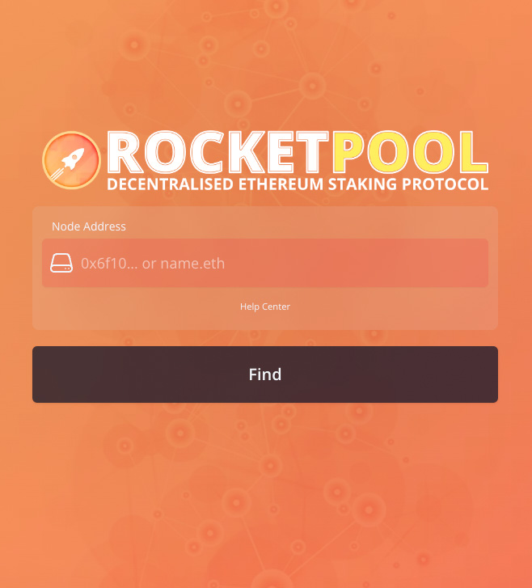
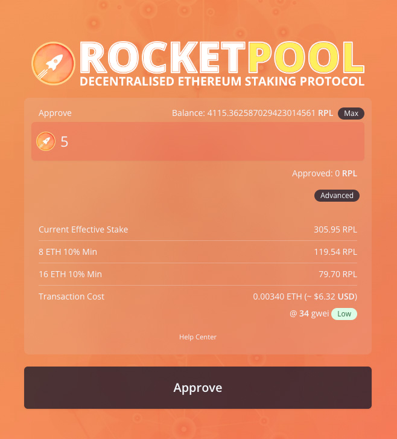
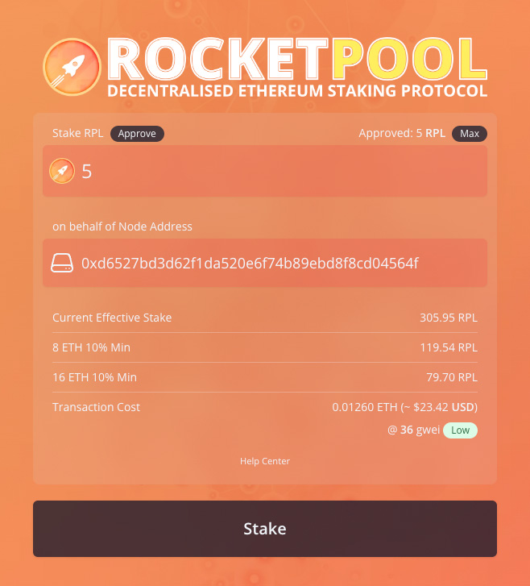

# Creating a New Minipool (Validator)

As a reminder, a `minipool` in Rocket Pool terms refers to a unique smart contract instance on the Execution Layer (ETH1) chain that your node manages.
The minipool handles a portion of your ETH, known as the **bond amount**, and a portion of ETH from the rETH staking pool, known as the **borrowed amount**.
It merges them together to form 32 ETH in total, which is then sent to the Beacon Chain deposit contract to create a new validator.
Thus, in order to create a validator using Rocket Pool, you need to **create a minipool**.

## Choosing a Bond Size

::: warning NOTE
8-ETH bonded minipools are a feature of the [**Atlas**](../atlas/whats-new) upgrade, which was launched on April 17th 2023.
:::

Before creating a minipool, the first step is to choose the amount of ETH you want to bond.
With the Atlas update, Rocket Pool allows bond amounts of either **8 ETH** or **16 ETH**.
This bond represents your literal stake in the game as a validator; if your node is penalized for poor performance or slashed for violating the rules of the protocol, the penalty is taken from your bond.

In addition to your ETH bond, creating a validator also requires **supplemental collateral** in the form of the **RPL token**.
The amount of RPL you need to stake depends on your bond size; the minimum is 10% of your _borrowed_ amount of ETH, and the maximum is 150% of your _bonded_ amount of ETH.

If choosing **8 ETH**, you stake 8 of your own ETH and "borrow" 24 ETH from the staking pool to complete the validator.
The minimum RPL stake is **2.4 ETH worth of RPL** (10% of 24), and the maximum is **12 ETH worth of RPL** (150% of 8).

If choosing **16 ETH** you stake 16 of your own ETH and borrow 16 ETH from the staking pool to complete the validator.
The minimum RPL stake is **1.6 ETH worth of RPL** (10% of 16), and the maximum is **24 ETH worth of RPL** (150% of 16).

In the event that the RPL/ETH ratio causes your stake to be less than the required stake, you will **not** be able to claim RPL rewards during that staking period. However, your minipool(s) will continue to earn commission. You can rectify this by staking more RPL or simply waiting to see if the ratio becomes favorable again.

### Rewards

From a profitability perspective (looking _purely_ at ETH rewards and ignoring RPL), two 8-ETH bonded minipools with a 14% commission provide _more rewards_ to the node operator than even _16-ETH bonded minipools at 20% commission_ (which, as of Redstone, is the highest possible reward configuration).
At the same time, they also provide more rewards to the _rETH holders_ as well due to the fact that the node operators are more efficiently putting the capital of the rETH holders to work.

Let's walk through a simple example to illustrate.
Say we are a node operator with 16 ETH available to stake (plus the required RPL bond).
Say we've earned 1 ETH of rewards on the Beacon Chain per validator.
Here's how the math works out for a single 16-ETH minipool with a 20% commission, versus two 8-ETH minipools at 14% commission:

```
1x 16 ETH Minipool @ 20%:
Rewards: 1 ETH
Node Share = (16/32) + (16/32 * 0.2)
           = 0.5 + (0.5 * 0.2)
           = 0.5 + 0.1
           = 0.6 ETH

rETH Share = 1 - 0.6
           = 0.4 ETH


2x 8 ETH Minipools @ 14%:
Rewards: 2 ETH
Node Share = ((8/32) + (24/32 * 0.14)) * 2
           = (0.25 + (0.75 * 0.14)) * 2
           = (0.25 + 0.105) * 2
           = 0.71 ETH

rETH Share = 2 - 0.71
           = 1.29 ETH
```

In other words, a node operator will earn **18% more ETH** via two 8-ETH minipools than they would with a single 16-ETH minipool at 20% commission.

## Staking RPL

Before you can create a minipool, you'll first need to stake your RPL collateral.
The minimum and maximum amounts are described above relative to ETH and depending on your desired bond size.
The exact amount of RPL will change based on the ETH/RPL price ratio, which is snapshotted on-chain at regular intervals by the Oracle DAO.

There is no maximum to the amount you can stake, though **you will only receive rewards for the first 150% of your bonded ETH** at each checkpoint - anything above that will go unrewarded.

::: tip NOTE
RPL stake isn't handled on a per-minipool basis.
When you stake RPL, you do it for your **entire node**.
This means you'll only need to handle the total RPL stake for your node if you plan to run multiple minipools.
:::

### Staking via the Website

The easiest and safest way to stake RPL for your node is to use the protocol's **Stake-on-Behalf** feature, which was
reintroduced with the Atlas upgrade. This way, you can stake RPL for your node while the RPL is still in the wallet
you used to acquire it. In other words, you **don't need to send RPL to your node's hot wallet** in order to stake it.

#### Whitelisting an address to stake on behalf

You first must whitelist an address to have permission to stake on behalf of your node. This only needs to be performed
once per address you wish to stake from. You can do this via the following Smartnode command:

```bash
rocketpool node add-address-to-stake-rpl-whitelist address-or-ens
```

Where `address-or-ens` is the address or and ENS name that resolves to your desired address. You will be asked to
confirm the whitelist addition and after the transaction is confirmed, you can then navigate to the relevant page below.

#### Staking RPL on behalf of

Select which network you're using from the tabs below to be taken to it:

:::::: tabs
::::: tab Mainnet
[https://stake.rocketpool.net/stake-behalf](https://stake.rocketpool.net/stake-behalf)

::::: tab Prater Testnet
[https://testnet.rocketpool.net/stake-behalf](https://testnet.rocketpool.net/stake-behalf)

::::::

Start by connecting your wallet to the website using MetaMask, WalletConnect, or any of the other methods the website supports.
You will then be presented with this dialog to look up your node address:

{ style="display: block; margin: 0 auto" }

Enter your node address & click "Lookup".

**Make sure you have the correct node address before doing this!**
If you need to confirm your node's address, you can quickly retrieve it via the CLI using the `rocketpool node status` command.

This will check that the address is a registered node & that the node has whitelisted the connected wallet. Withdrawal addresses are whitelisted by default, however if you wish to allow other addresses you will need to whitelist them via the following command on your node.

```bash
rocketpool node add-address-to-stake-rpl-whitelist address-or-ens
```

Once you have passed the checks, you will be presented with the next step.

{ style="display: block; margin: 0 auto" }

This is a two-step process.

First, enter the amount of RPL you want to stake and click `Approve` - this will **approve** the staking contract to access that much RPL in your wallet, but **no more than that amount**.

::: tip TIP
You can approve more than the amount you intend to stake if you trust the Rocket Pool staking contract, and don't want to perform this extra Approve transaction each time you want to stake more RPL.
:::

Once the RPL is approved, you will see this dialog:

{ style="display: block; margin: 0 auto" }

Enter the amount of RPL you want to stake in the `Stake RPL` box, and enter your node's address in the `on behalf of Node Address` box.

When you've entered that information, press the `Stake` button and approve the transaction.
It will be sent to the Ethereum network, and once included in a block, you're all set!

If you run `rocketpool node status`, you should see your staked RPL appear under the `=== RPL Stake ===` section.

#### Removing an address from the stake whitelist

If you ever want to remove an address from your stake-on-behalf whitelist, you may do so with the following Smartnode command:

```bash
rocketpool node remove-address-from-stake-rpl-whitelist address-or-ens
```

Where `address-or-ens` is the address or and ENS name resolving to the address you want to remove from the whitelist.

### Staking via the Node CLI

If you cannot (or
