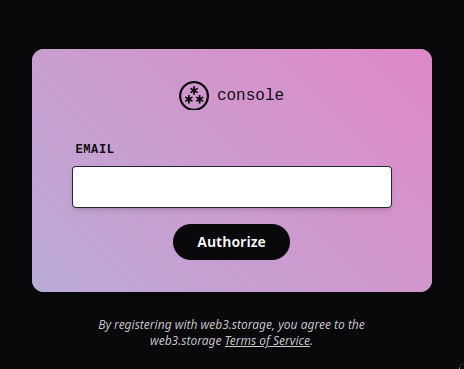
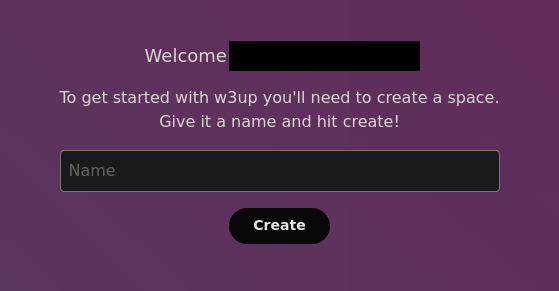

# Using web3.storage

As part of your duties as an Oracle DAO member, you will regularly create what are known as "rewards tree" files.
These files are required for RPL and Smoothing Pool rewards to function properly. Your node will automatically construct them at the end of each rewards interval.

The rewards tree files contain:
- Each node operator's total RPL earnings for that period (for both collateral and Oracle DAO rewards, if applicable)
- Each node operator's total ETH earnings if opted into (or partially opted into) the Smoothing Pool
- A Merkle proof for each node operator that can be used to claim their rewards from the Rocket Pool contracts at their discretion
- The detailed performance of each minipool opted into the Smoothing Pool, including a record of every attestation they missed while opted in over the duration of the rewards interval

Once created, your node will upload them to [IPFS](https://ipfs.tech/) so they can be downloaded automatically by other node operators and used for claiming rewards.
For uploading, Rocket Pool's software leverages a system called [web3.storage](https://web3.storage/). Effectively it is a combination of services that provide authentication, uploading of files to IPFS backed by [Filecoin](https://filecoin.io/) storage, and pinning of uploaded files so others can reliably access them.

Previously, web3.storage had an account system that Oracle DAO members registered with and received a special API key that could be used to upload files to it.
However, that service has now been deprecated and replaced by a new system.
Effective **9 January 2024**, the old system will be discontinued and fully replaced with the new system.

**Oracle DAO members that existed prior to 9 January 2024 and used the old system will need to migrate to the new system to ensure the ongoing health of the Rocket Pool rewards system.**

For more information on the transition from the old system to the new one, please read [the web3.storage transition article](https://blog.web3.storage/posts/the-data-layer-is-here-with-the-new-web3-storage).

## Components

The new web3.storage system consists of the following components:
- An **account**, which consists of an email address, a [subscription plan](https://web3.storage/pricing/), and billing information
- An **agent**, which is a device that contains a public/private key pair registered with an account (there can be multiple agents per account)
- A **space**, which is a logical bucket tied to one or more agents that tracks files uploaded to IPFS by an agent within a particular space

Notably, the new system no longer provides an API key that can be passed around to upload files on your account's behalf.
Instead, each device or process attempting to use web3.storage is now required to provide a public key which has been authorized to access your account.
While this makes integration more difficult, the Smartnode abstracts all of that from Oracle DAO members once its web3.storage support has been configured.

It also has two tools that can be used for general account management and file uploading:
- The [console website](https://console.web3.storage/)
- The [CLI](https://web3.storage/docs/w3cli/), an application written in Javascript that uses NodeJS

The legacy service provided a convenient [Go library](https://github.com/web3-storage/go-w3s-client) that the Smartnode leveraged to upload rewards tree files upon creation.
Unfortunately, the library has been deprecated with the legacy system and a Go library with bindings for the new system is not currently planned.
Thus, the Smartnode wraps the CLI in a [custom-made Docker container](https://github.com/rocket-pool/w3cli-image) (for Docker and Hybrid-mode users) and uses it seamlessly behind the scenes to upload files.

That being said, it cannot create an account. Doing so is a manual operation that must be done by each Oracle DAO member prior to configuring web3.storage support on their node.

## Creating an Account

The [official documentation](https://web3.storage/docs/how-to/create-account/) suggests a few ways to create an account with the new system.
In our experience, the most convenient one to use will be the [Web Console](https://console.web3.storage/) as creating an account also requires specifying a subscription plan and billing info, which is most easily done with a web frontend.

### Creating a New Account via the Web Console

Navigate to [https://console.web3.storage](https://console.web3.storage) and you will be greeted with the following prompt:

At this point, your browser has effectively become a web3.storage **agent**.
It has generated a private key and stored it in your browser's [IndexedDB](https://javascript.info/indexeddb) storage.

**If you ever clear your browser's storage, this private key (and the agent associated with it) will be lost.**
Because of this, we recommend you do *not* use the web console as your primary means of interacting with web3.storage and just use it for initially setting up your account.

Enter the email address you associate with your Oracle DAO account here and click `Authorize`.
A verification link for this new agent will then be sent to it.
Upon clicking the link, you will be prompted to select a subscription plan.

::: tip NOTE
As rewards tree files are only generated once per 28 days (at the time of this writing) and are less than 5 MB in size, the Starter tier is likely sufficient.
:::

Select one and enter the relevant details, then proceed.

You will next be prompted to create a space:

Spaces, by default, are unique to each agent in web3.storage and are **not** shared between agents.
Because of this, we recommend you *do not* create a space using the web console.
At this point your account creation should be complete and you no longer need to use the web console.

If you are comfortable with the web3.storage CLI and underlying mechanics, you can create a new space here and use the CLI's delegation system to provide access to it in the agent your Smartnode will run with.
However, doing so is beyond the scope of this guide.

## Setting Up web3.storage in the Smartnode

*Still under construction, stay tuned.*