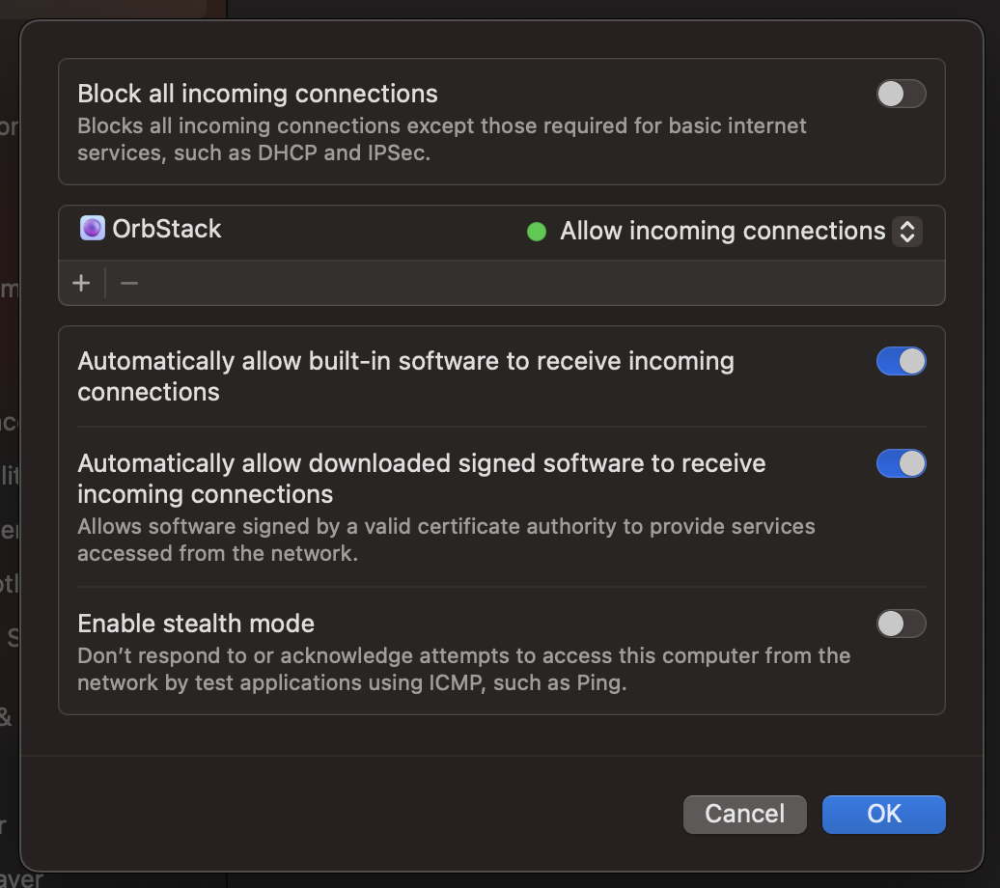

# Macの準備

Rocket Poolをインストールする前に、システムが互換性があり正しく動作することを確認するためのチェックをいくつか行う必要があります。

::: danger
Rocket Poolノードを実行するための専用マシンを作成することを強くお勧めします。
日常的な業務用デスクトップなどの汎用マシンでノードを実行すると、ウォレットが危険にさらされ、コインが盗まれる可能性がある追加のセキュリティリスクが発生します。

**最大限の安全性を確保するために、ノードの実行専用の新しいマシンを構築してください。**
:::

## システム要件

以下は、Rocket Poolノードが必要とするソフトウェアおよびハードウェア要件の簡単な説明です。
このガイドは、マシンが物理的に構築されており、オペレーティングシステムがインストールされていることを前提としています。

### サポートされているオペレーティングシステム

Rocket Poolでは、ハードウェアに対応した最新バージョンのmacOSの使用を推奨しています。

### macOSサポート

以下の前提条件をインストールする必要があります。

Macのパッケージマネージャーとして[Homebrew](https://brew.sh)を使用することを強くお勧めします。これにより、`brew`コマンドを使用して簡単にパッケージをインストールできます。

次のコマンドでインストールできます。

```shell
/bin/bash -c "$(curl -fsSL https://raw.githubusercontent.com/Homebrew/install/HEAD/install.sh)"
```

XCode Command Line Toolsなどの前提条件がインストールされるはずです。インストールされない場合は、次のコマンドで手動でインストールできます。

```shell
xcode-select --install
```

インストールが完了したら、次のコマンドですべてが正しく動作していることを確認してください。

```shell
brew doctor
```

すべてがインストールされ動作していれば、Homebrewで`brew`コマンドを使用してパッケージをインストールできるようになります。

たとえば、Homebrewを使用して`wget`をインストールするには、ターミナルで次のコマンドを実行します。

```shell
brew install wget
```

Homebrewがインストールされたので、Dockerクライアントの[Orbstack](https://orbstack.dev)をインストールできます。

```shell
brew install --cask orbstack
```

OrbstackはApplicationsフォルダにインストールされます。そこから起動すると初期化されます。Docker Desktopから移行する場合は、既存のDockerインストールを検出し、イメージとコンテナを移行します。

ハードウェアに応じて、Orbstackの設定を調整する必要がある場合があります。

以前にDocker Desktopをインストールしたことがある場合は、まずアンインストールする必要があります。Docker Desktopは以前は推奨されるDockerクライアントでしたが、過去1年間でより優れた安定性を提供するいくつかの新しいクライアントがリリースされました。

ファイアウォール（システム設定 -> ネットワーク -> ファイアウォール）がオンになっており、Orbstackが着信接続を許可するアプリケーションのリストに追加されていることを確認してください。（Orbstackが自動的に行うはずです）



### SSHのインストールと使用

SSHはmacOSにすでにインストールされているはずです。

### インストール前のシステムチェック

Rocket Poolをインストールする前に、以下のチェックリストを確認してください。

- システムが完全に構築され、電源が入り、オペレーティングシステムにブートできる。
- インターネットの閲覧、メールのチェック、ゲームのプレイなど、システムで他の活動を行わない。
- macOSオペレーティングシステムがインストールされている。
- ユーザーアカウントにroot / 管理者権限がある。
- パフォーマンス要件を満たすSSDがある。
- SSDがファイルシステムにマウントされている。
- 初期のExecutionとConsensus同期プロセスのために少なくとも1.5TBの空き容量がある。
- ISPがデータに上限を設けている場合、月間2TB以上である。

これらすべての項目を確認して確認した場合、Rocket Poolをインストールしてノードの実行を開始する準備が整いました。
[ETHクライアントの選択](../eth-clients)セクションに進んでください。
