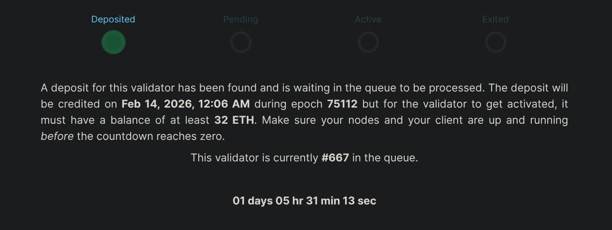
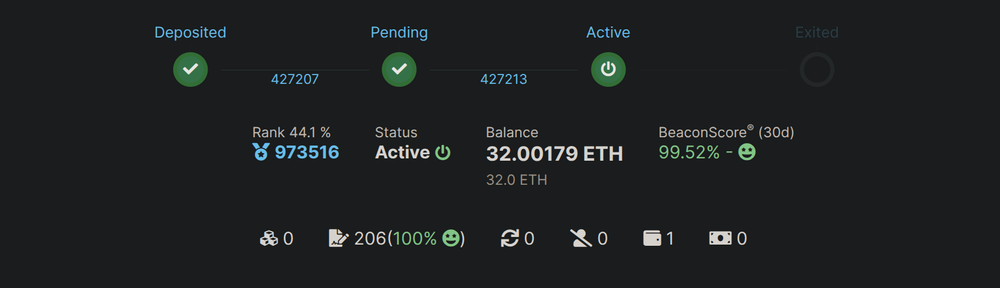

# Megapoolの作成（バリデーター）

Saturn 1へようこそ！Rocket Pool megapoolは実行レイヤー上のスマートコントラクトインスタンスです。
ノードは1つまたは複数のバリデーターのEthereum引き出しアドレスとして機能するmegapoolを管理します。
各バリデーターは、ボンド額と呼ばれるあなたのETHの一部と、rETHステーキングプールからのETHの一部（借入額）で構成されます。megapoolはボンド額と借入額のETHを合計32 ETHにまとめ、新しいバリデーターを作成するためにBeacon Chainデポジットコントラクトに送金する役割を担います。

megapoolは最初のバリデーターデポジット時に自動的にデプロイされます。その後、同じmegapoolを使って好きな数のバリデーターを管理できます！新しいバリデーターを作成するたびに新しいmegapoolをデプロイする必要はありません。

::: warning 警告
Megapoolバリデーターは Beacon Chainキューを2回クリアする必要があります。
1. プレステーク（1 ETH）。デポジットプールからmegapoolバリデーターにETHが割り当てられると、Beacon Chainには1 ETHのみが送られます。この時点で、バリデーターはBeacon Chainキューに入ります。
2. ステーク（31 ETH）。バリデーターがBeacon Chainによって処理された後、Rocket Poolプロトコルはバリデーターの引き出しクレデンシャルを検証し、残りの31 ETHをBeacon Chainにステークします。この時点で、バリデーターは2回目（最後）のBeacon Chainキューに入ります。

以前のminipoolでは、[Oracle DAO（oDAO）](/ja/odao/overview#the-rocket-pool-oracle-dao)がすべてのminipoolバリデーターの引き出しクレデンシャルの検証を担当していました。この新しいシステムはキュー時間を延ばしますが、oDAOによって強制されていた信頼要件を取り除きます。

[validatorqueue.com](https://www.validatorqueue.com/) はBeacon Chainキューの長さを監視するのに役立つツールです。minipoolのステークをmegapoolに移行する際は、この要素を考慮してください。

:::


::: tip 注意

バリデーターの作成は2つのキューによって管理されます。

1. 最初はRocket Poolデポジットキューです。別のセクションで詳しく説明しますが、基本的にこのキューはRocket Poolプロトコルによって管理され、バリデーターが借入ETHを受け取るタイミングを決定します。
   4 ETHのボンドとデポジットプールの28 ETHをマッチングしてバリデーターを作成するには、デポジットプールにETHが利用可能である必要があります。

2. 2つ目はBeacon Chainキューで、Ethereum Beacon Chainによって管理され、バリデーターがいつアクティブになるかを決定します。
   各キューでの位置やネットワークの現状によって、バリデーターがアクティブになるまでの時間は大きく異なる場合があります。

Rocket Poolデポジットキューには、既存のノードオペレーターがminipoolバリデーターETHをmegapoolバリデーターETHに移行しやすくするためのエクスプレスキューシステムがあります。

:::

::: tip 有用なリンク
[saturn-1.net/queue](https://saturn-1.net/queue) はSteely!によって作成されたコミュニティサポートのダッシュボードです。このページではRocket Poolデポジットキューの長さを確認できます。

[validatorqueue.com](https://www.validatorqueue.com/) はBeacon Chainキューの長さを確認するのに役立つサイトです。このキューはBeacon Chainに入出するETH量によって変動し、`256 ETH per epoch`のレートで処理されます。

[rocketpool.net/node-staking/rpl-fee-switch](https://rocketpool.net/node-staking/rpl-fee-switch) はSaturn 1のフィースイッチがあなたのステーキング報酬に与える影響をモデル化します。

:::

## Rocket Poolデポジットキューとエクスプレスキュー

Rocket Poolのデポジットキュー内には、エクスプレスキューと標準キューの2種類があります。

デポジットキューには、既存のノードオペレーターがminipoolバリデーターETHをmegapoolバリデーターETHに移行しやすくするためのエクスプレスキューシステムがあります。また、エクスプレスキューを使用したデポジットに対して、より予測可能なデポジットタイムラインを提供します。

エクスプレスキューは4:1の比率で処理されます。つまり、標準キューから1つのバリデーターがマッチングされるごとに、エクスプレスキューから4つのバリデーターがマッチングされます。言い換えると、エクスプレスキューから4つのバリデーターがマッチングされ、次に標準キューから1つ、次にエクスプレスキューから4つ、という順番で処理されます。

既存のノードオペレーターは、レガシーminipoolでのボンドETHに基づいてエクスプレスキューチケットを受け取ります：ボンドした4 ETHごとに1枚のチケット。
例えば、8 ETHのレガシーminipoolを持つノードオペレーターは2枚のエクスプレスキューチケットを受け取ります。これは2つの4 ETH megapoolバリデーターにエクスプレスキューを使って完全移行するのに十分なチケット数です。
[RPIP-59：デポジットメカニクス](https://rpips.rocketpool.net/RPIPs/RPIP-59#deposit-queue)では、デポジット処理の詳細が説明されています。

[エクスプレスキューからバリデーターをデキューする](./create-megapool-validator#exit-a-validator-from-the-rocket-pool-deposit-queue)ことを選択した場合、ノードはエクスプレスキューチケットを返金されます。

## ETHのデポジットとバリデーターの作成

これがノードの最初のmegapoolバリデーターであれば、ノードのmegapoolも同時に自動的にデプロイされます。ノードのMegapoolは1つまたは複数のバリデーターを管理できるため、megapoolのデプロイはノードごとに一度だけ行われることを覚えておいてください！

megapoolにETHをデポジットしてBeacon Chainバリデーターを作成する準備ができたら、以下のコマンドを使用します：

```
rocketpool megapool deposit
```

::: danger 警告

CLIは次のステップの多くを自動化しますが、`prelaunch`から`staking`への移行が成功するようにノードとトランザクションを<strong>強く</strong>監視することをお勧めします。

失敗したトランザクション（ガス設定の調整、ガス代のETH不足、または初期デポジット後28日間のノードオフライン）により、megapoolバリデーターが`dissolved`状態に移行する可能性があり、これは避けるべきです。

プレランチバリデーターが365日以内にステークに失敗した場合、バリデーターはdissolvedされます。プレランチプロセス中にBeacon Chainに送られた1 ETH（4 ETHボンドのうち）は**回収不可能**です。
ノードオペレーターはmegapoolへの払い戻しとして残りの3 ETH（0.05 ETHのdissolveペナルティを負債として差し引いた後）を受け取り、正味払い戻し額は2.95 ETHです。
これは`rocketpool megapool claim`または`rocketpool claims claim-all`を使用して請求できます。

[成功したステークの確認方法についてはこちら](./create-megapool-validator#confirming-a-successful-stake)

:::

最初のプロンプトでは、作成したいバリデーターの数を尋ねます。同じデポジットで最大35個まで作成できますが、ここではデモンストレーションとして1つのバリデーターを作成します。`1`と入力してから`enter`を押して、1つのバリデーターの作成を開始します。

```
Your eth2 client is on the correct network.

How many validators would you like to create? (max: 35)
1
```

2番目のプロンプトでは、ノードが現在ボンドしているETH量と、選択したバリデーター数の合計ボンド要件に関する情報が表示されます。デモのノードにはmegapoolバリデーターがないため、`0.00 ETH bonded`と表示されています。現在のボンド要件は`4 ETH`です。
表示された情報を読んで理解したら、`y`と入力してから`enter`を押して次のプロンプトに進みます。

```
The node is currently bonded with 0.00 ETH.
The total bond requirement is 4.00 ETH.

NOTE: You are about to create 1 new megapool validator(s), requiring a total of: 4.00 ETH.
Would you like to continue? [y/n]
y
```

次のプロンプトでは[Rocket Poolデポジットキュー](/ja/node-staking/megapools/create-megapool-validator#rocket-pool-deposit-queue-and-express-queue)の状況が表示されます。
ETHとのマッチングを待っているバリデーターの数が表示されます。エクスプレスキューは主に既存のノードオペレーター向けで、新しいノードにはエクスプレスキューチケットがありません。`The express queue rate is 4`は、標準キューの1つに対してエクスプレスキューから4つのバリデーターがマッチングされることを意味します。

```
There are 1 validator(s) on the express queue.
There are 12 validator(s) on the standard queue.
The express queue rate is 4 (4 express validators assigned per 1 standard).
A new express validator would be at queue position 3.
A new standard validator would be at queue position 14.
```

::: tip 注意
返還ノードオペレーターで、このデポジットに利用可能なエクスプレスキューチケットがある場合、この時点でチケットの使用を促すプロンプトが表示されます。
この単一のmegapoolバリデーターデポジットに1枚のエクスプレスキューチケットを使用して進めるには`1`と入力してから`enter`を押します。

```
How many express tickets would you like to use? (max: 7)
1
```

エクスプレスキューチケットを保存して標準キューで進めたい場合は、`0`と入力してから`enter`を押して次のプロンプトに進みます。
:::

バリデーターに対して引き換え可能な[デポジットクレジット](/ja/node-staking/megapools/credit)がある場合、ここでプロンプトが表示されます。ない場合は、このステップでネットワークの現在のガス価格の提案が表示されます。

```
Your credit balance is 0.00 ETH. (Credit in addition to ETH staked on your behalf).
Your consensus client is synced, you may safely create a megapool validator.
+================ Suggested Gas Prices ================+
| Avg Wait Time |   Max Fee    |     Total Gas Cost     |
| 15 Seconds    | 2.13120 gwei | 0.00160 to 0.00240 ETH |
| 1 Minute      | 1.96787 gwei | 0.00148 to 0.00222 ETH |
| 3 Minutes     | 1.00871 gwei | 0.00075 to 0.00113 ETH |
| >10 Minutes   | 1.00871 gwei | 0.00075 to 0.00113 ETH |
+======================================================+

These prices include a maximum priority fee of 0.010 gwei.
Please enter your max fee (including the priority fee) or leave blank for the default of 1.96787 gwei:

```

ガス価格を確認した後、megapoolバリデーターを作成するための最後の確認を行います。

```
Using a max fee of 1.968 gwei and a priority fee of 0.010 gwei.
You are about to deposit 4.000000 ETH to create 1 new megapool validator(s).
ARE YOU SURE YOU WANT TO DO THIS?
 [y/n]
y

Creating 1 megapool validator(s) ...
Transaction has been submitted with hash <tx-hash>.
You may follow its progress by visiting:
https://hoodi.etherscan.io/tx/<tx-hash>

Waiting for the transaction to be included in a block... you may wait here for it, or press CTRL+C to exit and return to the terminal.

The node deposit of 4.000000 ETH total was made successfully!
Validator pubkeys:
  1. <beacon-pubkey>

The 1 new megapool validators have been created.
Once your validators progress through the queue, ETH will be assigned and a 1 ETH prestake submitted for each.
After the prestake, your node will automatically perform a stake transaction for each validator, to complete the progress.
To check the status of your validators use `rocketpool megapool validators`
To monitor the stake transactions use `rocketpool service logs node`

```

トランザクションが完了すると、etherscanトランザクションハッシュとmegapoolバリデーターがオンラインになった後に期待されるBeacon Chain公開鍵の確認が表示されます。`rocketpool megapool status`コマンドでmegapoolの状況を確認するか、`rocketpool megapool validators`コマンドで特定のバリデーターの状況を確認できます。バリデーターはRocket Poolデポジットキューを処理中の間、`initialized`状態になります。megapoolバリデーターの公開鍵は、Rocket Poolデポジットキューによって処理されETHが割り当てられるまでBeacon Chainに登録されないことに注意してください。

ここまで来たらもう完成です！megapoolバリデーターの作成おめでとうございます。ノードを最良の状態に保つ方法を学ぶために、ガイドの[モニタリングとメンテナンス](/ja/node-staking/maintenance/overview)セクションをぜひご確認ください。また、`initialized`バリデーターがペナルティなしにスムーズに`staking`に移行するよう、次のセクションの成功したステークの確認も続けてお読みください。

## 成功したステークの確認

::: danger 警告

CLIは次のステップの多くを自動化しますが、`prelaunch`から`staking`への移行が成功するようにノードとトランザクションを<strong>強く</strong>監視することをお勧めします。

失敗したトランザクション（ガス設定の調整、ガス代のETH不足、または初期デポジット後28日間のノードオフライン）により、megapoolバリデーターが`dissolved`状態に移行する可能性があり、これは避けるべきです。

プレランチバリデーターが365日以内にステークに失敗した場合、バリデーターはdissolvedされます。プレランチプロセス中にBeacon Chainに送られた1 ETH（4 ETHボンドのうち）は**回収不可能**です。
ノードオペレーターはmegapoolへの払い戻しとして残りの3 ETH（0.05 ETHのdissolveペナルティを負債として差し引いた後）を受け取り、正味払い戻し額は2.95 ETHです。
これは`rocketpool megapool claim`または`rocketpool claims claim-all`を使用して請求できます。

:::

このプロセス全体を通じてノードをオンラインに保ってください！バリデーターが以下で説明する各ステージ間をスムーズに進むよう、完全に自動的なステップをいくつか実行します：

新しいmegapoolバリデーターは`initialized`状態になります。Rocket Poolデポジットキューを処理してデポジットプールから28 ETHが割り当てられるまで、この状態が続きます。`rocketpool megapool validators`コマンドを使用してバリデーターの状況を確認できます。次のように表示されるはずです：

```
1 Initialized validator(s):

--------------------

Megapool Validator ID:        7
Expected pubkey:              <expected-pubkey>
Validator active:             no
Validator Queue Position:     14
Express Ticket Used:          no
```

バリデーターに[Rocket Poolデポジットキュー](/ja/node-staking/megapools/create-megapool-validator#rocket-pool-deposit-queue-and-express-queue)からETHが割り当てられると、`Prelaunch`状態に移行します。この時点で、megapoolの残高から1 ETHがBeacon Chainにデポジットされます。バリデーターの公開鍵もBeacon Chainに登録されるため、https://beaconcha.in/（テストネットを使用している場合はhttps://hoodi.beaconcha.in/）などのエクスプローラーで`Prelaunch`バリデーターの状態を確認できます。
公開鍵で https://beaconcha.in/ を検索するか、 `https://beaconcha.in/validator/<your-validator-pubkey>` の形式でこのリンクにアクセスしてバリデーターを確認できます。

```
1 Prelaunch validator(s):

--------------------

Megapool Validator ID:        7
Validator pubkey:             <pubkey>
Validator active:             no
Express Ticket Used:          no

```


`Prelaunch`バリデーターがBeacon Chainによって処理され、初期1 ETHデポジットがクレジットされると、ノードは自動的に`stake`トランザクションを実行して32 ETHの完全なBeacon Chainデポジットを完了します。`stake`トランザクションにより`Prelaunch`バリデーターは`Staking`バリデーターに移行します。この時点で`Staking`バリデーターは：- 32 ETHがBeacon Chainにデポジットされている
- バリデーターインデックス番号が割り当てられている - Beacon Chainでのアクティベーションが保留中

```
1 Staking validator(s):

Megapool Validator ID:        1
Validator pubkey:             <pubkey>
Validator active:             no
Validator index:              <index>
Beacon status:                pending_queued
Express Ticket Used:          no

```


Beacon Chainバリデーターキューの現在の状況はhttps://www.validatorqueue.com/で確認できます。`Staking`バリデーターがBeacon Chainでアクティベートされると、`rocketpool megapool validators`メニューで`Beacon status:                active_ongoing`が表示され、アクティベートされてアテステーションの準備ができていることが確認できます。

```
1 Staking validator(s):

--------------------

Megapool Validator ID:        0
Validator pubkey:             <pubkey>
Validator active:             yes
Validator index:              <index>
Beacon status:                active_ongoing
Express Ticket Used:          no
```



これで完成です！おめでとうございます！Rocket Poolでmegapoolバリデーターを正式に作成しました！ノードの監視と最良の状態を保つ方法については、[モニタリングとメンテナンス](/ja/node-staking/maintenance/overview)ガイドをご覧ください。

## Rocket Poolデポジットキューからバリデーターを退出する

キュー（エクスプレスまたは標準）で待機しているバリデーターがあり、キューから退出したい場合、そうすることができます！4 ETHのデポジットは同額のrETHとして引き換え可能なクレジットとして払い戻されます。手順は非常に簡単です：

まず、`rocketpool megapool validators`を確認して、デキューするバリデーターを特定します。デキューするバリデーターが`Initialized`状態であることを確認してください。公開鍵をメモしておきます。バリデーターにETHが割り当てられた後はデキューできなくなります。

```
1 Initialized validator(s):

--------------------

Megapool Validator ID:        6
Expected pubkey:              <beacon-pubkey>
Validator active:             no
Validator Queue Position:     14
Express Ticket Used:          no
```

以下のコマンドを使用してキューからバリデーターを退出させ、選択を進めます：

```
staker@node:~$ rocketpool megapool exit-queue

Please select a validator to exit the queue:
1: Pubkey: <beacon-pubkey>
```

選択が完了し、バリデーターがRocket Poolデポジットキューから退出したことを確認したら、以下のコマンドを使用してクレジットをrETHとして引き換えることができます：

```
staker@node:~$ rocketpool node withdraw-credit

You have 4.000000 ETH of credit that you can withdraw, receiving the equivalent amount in rETH. Would you like to withdraw the maximum amount of credit? [y/n]
```

以上です！別のバリデーターをデポジットしたい場合、このクレジットはrETHとして引き換えられるだけでなく、バリデーターデポジットとしても使用できます。
退出（デキュー）したバリデーターにエクスプレスキューチケットを使用していた場合、ノードはそのエクスプレスキューチケットを返金されます。

## 複数のMegapoolバリデーターの作成

ノードのmegapoolは好きな数のバリデーターを管理できます。追加のバリデーターを作成したい場合（またはトランザクション手数料を節約するために同じトランザクションで複数のバリデーターを作成したい場合）、`rocketpool megapool deposit`コマンドを使用して作成できます。現在のブロックガスリミットを考慮すると、1回のトランザクションで作成できるバリデーターの最大数は35です。

## 次のステップ

megapoolバリデーターが稼働したので、次のステップではノードの健全性を監視し、アップデートを確認して適用し、その生涯を通じてメンテナンスする方法を説明します。

これらのトピックの詳細については、次の[モニタリングとメンテナンス](/ja/node-staking/maintenance/overview)セクションをお読みください。
