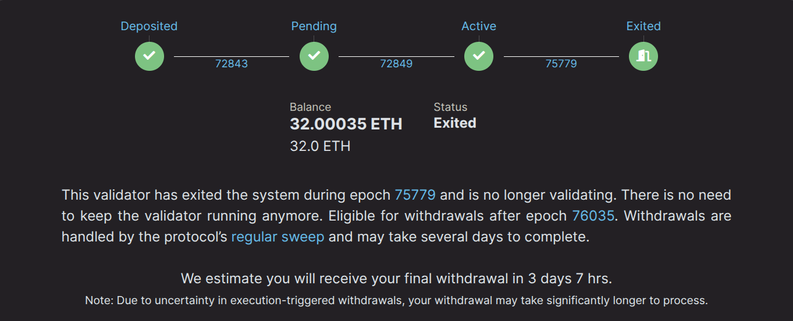

# Megapoolバリデーターの終了

megapoolバリデーターの運用を終了し、Beacon Chainにロックされた全残高にアクセスしたい場合、いくつかのステップを踏む必要があります。このページでは、megapoolバリデーターを終了するプロセスを説明します。

1. Beacon Chainに自発的な終了リクエストを送信する（手動）
2. バリデーター終了を通知する（Smart Nodeにより自動化）
3. 最終残高を通知する（Smart Nodeにより自動化）

## Beacon Chainへの終了リクエストの送信

Beacon Chainに終了リクエストを送信するには、Smart Nodeの`rocketpool megapool exit-validator`コマンドを使用します。終了可能なバリデーターのリストが表示されます。

```
staker@node:~$ rocketpool megapool exit-validator

Please select a validator to EXIT:
1: ID: 1 - Index: 1269834 Pubkey: 0x9455594c2f02674922eb6dee40d096f3203dd1762aa7f1a988ab6c277a62418ec3abfb460b57f33f13a5922e9551d5cc
2: ID: 2 - Index: 1269835 Pubkey: 0xa188774e1adf42db768230541403347a8d2ebcd8386b7f5662bcf1004e17d8d53303889a7e527448cf29bff9bde34bb9
3: ID: 3 - Index: 1269851 Pubkey: 0xa3e211e95a542ffaf8467ba211a3d893b58c59204dab8c32df29f0cfda3f9ce485a3bc13a50e4c205f912613521ed203
4: ID: 7 - Index: 1274411 Pubkey: 0xb5369a5f8550daa07476378dc4864f08b74d4950e28c74844527b59b1e9dea9fd376ea3bd171ee8fba7de866cd4ea37e
5: ID: 8 - Index: 1275239 Pubkey: 0xa56660fa14f0cb7a7030ea0c68a075c7fd700d98ee3afb498030f2bafbadfbf29703bf8fe8ccc9e1f2332b96dcb51ee2
```

バリデーターを選択したら、Smart Nodeが追加のプロンプトを表示します。終了するつもりのバリデーターを選択したことを確認し、`y`と入力してから`enter`を押してBeacon Chainに自発的な終了リクエストを送信します。このアクションにはガスは必要ありません。あなたのノードからBeacon Chainにバリデーターを自発的に終了させる署名済みメッセージを送信します。

```
NOTE:
You are about to exit a validator. This will tell each validator to stop all activities on the Beacon Chain.
Please continue to run your validators until each one you've exited has been processed by the exit queue.
You can watch their progress on the https://beaconcha.in explorer.
Your funds will be locked on the Beacon Chain until they've been withdrawn, which will happen automatically (this may take a few days).
Once your funds have been withdrawn, you can run `rocketpool megapool notify-validator-exit` to distribute them to your withdrawal address.

Are you sure you want to EXIT validator id 1? [y/n]
y

Successfully requested to exit validator id 1.
```

あなたのノードはBeacon Chainに自発的な終了リクエストを送信します。この時点で、あなたのバリデーターはBeacon Chainの`active_exiting`状態になっているはずです。`rocketpool megapool validators`コマンドを実行し、終了リクエストを送信したバリデーターを確認することで、これを確認できます：

```

Megapool Validator ID:        1
Validator pubkey:             0x9455594c2f02674922eb6dee40d096f3203dd1762aa7f1a988ab6c277a62418ec3abfb460b57f33f13a5922e9551d5cc
Validator active:             yes
Validator index:              1269834
Beacon status:                active_exiting
Express Ticket Used:          no
```


::: tip 注意
あなたのバリデーターはBeacon Chain終了キューで処理されるまでアテステーションを続けますので、このプロセス中はノードをオンラインに保ってください！数日またはそれ以上かかる場合があります。
このウェブサイトは現在のキュー時間を確認するのに便利です：https://www.validatorqueue.com/
:::

## バリデーター終了の通知

前の段階`active_exiting`では、あなたのノードはBeacon Chain終了キューの対象となりながらアテステーションを行っていました。待機時間は終了を待つETHの量によって異なります。

あなたのバリデーターがこのキューの最後まで到達すると、`exited_unslashed`状態に移行します。この段階で、あなたのSmart Nodeは自動的に`notify validator exit`を呼び出し、あなたのバリデーターが終了してまもなく引き出し可能になることをRocket Poolプロトコルに通知します。

::: warning 警告
このステップは`rocketpool_node`タスクループ内でSmart Nodeによって完全に自動化されています。プロセス中はノードをオンラインに保つことが非常に重要です。オフラインの場合、`0.05 ETH`の罰金が課せられます。罰金は引き出し残高から差し引かれます。バリデーター終了プロセス全体を通じてノードのステータスをモニタリングしてください。
:::

```
Megapool Validator ID:        1
Validator pubkey:             0x9455594c2f02674922eb6dee40d096f3203dd1762aa7f1a988ab6c277a62418ec3abfb460b57f33f13a5922e9551d5cc
Validator active:             no
Validator index:              1269834
Beacon status:                exited_unslashed
Express Ticket Used:          no
```

beaconcha.inのステータスは次のようになります：



Beacon Chain上で256エポック後、完全な32 ETHとその他の累積報酬があなたのノードのmegapoolに送信されます。

## 最終残高の通知

この時点で、あなたのバリデーターはBeacon Chainから完全に終了し、Beacon Chainからあなたのmegapoolへ最終引き出しが送信されます。あなたのSmart Nodeは自動的に`notify final balance`を呼び出します。
この呼び出しによりあなたのmegapoolバリデーターの役割が完全に終了し、残高のあなたの分がノードのETH引き出しアドレスに配布されます。ノードをオンラインに保ち、`notify validator exit`や`notify final balance`などの自動タスクが実行された場合、あなた側でのそれ以上の手順は必要ありません。
