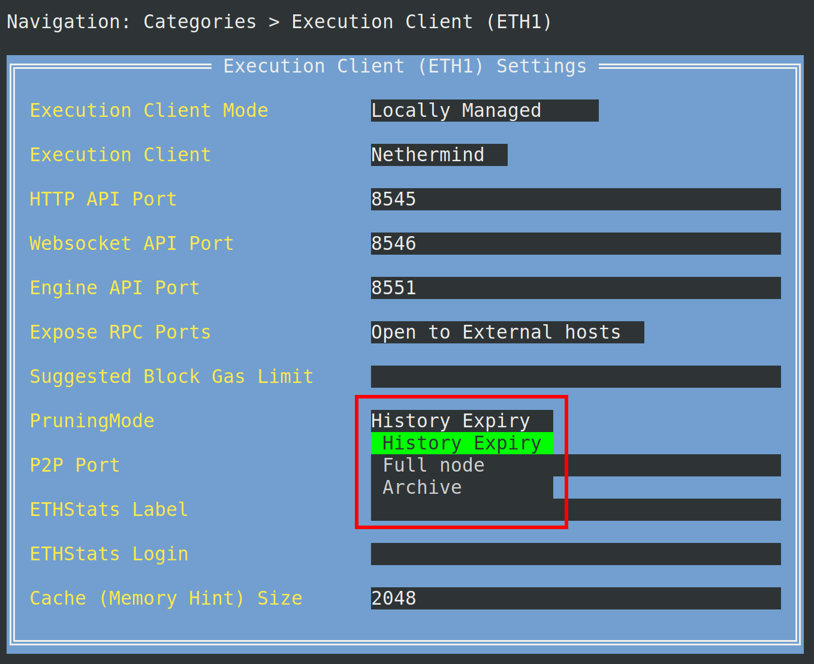

import { Tab, Tabs } from "@rspress/core/theme";

# Merge 이전 기록 만료

모든 Execution 클라이언트는 이제 [EIP-4444](https://eips.ethereum.org/EIPS/eip-4444)에 따라 부분 기록 만료를 지원합니다. 사용자는 Smartnode 버전 `v1.17.0`부터 merge 이전 블록 기록을 제거하여 노드의 스토리지 요구 사항을 크게 줄일 수 있습니다. 부분 기록 만료에 대해 자세히 알아보려면 이 블로그 게시물을 참조하십시오: https://blog.ethereum.org/2025/07/08/partial-history-exp

::: tip 참고

    merge 이전 기록을 제거하는 단계는 노드에서 선택한 Execution 클라이언트에 따라 다릅니다:
    - Nethermind 사용자는 merge 이전 기록을 제거하려면 전체 재동기화가 필요합니다.
    - Geth 사용자는 `rocketpool service prune-eth1` 명령을 사용하거나 전체 재동기화를 수행할 수 있습니다.
    - Besu 및 Reth 사용자는 노드가 계속 증명하는 동안 온라인 정리를 수행할 수 있습니다.

:::

다음 merge 이전 기록 제거 단계는 Docker 모드 노드에만 해당됩니다. Hybrid 모드 또는 Native 모드에서 외부 클라이언트를 사용하는 경우 Execution 클라이언트에서 제공하는 문서를 참조하십시오.

먼저 설정 관리자를 엽니다:

```shell
rocketpool service config
```

Execution Client 정리 모드를 변경하려면 `Execution Client (ETH1)` 메뉴로 이동하여 드롭다운 메뉴에서 `Pruning Mode`에 대한 `History Expiry` 설정을 선택합니다



선택한 후 `escape`를 눌러 메인 메뉴로 돌아간 다음 `tab`을 눌러 `Review Changes and Save` 버튼을 강조 표시합니다. `enter` 키를 눌러 계속합니다. Execution 클라이언트 설정에 대한 변경 사항을 미리 볼 수 있는 메뉴가 표시됩니다.


`Save Settings`에서 `enter` 키를 눌러 저장하고 설정 관리자를 종료한 다음 `y`를 입력하여 `rocketpool_eth1` 컨테이너를 다시 시작합니다.

```shell
Your changes have been saved!
The following containers must be restarted for the changes to take effect:
	rocketpool_eth1
Would you like to restart them automatically now? [y/n]
```

이 시점부터 단계는 사용 중인 Execution 클라이언트에 따라 다릅니다:

<div className="p-3">
  <Tabs>

        <Tab label="Nethermind">
        Nethermind 노드는 merge 이전 기록을 제거하려면 전체 재동기화가 필요합니다. `History Expiry` 설정을 저장하고 `eth1` 컨테이너를 다시 시작한 후 Execution 클라이언트를 재동기화해야 합니다.

        ::: warning 경고
        fallback 노드가 구성되어 있지 않으면 재동기화 중에 노드의 검증이 중지됩니다. fallback 노드는 정리 또는 재동기화 중에 기본 노드가 계속 증명하고 블록을 제안할 수 있도록 합니다. fallback 노드를 구성하는 방법을 알아보려면 [여기](/ko/node-staking/fallback)를 클릭하십시오.
        :::

        다음 명령을 사용하여 Execution 클라이언트를 재동기화합니다:
        ```shell
        rocketpool service resync-eth1
        ```

        모두 완료되었습니다! 노드는 더 이상 merge 이전 데이터를 저장하지 않아 2 TB 드라이브에 노드를 맞추는 실행 가능성이 크게 향상됩니다.
        다음 명령을 사용하여 진행 상황을 모니터링하는 것이 좋습니다.
        ```shell
        rocketpool service logs eth1
        ```

    </Tab>

    <Tab label="Geth">

        Geth 노드는 merge 이전 기록을 제거하려면 오프라인 정리가 필요합니다. `History Expiry` 설정을 저장하고 `eth1` 컨테이너를 다시 시작한 후 Execution 클라이언트를 정리해야 합니다. 또는 merge 이전 기록을 제거하기 위해 전체 재동기화를 수행할 수 있습니다.

        ::: tip 참고
        전체 재동기화보다 정리를 권장합니다. 새로운 Geth 데이터베이스로 다시 시작하거나 정리에 문제가 있는 경우 `rocketpool service resync-eth1`을 사용하여 Execution 클라이언트를 재동기화할 수 있습니다. 두 선택 모두 merge 이전 기록이 만료되어야 합니다.
        :::

        ::: warning 경고
        fallback 노드가 구성되어 있지 않으면 정리 또는 재동기화 중에 노드의 검증이 중지됩니다. fallback 노드는 정리 또는 재동기화 중에 기본 노드가 계속 증명하고 블록을 제안할 수 있도록 합니다. fallback 노드를 구성하는 방법을 알아보려면 [여기](/ko/node-staking/fallback)를 클릭하십시오.
        :::

        다음 명령을 실행하여 Execution 클라이언트를 정리하십시오:
        ```shell
        rocketpool service prune-eth1
        ```
        정리에 대해 자세히 알아보려면 [여기](/ko/node-staking/pruning#starting-a-prune)를 클릭하십시오.

        모두 완료되었습니다! 노드는 더 이상 merge 이전 데이터를 저장하지 않아 2 TB 드라이브에 노드를 맞추는 실행 가능성이 크게 향상됩니다.
        다음 명령을 사용하여 진행 상황을 모니터링하는 것이 좋습니다.
        ```shell
        rocketpool service logs eth1
        ```

    </Tab>

    <Tab label="Besu">

        모두 완료되었습니다! Besu 노드는 계속 증명하고 블록을 제안하면서 온라인 정리를 수행합니다.
        노드는 더 이상 merge 이전 데이터를 저장하지 않아 2 TB 드라이브에 노드를 맞추는 실행 가능성이 크게 향상됩니다.
        다음 명령을 사용하여 진행 상황을 모니터링하는 것이 좋습니다.
        ```shell
        rocketpool service logs eth1
        ```

    </Tab>

    <Tab label="Reth">

        모두 완료되었습니다! Reth 노드는 계속 증명하고 블록을 제안하면서 온라인 정리를 수행합니다.
        노드는 더 이상 merge 이전 데이터를 저장하지 않아 2 TB 드라이브에 노드를 맞추는 실행 가능성이 크게 향상됩니다.
        다음 명령을 사용하여 진행 상황을 모니터링하는 것이 좋습니다.
        ```shell
        rocketpool service logs eth1
         ```

    </Tab>

  </Tabs>
</div>
