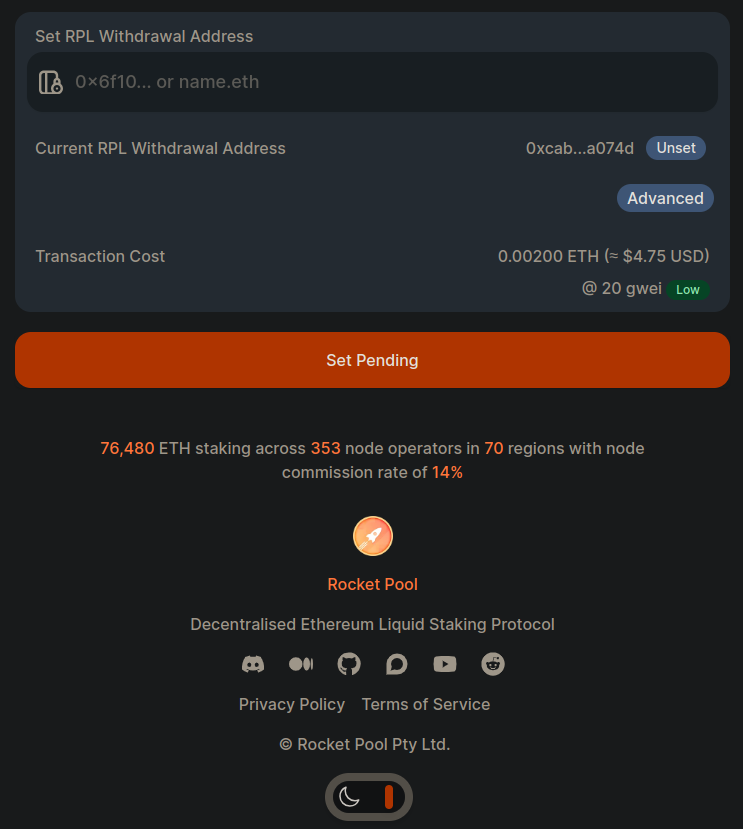

import { Tab, Tabs } from "@rspress/core/theme";
import nodeAddress from "./images/nodeaddress.png";
import rplWithdrawalConfirmation from "./images/rpl_withdrawal_confirmation.png";

# Preparando seu Nó para Operação

Se você chegou até aqui, então você iniciou com sucesso os serviços do Smartnode, criou uma carteira e terminou de sincronizar as cadeias de Execução e Consenso em seus respectivos clientes.
Se sim, então você está pronto para registrar seu nó na rede Rocket Pool e criar um minipool com um validador!
Caso contrário, revise as seções anteriores e retorne aqui quando tiver completado essas etapas.

Antes de criar um novo minipool e validador, há algumas etapas a serem seguidas para terminar de preparar seu nó.
Estas só precisam ser feitas uma vez; depois que você as fizer, pode pular para a seção [Criando um Novo Minipool](./create-validator.mdx) se quiser criar múltiplos minipools em seu nó.

## Carregando sua Carteira do Nó

Registrar seu nó e estabelecer um validador envolvem submeter transações à rede Ethereum a partir da carteira do seu nó.
Isso significa que **você precisará ter algum ETH nela** para pagar os custos de gas dessas transações.
Você também precisará fazer stake de algum **token RPL** antes de criar um minipool como colateral; você pode fazer isso diretamente no nó, ou (preferivelmente) você pode usar a função **Stake on Behalf** do site da Rocket Pool para fazer stake para seu nó com RPL em sua carteira fria.
Vamos discutir a funcionalidade Stake on Behalf mais tarde neste guia quando for hora de fazer stake do seu RPL.

O ETH necessário para as taxas de gas para configurar um nó com um minipool é cerca de 0.0025 ETH vezes o preço atual de gas em gwei.
Por exemplo, com um preço de gas de 30 gwei, você pagaria cerca de 0.075 ETH em taxas de gas.

Veja [esta planilha](https://docs.google.com/spreadsheets/d/1loB9U8wCIJn73a1DsR-mJJ9PQaYWMlF9asNc7BgM_zc/edit#gid=1413609552https://docs.google.com/spreadsheets/d/1loB9U8wCIJn73a1DsR-mJJ9PQaYWMlF9asNc7BgM_zc/edit#gid=1413609552) para ajudar a estimar as taxas de gas para várias condições de rede.

<div className="p-3">
  <Tabs>
    <Tab label="Executando na Rede de Teste Hoodi">
      Se você estiver executando na rede de teste Hoodi, consulte a seção [Praticando com a Rede de Teste](/pt/node-staking/testnet/overview) para aprender como adquirir ETH de teste.

      Para RPL de teste, adicionamos uma função de faucet similar diretamente ao CLI.
      Consulte o guia [Obtendo RPL de Teste no Hoodi](/pt/node-staking/testnet/overview#getting-test-rpl-on-hoodi) para adquirir alguns.
    </Tab>
    <Tab label="Executando na Rede Principal">
      Assumimos que você já possui uma carteira compatível com Ethereum separada que está mantendo seu ETH.
      Se você precisa de RPL, você pode comprá-lo em uma exchange centralizada como [Kraken](https://www.kraken.com/prices/rocket-pool?quote=usd) ou uma exchange descentralizada como [Balancer](https://app.balancer.fi/#/trade/ether/0xD33526068D116cE69F19A9ee46F0bd304F21A51f).

      Comece transferindo algum ETH da sua carteira existente para a carteira do nó.
      Se estiver executando na Mainnet, **deixe seu RPL na carteira que você usou para comprá-lo.**

      Como lembrete, você pode usar `rocketpool wallet status` para obter o endereço da carteira do nó se precisar.
      Se você não tiver certeza de como enviar criptomoeda da sua carteira existente, consulte a documentação da sua carteira.

      <p className="rspress-directive danger">
        <p className="rspress-directive-title">AVISO</p>
        Enviar criptomoeda entre carteiras é uma operação irreversível!
        Se você digitar o endereço de destinatário errado, **não há maneira de recuperar seus tokens**.
        Recomendamos que você envie uma pequena quantidade de ETH primeiro como uma **transação de teste** para verificar se você digitou corretamente o endereço da carteira do nó, e depois **adicionar à lista de permissões** esse endereço em sua outra carteira, se possível, para evitar digitá-lo incorretamente.
      </p>
    </Tab>

  </Tabs>
</div>

## Registrando seu Nó com a Rede

Depois de ter ETH em sua carteira, você pode registrar seu nó com a rede Rocket Pool para acessar todos os seus recursos.
Para fazer isso, execute o seguinte comando:

```shell
rocketpool node register
```

Isso solicitará o fuso horário com o qual você deseja se registrar.
Por padrão, isso detectará o fuso horário do relógio do seu sistema, mas você pode alterá-lo se preferir.
Qualquer um dos fusos horários no formato `País/Cidade` [listados nesta página](https://en.wikipedia.org/wiki/List_of_tz_database_time_zones) deve ser aceitável.

::: tip NOTA
O fuso horário é usado apenas para o mapa global de operadores de nó exibido no site principal.
Você não precisa configurá-lo para seu fuso horário real se tiver preocupações de segurança.
Se preferir permanecer anônimo, use uma opção genérica como `Etc/UTC`.
:::

Quando isso estiver completo, você será oficialmente um membro da rede Rocket Pool!

## Definindo seu Endereço de Retirada Primário

Antes de qualquer outra coisa, recomendamos enfaticamente que você altere o **endereço de retirada primário** do seu nó.
Este é o endereço para o qual todas as suas recompensas de checkpoint de RPL, seu RPL em stake e seu ETH da Beacon Chain serão enviados quando você reivindicar suas recompensas de checkpoint ou sair do seu validador e retirar do seu minipool.

Opcionalmente, você pode definir um endereço de retirada para seu ETH e [um novo para seu RPL](https://rpips.rocketpool.net/RPIPs/RPIP-31). O endereço de retirada de RPL, se definido, poderá acionar e reivindicar RPL das recompensas de inflação e não terá efeito nas recompensas de consenso de ETH ou qualquer coisa relacionada a ETH. Se você não tiver definido um endereço de retirada de RPL, o Endereço de Retirada Primário receberá recompensas de RPL também. Por padrão, **quem controla o endereço de retirada primário pode acessar TODO o seu RPL em stake, ETH e recompensas.**

O endereço usado para fornecer ETH a um nó deve ser o endereço de retirada primário para o nó. Clique [aqui](../legacy/houston/stake-eth-on-behalf.mdx) para ler sobre **fazer stake de ETH em nome de um nó**.

::: warning NOTA
Ao configurar seu nó pela primeira vez, isso é definido como o endereço da carteira do seu nó.
No entanto, por motivos de segurança, **é de vital importância definir isso para um endereço diferente controlado por uma carteira fria.**
Uma carteira fria pode ser uma carteira de hardware (como [Ledger](https://www.ledger.com/), [Trezor](https://trezor.io/) ou [Grid+](https://gridplus.io/)), ou uma carteira Smart Contract (como [Argent](https://www.argent.xyz/)).

Nós **fortemente recomendamos** que você NÃO use uma carteira quente como MetaMask como seu endereço de retirada primário.

Dessa forma, se a carteira do seu nó for comprometida, o atacante não terá acesso ao seu ETH e RPL em stake ao forçá-lo a sair, porque todos esses fundos serão enviados para sua carteira fria separada (que eles esperamos não possuam).

Endereços de retirada primários são definidos no nível do operador do nó.
Se você criar múltiplos minipools, todos eles se referirão ao mesmo endereço de retirada primário, então você só precisa realizar essa configuração uma vez.

[Veja aqui](https://ethereum.org/en/security/#wallet-security) alguns conceitos básicos sobre segurança de carteira da Ethereum Foundation.
:::

Existem duas maneiras diferentes de fazer isso.
Leia as duas opções abaixo para determinar qual se aplica a você.

<div className="p-3">
  <Tabs>
    <Tab label="Método 1">
      **Use este método se seu novo endereço de retirada primário puder ser usado para assinar transações via MetaMask ou WalletConnect.**

      <p className="rspress-directive warning">
        <p className="rspress-directive-title">NOTA</p>
        Este método exigirá que você **submeta uma transação** do seu novo endereço de retirada primário, então **você deve ter uma pequena quantidade de ETH nesse endereço já.**
      </p>


      <p className="rspress-directive warning">
        <p className="rspress-directive-title">NOTA</p>
        Para usuários de carteiras de hardware **Ledger**, observe que o Ledger Live ainda não suporta MetaMask ou WalletConnect nativamente.
        Você precisará usar o MetaMask e conectá-lo ao seu Ledger.
        Siga [as instruções oficiais do Ledger](https://www.ledger.com/academy/security/the-safest-way-to-use-metamask) para fazer isso.

        Para trabalhar com o site da Rocket Pool, você precisará ter seu Ledger conectado, desbloqueado e o app ETH aberto.
        Você também precisará **ativar "blind signing"** para a sessão atual; você pode encontrar isso na parte de Configurações do app ETH no dispositivo.
        O Blind signing será automaticamente desativado depois que você fechar a sessão.

        Se você estiver usando Hoodi Testnet e quiser usar seu Ledger como seu endereço de retirada primário, **você deve criar uma nova carteira Ethereum no seu Ledger** primeiro para garantir que você não conecte seu endereço real à rede de teste, o que tende a causar confusão.
        Certifique-se de selecionar a **Hoodi Testnet** no menu suspenso de seleção de rede ao conectar seu Ledger ao MetaMask.
        Observe que o Ledger Live não mostrará seu saldo na rede de teste, mas outros aplicativos que suportam a rede de teste (como MetaMask e Etherscan) poderão exibi-lo.
      </p>

      1. Execute `rocketpool node set-primary-withdrawal-address 'endereço da sua carteira fria ou nome ENS'`. Seu novo endereço de retirada primário será marcado como "pendente". Até você confirmá-lo, **seu antigo endereço de retirada primário ainda será usado**.
      2. Para confirmá-lo, você deve enviar uma transação especial **do seu novo endereço de retirada primário** para o contrato do minipool para verificar que você possui o endereço de retirada primário.
      1. A maneira mais fácil de fazer isso é navegar até o site de endereço de retirada primário da Rocket Pool (para a [Hoodi Testnet](https://testnet.node.rocketpool.net/primary-withdrawal-address) ou para [Mainnet](https://node.rocketpool.net/primary-withdrawal-address)).
      3. Se você ainda não conectou o Metamask ou WalletConnect ao site da Rocket Pool, faça isso agora. Clique no botão **select wallet** no centro da tela e escolha MetaMask ou WalletConnect com base em qual carteira você gostaria de usar. Você será solicitado a confirmar a conexão. Por exemplo, usando MetaMask:

      Clique em **Next**, depois clique em **Confirm** para permitir que o site da Rocket Pool use sua carteira. 3. Selecione **primary Withdrawal Address** no menu superior (ou no menu hambúrguer no lado esquerdo se você estiver em um dispositivo móvel). 4. Você verá este prompt:

      4. Digite seu **endereço da carteira do nó** aqui e clique no **botão Check Mark** para continuar.

      1. Você será solicitado com uma pergunta perguntando se deseja definir um novo endereço de retirada primário do nó ou confirmar um pendente. Selecione **Confirm**.
      2. Agora, deve haver uma nova caixa de diálogo de confirmação em sua carteira. Novamente, usando MetaMask como exemplo, clique no ícone do MetaMask para abri-lo e você deve ver algo assim:

      Clique em **Confirm** para enviar a transação para a rede. Isso levará algum tempo até ser incluído em um bloco, mas quando isso acontecer, você verá uma caixa de diálogo de confirmação:

      <video controls="controls" src="https://cdn-rocketpool.s3.us-west-2.amazonaws.com/confirm_pending_withdrawal.mp4" />

      5. Seu novo endereço de retirada primário agora será confirmado e ativado. Você pode ver isso com `rocketpool node status`.
    </Tab>
    <Tab label="Método 2">
      **Use este método apenas se seu endereço de retirada primário _não puder_ ser usado para assinar transações via MetaMask ou WalletConnect.**

      Neste método, você executará:

      ```shell
      rocketpool node set-primary-withdrawal-address --force 'endereço da sua carteira fria'
      ```

      Você terá a chance de enviar uma transação de teste antes de confirmar isso, para garantir que você tenha o endereço correto.
      Se você confirmar este comando quando solicitado, seu novo endereço de retirada primário será definido imediatamente.

      ::: danger
      Ao fazer isso, você ignora a medida de segurança associada ao Método 1, que exige que você prove que possui o novo endereço.
      Se você cometer um erro de digitação aqui, não há como desfazer e **as recompensas do seu minipool serão perdidas para sempre**.

      Nós **fortemente** encorajamos você a usar o mecanismo de transação de teste antes de confirmar isso e, se possível, use o Método 1.
    </Tab>

  </Tabs>
</div>

Depois disso, você **não poderá mais alterar seu endereço de retirada primário usando o comando `set-primary-withdrawal-address`**.
Para alterá-lo, você precisará enviar uma transação assinada do seu endereço de retirada primário **ativo** (aquele para o qual você acabou de mudar).
O site da Rocket Pool tem uma função para ajudá-lo a fazer isso.

## Definindo seu Endereço de Sinalização Snapshot

Definir seu endereço de sinalização Snapshot permitirá que você participe de votações Snapshot em um navegador ou dispositivo móvel
sem ter que expor as chaves do nó a uma carteira quente.

Há algumas coisas para preparar:

- O endereço do seu nó
- Um endereço que você deseja usar para votação snapshot (endereço de sinalização)

Você estará assinando uma mensagem dizendo que o endereço do seu nó pode delegar ao novo endereço. Esta mensagem declara sua
intenção de usar o endereço da sua carteira como um endereço de sinalização Snapshot.

Selecione qual rede você está usando em uma das abas abaixo.

<div className="p-3">
  <Tabs>
    <Tab label="Hoodi Testnet">Se você estiver experimentando isso no Hoodi testnet, você pode assinar nesta página: https://testnet.node.rocketpool.net/signalling-address</Tab>
    <Tab label="Mainnet">Se você estiver pronto para configurar isso na mainnet, vá aqui: https://node.rocketpool.net/signalling-address</Tab>
  </Tabs>
</div>

:::danger AVISO
Não carregue a chave privada do seu nó em uma carteira quente. Escolha outra conta para ser seu endereço de sinalização.
Depois de definir o endereço de sinalização, você pode usá-lo para votar no Snapshot com o poder de voto do seu nó.
:::

Comece **conectando o endereço que você deseja usar como endereço de sinalização** ao site usando MetaMask,
WalletConnect ou qualquer um dos outros métodos que o site suporta. Você será então apresentado com esta caixa de diálogo para procurar
seu endereço de nó.

Em seguida, você digitará seu endereço de nó e clicará no botão laranja "Find". Isso verificará se o endereço é um
nó registrado e então o levará para a próxima etapa.

:::tip DICA
**Certifique-se de ter o endereço de nó correto antes de fazer isso!** se você precisar confirmar o endereço do seu nó, você pode
recuperá-lo rapidamente via CLI usando o comando `rocketpool node status`.
:::

Depois de fazer login e confirmar o endereço do seu nó, você verá seu **endereço de sinalização Snapshot**. Deve ser o
mesmo da conta com a qual você entrou no site. Verifique se isso está correto antes de prosseguir. Quando tiver
certeza de que está conectado à conta desejada, clique no botão laranja "Sign Message". Você verá um prompt no
aplicativo de extensão da sua carteira para assinar a seguinte mensagem:

```
`snapshot signalling address` may delegate to me for Rocket Pool governance
```

Assinar não custará nenhum gas, mas definir custará. Depois de assinar, o frontend fornecerá um comando para colar no
smartnode. Vá em frente e cole-o no CLI do seu smartnode e siga as etapas solicitadas. O comando deve se parecer
com isto:

```shell
rocketpool pdao set-signalling-address
`snapshot signalling address`
`EIP712 signature`
```

Se você vir esta mensagem em seu CLI, está tudo pronto!

```
The node's signalling address was successfully set to `snapshot signalling address`
```

:::tip DICA
Não se preocupe se você fechar acidentalmente o site ou perder o rastro do comando. Você pode simplesmente repetir as etapas e **assinar
novamente usando o mesmo endereço de nó e endereço de sinalização**. O frontend usa `signer.Signmessage()` da biblioteca ethers,
o que significa que sua assinatura é determinística dado o mesmo input.
Clique [aqui](https://docs.ethers.org/v6/api/providers/#cid_865) para saber mais.
:::

Limpar seu endereço de sinalização é bem fácil, basta usar este comando no CLI:

```shell
rocketpool pdao clear-signalling-address
```

## Definindo seu Endereço de Retirada de RPL

É importante entender a diferença entre seu [endereço de retirada primário](./prepare-node#setting-your-primary-withdrawal-address) e seu endereço de retirada de RPL. Por padrão, seu endereço de retirada de RPL não está definido e seu endereço de retirada Primário é para onde todas as suas recompensas de checkpoint de RPL, seu RPL em stake e ETH da Beacon Chain serão enviados.

Você pode definir um [endereço de retirada separado para seu RPL](https://rpips.rocketpool.net/RPIPs/RPIP-31) se desejar. Seu endereço de retirada de RPL, se definido, poderá acionar e reivindicar RPL das recompensas de inflação e não terá efeito nas recompensas de consenso de ETH ou qualquer coisa relacionada a ETH. Neste caso, seu endereço de retirada Primário não terá mais nenhuma autoridade sobre ações relacionadas a RPL.

Isso cria algumas oportunidades interessantes onde RPL pode ser fornecido por uma entidade a um operador de nó que não deseja ter exposição a RPL. Essa entidade pode então reivindicar recompensas de RPL por fornecer o colateral de seguro necessário para o nó. Em outras palavras, isso permite que diferentes atores forneçam cada tipo de colateral.

::: warning NOTA
Ao configurar seu nó pela primeira vez, seu endereço de retirada de RPL por padrão não está definido.
Se você optar por definir um endereço de retirada de RPL, **é de vital importância definir isso para um endereço diferente controlado por uma carteira fria.**
Uma carteira fria pode ser uma carteira de hardware (como [Ledger](https://www.ledger.com/), [Trezor](https://trezor.io/) ou [Grid+](https://gridplus.io/)), ou uma carteira Smart Contract (como [Safe](https://app.safe.global/welcome)).

Nós **fortemente recomendamos** que você NÃO use uma carteira quente como MetaMask como seu endereço de retirada de RPL.

Dessa forma, se a carteira do seu nó for comprometida, o atacante não terá acesso ao seu RPL em stake ao forçá-lo a sair, porque todos esses fundos serão enviados para sua carteira fria separada (que eles esperamos não possuam).

Endereços de retirada de RPL são definidos no nível do operador do nó.
Se você criar múltiplos minipools, todos eles se referirão ao mesmo endereço de retirada de RPL, então você só precisa realizar essa configuração uma vez.

[Veja aqui](https://ethereum.org/en/security/#wallet-security) alguns conceitos básicos sobre segurança de carteira da Ethereum Foundation.
:::

Existem duas maneiras diferentes de fazer isso.
Leia as duas opções abaixo para determinar qual se aplica a você.

<div className="p-3">
  <Tabs>
    <Tab label="Método 1">
      **Use este método se seu novo endereço de retirada de RPL puder ser usado para assinar transações via MetaMask ou WalletConnect.**

      <p className="rspress-directive warning">
        <p className="rspress-directive-title">NOTA</p>
        Este método exigirá que você **submeta uma transação** do seu novo endereço de retirada de RPL, então **você deve ter uma pequena quantidade de ETH nesse endereço já.**
      </p>

      <p className="rspress-directive warning">
        <p className="rspress-directive-title">NOTA</p>
        Para usuários de carteiras de hardware **Ledger**, observe que o Ledger Live ainda não suporta MetaMask ou WalletConnect nativamente.
        Você precisará usar o MetaMask e conectá-lo ao seu Ledger.
        Siga [as instruções oficiais do Ledger](https://www.ledger.com/academy/security/the-safest-way-to-use-metamask) para fazer isso.

        Para trabalhar com o site da Rocket Pool, você precisará ter seu Ledger conectado, desbloqueado e o app ETH aberto.
        Você também precisará **ativar "blind signing"** para a sessão atual; você pode encontrar isso na parte de Configurações do app ETH no dispositivo.
        O Blind signing será automaticamente desativado depois que você fechar a sessão.

        Se você estiver usando Hoodi Testnet e quiser usar seu Ledger como seu endereço de retirada de RPL, **você deve criar uma nova carteira Ethereum no seu Ledger** primeiro para garantir que você não conecte seu endereço real à rede de teste, o que tende a causar confusão.
        Certifique-se de selecionar a **Hoodi Testnet** no menu suspenso de seleção de rede ao conectar seu Ledger ao MetaMask.
        Observe que o Ledger Live não mostrará seu saldo na rede de teste, mas outros aplicativos que suportam a rede de teste (como MetaMask e Etherscan) poderão exibi-lo.
      </p>

      1. Execute `rocketpool node set-rpl-withdrawal-address 'endereço da sua carteira fria ou nome ENS'`. Seu novo endereço de retirada de RPL será marcado como "pendente". Até você confirmá-lo, **seu antigo endereço de retirada de RPL ainda será usado**.
      2. Para confirmá-lo, você deve enviar uma transação especial **do seu novo endereço de retirada de RPL** para o contrato do minipool para verificar que você possui o endereço de retirada de RPL.
      1. A maneira mais fácil de fazer isso é navegar até o site de endereço de retirada de RPL da Rocket Pool (para a [Hoodi Testnet](https://testnet.node.rocketpool.net/rpl-withdrawal-address) ou para [Mainnet](https://node.rocketpool.net/rpl-withdrawal-address)).
      3. Se você ainda não conectou o Metamask ou WalletConnect ao site da Rocket Pool, faça isso agora. Clique no botão **select wallet** no centro da tela e escolha MetaMask ou WalletConnect com base em qual carteira você gostaria de usar. Você será solicitado a confirmar a conexão. Por exemplo, usando MetaMask:

      Clique em **Next**, depois clique em **Confirm** para permitir que o site da Rocket Pool use sua carteira. 3. Selecione **RPL Withdrawal Address** no menu superior (ou no menu hambúrguer no lado esquerdo se você estiver em um dispositivo móvel). 4. Você verá este prompt:

      4. Digite seu **endereço da carteira do nó** aqui e clique no botão laranja **Find** para continuar.

      

      1.  Você será solicitado a confirmar um endereço de retirada de RPL pendente. Este deve ser o mesmo endereço que você usou ao executar este comando anteriormente: `rocketpool node set-rpl-withdrawal-address` Selecione **Confirm Pending** quando estiver pronto.
      2.  Agora, deve haver uma nova caixa de diálogo de confirmação em sua carteira. Novamente, usando MetaMask como exemplo, clique no ícone do MetaMask para abri-lo e você deve ver algo assim:

      Clique em **Confirm** para enviar a transação para a rede. Isso levará algum tempo até ser incluído em um bloco, mas quando isso acontecer, você verá uma caixa de diálogo de confirmação:

      

      5. Seu novo endereço de retirada de RPL agora será confirmado e ativado. Você pode ver isso com `rocketpool node status`.
    </Tab>
    <Tab label="Método 2">
      **Use este método apenas se seu endereço de retirada de RPL _não puder_ ser usado para assinar transações via MetaMask ou WalletConnect.**

      Neste método, você executará:

      ```shell
      rocketpool node set-rpl-withdrawal-address --force `endereço da sua carteira fria`
      ```

      Você terá a chance de enviar uma transação de teste antes de confirmar isso, para garantir que você tenha o endereço correto.
      Se você confirmar este comando quando solicitado, seu novo endereço de retirada de RPL será definido imediatamente.


      <p className="rspress-directive danger">
        Ao fazer isso, você ignora a medida de segurança associada ao Método 1, que exige que você prove que possui o novo endereço.
        Se você cometer um erro de digitação aqui, não há como desfazer e **as recompensas do seu minipool serão perdidas para sempre**.

        Nós **fortemente** encorajamos você a usar o mecanismo de transação de teste antes de confirmar isso e, se possível, use o Método 1.
      </p>
    </Tab>

  </Tabs>
</div>

Depois disso, você **não poderá mais alterar seu endereço de retirada de RPL usando o comando `set-rpl-withdrawal-address`**.
Para alterá-lo, você precisará enviar uma transação assinada do seu endereço de retirada de RPL **ativo** (aquele para o qual você acabou de mudar).
O site da Rocket Pool tem uma função para ajudá-lo a fazer isso.

Se você quiser desfazer seu endereço de retirada de RPL, o processo é bem simples. Primeiro, você vai querer navegar de volta para a página de Endereço de Retirada de RPL no site da Rocket Pool.

<div className="p-3">
  <Tabs>
    <Tab label="Hoodi Testnet">https://testnet.node.rocketpool.net/rpl-withdrawal-address</Tab>
    <Tab label="Mainnet">https://node.rocketpool.net/rpl-withdrawal-address</Tab>
  </Tabs>
</div>

Se você estiver logado com o endereço de retirada de RPL do nó, você deve ser capaz de clicar no botão **unset** à direita aqui:



Clicar em **unset** levará você a uma página onde você pode confirmar os detalhes. Se você estiver satisfeito com o que vê, clique no botão laranja **unset** para enviar a transação para a rede.

Isso é tudo o que há para definir seu endereço de retirada de RPL! Esperamos que você tenha achado o processo rápido e fácil.

Sinta-se à vontade para dar uma passada em [nosso servidor Discord](https://discord.gg/G46XgK264a) para nos contar o que você achou e acompanhar o projeto conforme ele evolui.

## Mapear um Nome ENS para sua Carteira do Nó

Se você quiser que o endereço da carteira do seu nó seja mapeado para um nome legível por humanos como `alice.eth`, siga estas etapas:

1. Compre um nome ENS no [site oficial ENS](https://app.ens.domains).

2. Ainda no site ENS, configure a **resolução direta** para o nome, definindo qual endereço será usado quando alguém referenciar seu nome `.eth`.

- Selecione "My account"
- Clique no nome ENS que você deseja editar
- Clique em "Add/edit record"
- Insira o endereço ETH desejado, clique em "Confirm" e submeta a transação.

3. Depois que a transação anterior for confirmada, você pode usar o CLI do Smartnode para configurar a **resolução reversa**. Isso permitirá que aplicativos mapeiem de volta do endereço da carteira do seu nó para seu nome `.eth`.

Execute o comando:

```shell
rocketpool wallet set-ens-name <seu-nome-ens.eth>
```

Esta ação também requer o envio de uma transação. Você precisará confirmar os parâmetros desejados e submeter a transação.

::: warning NOTA
**Certifique-se de ter completado a etapa 2 para configurar a resolução direta antes de executar o comando CLI para configurar a resolução reversa**. Esta é uma medida de segurança para impedir que carteiras tentem se passar por um nome ENS que não controlam.
:::

4. Depois que a transação for incluída com sucesso em um bloco, execute `rocketpool node status` para ver que sua carteira agora está associada ao seu nome ENS.

## Próximos Passos

Os próximos passos para preparar seu nó ensinarão você sobre como configurar um nó de fallback, como funcionam as taxas de prioridade, seu Fee Distributor e o Smoothing Pool, e MEV.
Cada tópico exigirá que você faça uma escolha sobre como deseja executar seu nó.
Vá para as próximas seções do guia quando estiver pronto.

Depois de terminar esses tópicos, você será guiado através do processo de criação de um minipool e ganhar recompensas de staking.
