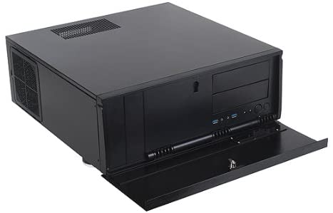
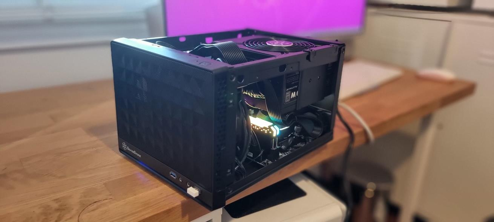
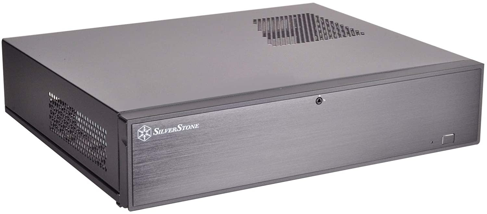
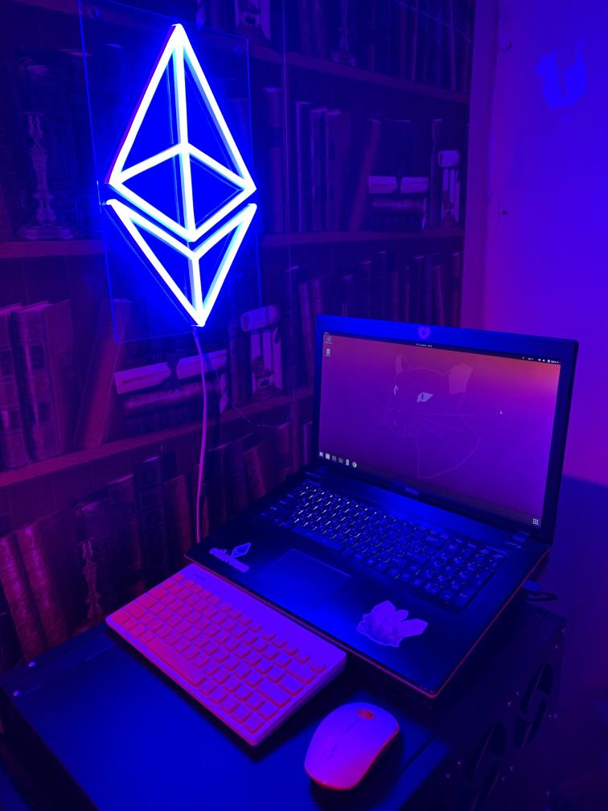
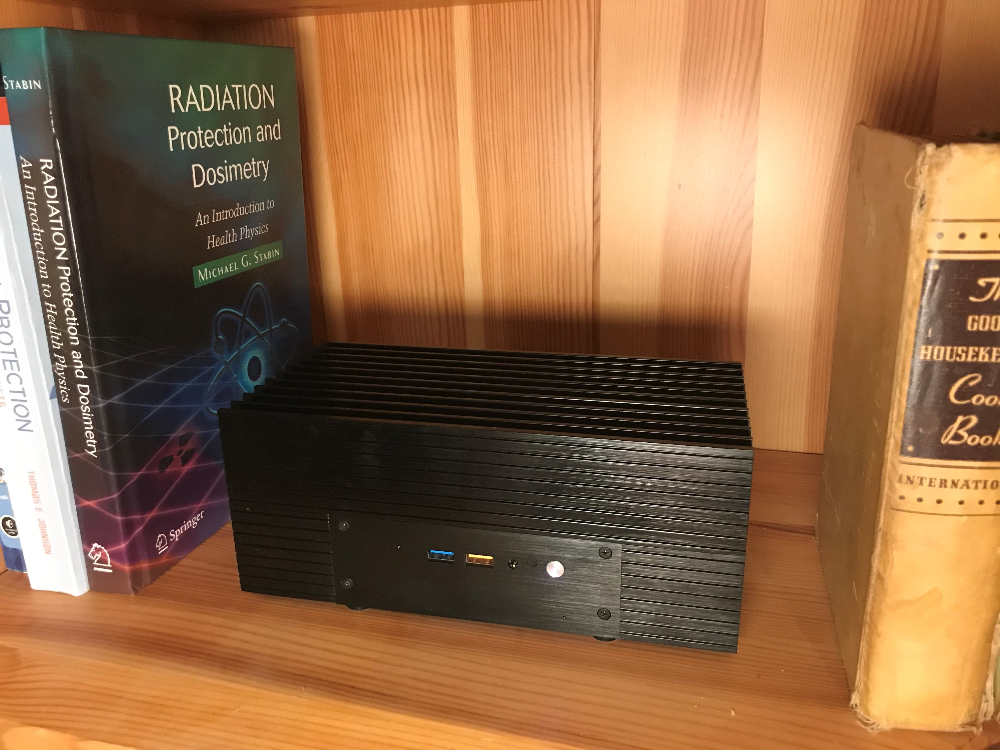
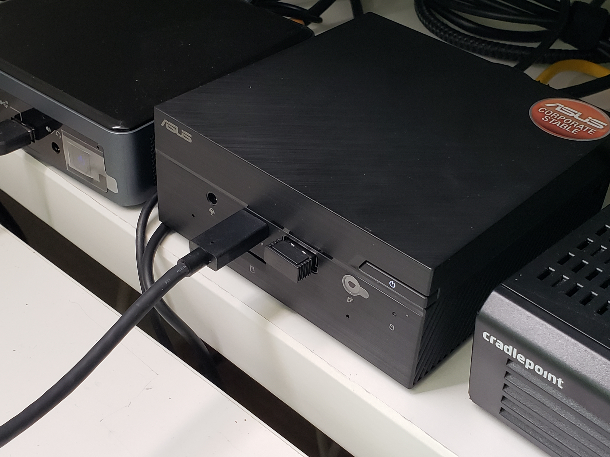
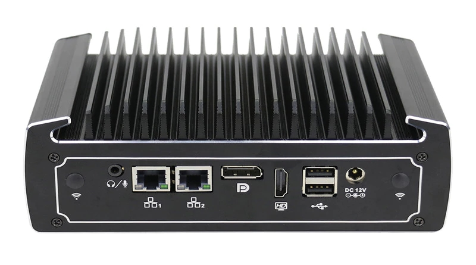

# Выбор оборудования для стейкинга

Официальных спецификаций для работы узла Rocket Pool не существует.
Эта страница предлагает некоторые рекомендации и примеры, которые вы можете использовать для выбора оборудования для стейкинга.

Минимальные аппаратные требования вашего узла будут зависеть от клиентов Consensus и Execution, которые вы выберете.
Если, например, вы планируете запускать узел на маломощном устройстве, вы можете быть ограничены использованием `Geth` в качестве клиента Execution и `Nimbus` в качестве клиента Consensus.
Если вы используете более мощный NUC с 32+ ГБ ОЗУ, вам доступны все комбинации клиентов.

Приведенные ниже рекомендации предполагают, что вы хотите **комфортный** уровень оборудования, то есть у вас есть избыточная мощность.
Если вы будете следовать этим рекомендациям, ваш узел будет иметь достаточно ресурсов для работы любых поддерживаемых Rocket Pool комбинаций клиентов.
Это позволит вам выбрать `random` пару клиентов, что очень важно для разнообразия клиентов в сети Ethereum.

::: tip ПРИМЕЧАНИЕ
Стейкинг Ethereum очень снисходительный.
Если ваш дом затоплен и ваше устройство для стейкинга вышло из строя, нет большого штрафа за то, чтобы вернуться к работе в течение недели (если только вы не находитесь в комитете синхронизации, что является очень редким событием).
Сбой компонентов может произойти в какой-то момент, но не переживайте об этом.
Простой не приведет к слешингу, если вы не офлайн во время крупного сбоя всей сети Ethereum.
:::

## Аппаратные требования

Валидаторы Ethereum не очень требовательны к вычислительным ресурсам, что означает, что как только ваши клиенты Execution и Consensus работают, любой дополнительный валидатор будет использовать **очень небольшое количество дополнительных ресурсов**.
Это справедливо до 64 валидаторов, после чего ресурсы, необходимые для добавления 65-го валидатора и последующих, становятся незначительными.

По нашему опыту, большинство настроек, включая mini-PC и NUC, способны работать с практически неограниченным количеством валидаторов.

### Требования к процессору

**Рекомендация: любой современный процессор с минимум 4 потоками.**

Работа узла Rocket Pool не очень требовательна к вычислениям.
Наибольшее влияние процессора проявляется в том, насколько быстро ваш узел может первоначально синхронизировать состояние блокчейна, когда вы впервые создаете его (или если вы когда-либо измените клиенты позже).
После первоначальной синхронизации процессор используется не так интенсивно.

Названия процессоров могут вводить в заблуждение; Intel Core i5 2010 года обычно **менее мощный**, чем core i3 2022 года.
Многие члены сообщества используют устройства Intel NUC из-за их малого форм-фактора, но старый i5 NUC может быть худшим выбором, чем новый i3.
По этой причине мы рекомендуем использовать «современный» процессор, которому не более нескольких лет.
Более конкретно, **для процессоров на базе x64** мы рекомендуем процессор, поддерживающий расширение [BMI2](<https://en.wikipedia.org/wiki/X86_Bit_manipulation_instruction_set#BMI2_(Bit_Manipulation_Instruction_Set_2)>) - проверьте спецификации производителя вашего процессора, чтобы узнать, поддерживается ли оно.
Не все современные процессоры поддерживают это; например, процессоры Celeron, как правило, не включают его.

Процессоры на базе ARM (такие как Mac M1 или M2, или Rock 5B) не относятся к вышеуказанному расширению BMI2.

::: tip ПРИМЕЧАНИЕ
Если вы заинтересованы в использовании NUC, вы можете определить, насколько современным является NUC, по его номеру модели.
Они отформатированы как `NUC` + `номер поколения` + `модель` + `тип процессора` + `суффикс`.
Например, устройство `NUC11PAHi50Z` является устройством i5 11-го поколения.
Вы можете увидеть список NUC [здесь](https://www.intel.com/content/www/us/en/products/details/nuc/kits/products.html) на веб-сайте Intel.

Другие mini-PC, такие как Asus PN50 или PN51, не следуют этому соглашению, но информация о том, какой процессор в них используется, должна быть включена на страницах их продуктов.
:::

Количество ядер на процессоре менее релевантно, чем его **количество потоков**.
Мы рекомендуем **минимум 4 потока** для работы узла Rocket Pool.
Двухъядерный процессор с 4 потоками будет работать без проблем.
Найти процессор только с 2 потоками редкость.

### Требования к ОЗУ

**Рекомендация: минимум 16 ГБ ОЗУ, предпочтительно 32 ГБ, предпочтительно DDR4**

Узлы Rocket Pool могут работать всего с 16 ГБ ОЗУ.
Мы обычно рекомендуем иметь немного больше, чтобы предложить некоторый запас и полную поддержку клиентов, требовательных к ОЗУ, таких как Teku.
Дополнительным преимуществом большего объема ОЗУ является то, что вы можете предоставить больший размер кэша клиенту Execution, что имеет тенденцию замедлять скорость использования вашего дискового пространства.

### Требования к SSD

**Рекомендация: SSD объемом 2+ ТБ с TLC или лучше, с кэшем DRAM. Предпочтительно NVMe.**

Этот элемент более важен, чем ожидает большинство людей.
Клиент Execution сильно зависит от IOPS, или «операций в секунду»; мы рекомендуем 15k Read IOPS и 5k Write IOPS
На практике это означает, что:

- Жесткие диски HDD (с вращающимися дисками) не будут работать
- SATA или внешние USB 3.0+ SSD _могут_ работать
- Предпочтительны диски NVMe SSD

Если у вас уже есть SSD, который вы хотите использовать, и вы хотите убедиться, что он имеет достаточную производительность для работы узла.

_\* Если вы не уверены, соответствует ли ваш диск этим требованиям производительности, `fio` - хороший способ их проверить.
См. [здесь](https://arstech.net/how-to-measure-disk-performance-iops-with-fio-in-linux/) инструкции для Linux,
и [здесь](https://www.nivas.hr/blog/2017/09/19/measuring-disk-io-performance-macos/) инструкции для MacOS._

:::tip ПРИМЕЧАНИЕ
Выбор SSD может быть сложным решением!

Метод, который SSD используют для хранения данных на своих флеш-чипах, оказывает заметное влияние на скорость и долговечность.
При покупке SSD вы можете заметить такие метки, как `QLC`, `TLC` или `SLC`.
Они обозначают количество данных, содержащихся в одной ячейке флеш-чипа: `Q` для "quad" означает 4, `T` для "triple" означает 3, `M` для "multi" означает 2, а `S` для "single" означает 1.

Мы рекомендуем диски **TLC, MLC или SLC**.
Мы **не рекомендуем диски QLC** из-за их более низкой производительности и меньшей общей надежности.

SSD поставляются с DRAM или без него, что является аппаратным элементом, который делает доступ к данным на SSD более эффективным.
Те, что с DRAM, быстрее, но те, что без DRAM, дешевле.
Однако DRAM довольно важен для обеспечения плавной работы узла.

Мы рекомендуем диск с кэшем **DRAM**.
Мы **не рекомендуем диски без DRAM**.
:::

Последнее соображение - размер диска.
По состоянию на 4/2026 размер базы данных клиента execution `geth` требует около 1,2 ТБ пространства после завершения первоначальной синхронизации (или после того, как вы только что закончили обрезку).
Это будет неуклонно расти со временем, и хотя обрезка может восстановить часть этого пространства, свежеобрезанное состояние _действительно_ растет со временем.
У вас будет спокойствие с диском большего размера. Размер этой базы данных можно уменьшить, если вы [решите не хранить историю до слияния](/node-staking/maintenance/history-expiry).

### Обычные аксессуары

Многие операторы узлов улучшают свои настройки сверх минимальных требований.
Некоторые общие дополнения включают:

- Радиаторы SSD для продления срока службы диска
- Источники бесперебойного питания (ИБП) на случай отключения электроэнергии
- Резервный узел для резервного копирования на случай сбоя

Все это удобно иметь, но не требуется для работы узла Rocket Pool.

## Примеры сборок

В этом разделе мы покажем несколько разнообразных сборок, которые сообщество Rocket Pool создало для себя.
Это примеры того, что используют люди, а не рекомендации о том, как вам следует организовать свою установку.
Обратите внимание, что многие из них несколько устарели и, например, используют SSD, которые сейчас слишком малы.

### Сервер Xer0



Пользователь Discord **Xer0** — один из многих стейкеров, которые выбрали обычный форм-фактор ПК для своей машины для стейкинга.
Они хотели собрать систему, которая прослужит долгие годы с минимальным обслуживанием и модернизацией, но при этом предлагает полную настройку каждого компонента.
С этой целью Xer0 разработал и собрал полноразмерный ATX-сервер — во многом похожий на традиционный настольный ПК, но нацеленный исключительно на стейкинг в Ethereum.
Их сборка включает шестиядерный Xeon Bronze 3204 (1,9 ГГц), 8 слотов DDR4 и слот M.2... хотя, поскольку это по сути домашний сервер, точный выбор компонентов полностью зависит от конечного пользователя.

Сборка Xer0:

- Материнская плата: [Supermicro X11SPI-TF](https://www.newegg.com/supermicro-mbd-x11spi-tf-o-intel-xeon-scalable-processors-single-socket-p-supported-cpu-tdp-suppor/p/1B4-005W-00153) ($440)
- Процессор: [Xeon Bronze 3204](https://www.amazon.com/Intel-BX806954216-Bronze-1-9GHz-FC-LGA14B/dp/B07RTBMWVJ) ($248)
- ОЗУ: [NEMIX 2x32GB DDR4 ECC 2933MHz](https://www.amazon.com/2x32GB-DDR4-2933-PC4-23400-Registered-Memory/dp/B07V1YG2VV) ($359)
- SSD: [Sabrent 2TB Rocket M.2 2280 SSD](https://www.newegg.com/sabrent-rocket-2tb/p/14R-00X6-00007) ($250)
- Корпус: [SilverStone HTPC ATX GD07B](https://www.amazon.com/dp/B007X8TQW0) ($172)
- Блок питания: [EVGA SuperNova 650 G3, 80+ Gold](https://www.newegg.com/evga-supernova-g3-series-220-g3-0650-y1-650w/p/N82E16817438094) ($111)
- Кулер: [Noctua NH-D9 DX-3647 4U](https://www.amazon.com/Noctua-NH-D9-DX-3647-4U-Premium/dp/B07DPQJH5J) ($100)
- **Итого: $1680**

Вот комментарии Xer0 о том, почему они выбрали эту сборку:

_Очевидно, нет необходимости строить монстра просто для стейкинга в сети Ethereum, но у меня есть несколько причин, по которым я собрал нечто подобное._

1. _Теперь я считаю, что 1 или более валидаторов в будущем будут стоить намного больше, чем то, что мы видим сейчас, поэтому я хотел купить что-то, что сможет поддерживать сеть как минимум следующие 10-20 лет без сбоев._
1. _Создав машину с таким количеством ядер, я также дал себе гораздо больше запаса — вплоть до того, что я мог бы запустить на ней L2-агрегатор без каких-либо проблем (с точки зрения оборудования) и всё остальное, что я захотел бы запустить на сервере._ :)
1. _Мне нравится собирать компьютеры, поэтому я его и собрал…_
1. _Серверная сборка даёт мне гораздо больше гибкости в плане оборудования и функций, которых нет у большинства компьютеров изначально._
1. _Небольшой задел на будущее (просто на всякий случай)_ :wink:

### Полочная сборка Darcius



Основатель Rocket Pool Дэвид Ругендайк (известный в Discord как **darcius**) потратил много времени на совершенствование своей ноды.
После некоторых раздумий он собрал Mini-ITX, который мал и портативен, но при этом обладает огромной вычислительной мощностью.
Его система включает 8-ядерный Ryzen 7 5800x (3,8 ГГц), два слота DDR4 и два слота M.2 для NVMe SSD.
Это действительно одна из самых высокопроизводительных систем среди нод Rocket Pool, но не без причины: darcius запускает особый тип ноды Rocket Pool, называемый Oracle Node, которая передаёт информацию с Beacon chain обратно в Execution chain обо всех валидаторах Rocket Pool.
При тысячах активных minipool Rocket Pool, за которыми нужно следить, эта работа требует большой мощности... но его полочная сборка легко справляется с задачей.

Сборка Darcius:

- Материнская плата: [MSI MPG B550I Mini-ITX AMD](https://www.newegg.com/msi-mpg-b550i-gaming-edge-wifi/p/N82E16813144323) ($200)
- Процессор: [AMD Ryzen 7 5800x](https://www.newegg.com/amd-ryzen-7-5800x/p/N82E16819113665) ($490)
- ОЗУ: [Corsair Vengeance RGB Pro 2x16GB DDR4 3600MHz](https://www.newegg.com/p/0RN-00P8-000A5) ($390)
- SSD: [Samsung 970 EVO Plus 2TB M.2 2280 NVMe SSD](https://www.newegg.com/samsung-970-evo-plus-2tb/p/N82E16820147744) ($315)
- Корпус: [SilverStone SST-SG13B Mini-ITX](https://www.amazon.com/SilverStone-Technology-Mini-ITX-Computer-SST-SG13WB-USA/dp/B07MNC3JCB) ($52)
- Блок питания: [SilverStone Strider Platinum 550W](https://www.newegg.com/silverstone-strider-platinum-series-ps-st55f-pt-550w/p/N82E16817256154) ($140)
- **Итого: $1587**

### Сборка Yorick на microATX



Опытный энтузиаст оборудования **YorickDowne** имеет большой опыт сборки и обслуживания серверов.
Используя эти знания, он остановился на гибкой конфигурации microATX.
Его машина значительно меньше типичного ПК, но всё же вмещает технологии серверного класса, которые максимизируют отказоустойчивость и время безотказной работы — ключевые метрики при работе ноды Rocket Pool.
У него есть рекомендации как для конфигураций Intel, так и AMD, которые вы можете найти [на его сайте](https://eth-docker.net/docs/Usage/Hardware).
Версия Intel использует четырёхъядерный i3-9100F (3,6 ГГц) или процессор Xeon, а версия AMD предполагает любой процессор Ryzen с поддержкой памяти ECC.
Для обеих конфигураций он предлагает 16 ГБ ECC-памяти и NVMe SSD на 1 ТБ.

Сборка Yorick:

- Материнская плата: [SuperMicro X11SCL-F-O](https://www.newegg.com/supermicro-mbd-x11scl-f-o-8th-generation-intel-core-i3-pentium-celeron-processor-intel-xeon-pro/p/N82E16813183671) ($200)
- Процессор: [Intel i3-9100F](https://www.newegg.com/intel-core-i3-9th-gen-core-i3-9100f/p/N82E16819118072) ($150)
- ОЗУ: [Samsung 1x16GB DDR4 ECC UDIMM 2400MHz](https://www.newegg.com/samsung-16gb-288-pin-ddr4-sdram/p/1WK-002G-00080) ($100)
- SSD: [Samsung 970 EVO Plus 1TB M.2 2280 NVMe SSD](https://www.newegg.com/samsung-970-evo-plus-1tb/p/N82E16820147743?Item=N82E16820147743) ($165)
- Корпус: [SilverStone Micro ATX HTPC Case ML04B-USA](https://www.amazon.com/Silverstone-Technology-Aluminum-Center-ML04B-USA/dp/B07PD8CL7P/) ($110)
- Блок питания: Любой (например: [Seasonic PRIME Fanless PX-500 Platinum 500W](https://www.newegg.com/seasonic-prime-fanless-px-500-500w/p/N82E16817151234)) ($161)
- Корпусные вентиляторы: Любые
- **Итого: около $886**

Вот комментарии Yorick о том, почему он выбрал эту сборку:

- _Она стоит столько же или дешевле, чем некоторые NUC_
- _В ней есть ECC-память, а это значит, что если память выйдет из строя — а это время от времени случается — я об этом узнаю, потому что система мне сообщит. Мне не придётся запускать memtest87 в течение 4-5 дней, чтобы понять, связана ли моя проблема с нестабильностью вообще с памятью. Я яростно берегу своё время, чтобы тратить его на разглагольствования в Discord, а не на устранение неполадок оборудования_
- _В ней есть IPMI — удалённое управление всей машиной через Ethernet/браузер, включая UEFI и перезагрузку питания. Я должен иметь возможность уехать в длительный отпуск и всё равно сохранить полный удалённый доступ._
- _Если я захочу избыточное хранилище, чтобы возможный отказ SSD не был событием, я могу это сделать_
- _Она обеспечивает большую гибкость в выборе компонентов сборки. Я могу выбрать столько ОЗУ и вычислительной мощности, сколько захочу; я могу выбрать запуск NAS с технологией виртуализации вроде TrueNAS Scale и запустить ноду там же вместе с другими домашними серверными задачами._

### Ноутбук Drez



Иногда тратиться на новое оборудование просто не имеет смысла.
В случае пользователя Discord **Drez** запуск ноды Rocket Pool — как раз такой случай.
У Drez случайно оказался запасной ноутбук, и они с лёгкостью превратили его в ноду.
Их машина оснащена четырёхъядерным i7-4710HQ (2,5 ГГц), двумя слотами DDR3 и слотом 2,5" SATA.
Будучи ноутбуком, она также имеет собственную батарею (что компенсирует потребность в ИБП).
Со временем они добавили несколько дополнительных улучшений, дав ноутбуку ещё больше мощности для дополнительного спокойствия.

Сборка Drez:

- Ноутбук: [MSI GE70 2PE Apache Pro](https://www.msi.com/Laptop/GE70-2PE-Apache-Pro/Specification) ($1800)
- ОЗУ: 2x8GB DDR3 1333Mhz (В комплекте)
- SSD: [Samsung 860 EVO 1TB 2.5" SATA](https://www.amazon.com/Samsung-Inch-Internal-MZ-76E1T0B-AM/dp/B078DPCY3T) ($110)
- **Итого: $1910**

Вот комментарии Drez о том, почему они выбрали эту сборку:

_Основная причина, по которой я собираюсь стейкать на этом ноутбуке, в том, что у меня уже был запасной и не нужно тратить лишние деньги на новый сервер.
Мне нравится его мобильность, компактность, встроенный экран для удобного мониторинга.
На случай перегрева я купил охлаждающую подставку для ноутбука и запасной кулер процессора, я также рекомендую заменить термопасту, особенно если вы собираетесь работать на более старой машине_

## NUC (Next Unit of Computing) и мини-ПК

Для работы ноды Rocket Pool не обязательно нужна полностью самостоятельная сборка настольного ПК.
На самом деле, одна из самых популярных конфигураций среди стейкеров — прославленный NUC.
NUC (Next Unit of Computing) — это по сути небольшой автономный компьютер, спроектированный с расчётом на очень низкое энергопотребление и максимальную эффективность.
NUC отлично подходят для большинства стейкеров, которые запускают всего несколько валидаторов, благодаря низкому обслуживанию, низким ежемесячным эксплуатационным расходам и простоте настройки.
В отличие от ПК, NUC поставляются предварительно собранными в корпусе; всё, что вам нужно сделать, — добавить немного ОЗУ, добавить SSD, и вы готовы к работе!
Ниже приведено несколько примеров конфигураций NUC, которые используют и рекомендуют некоторые ветераны Rocket Pool.

::: tip ПРИМЕЧАНИЕ
**Совместимость Ethernet-адаптера**

Если вы планируете купить Intel® NUC 11-го или 12-го поколения, вы можете столкнуться с проблемами подключения Ethernet-адаптера, особенно если адаптер идентифицируется как **I225-LM** (проверьте спецификации Intel перед покупкой).
Если у вас он уже есть, есть шаги, которые вы можете предпринять для решения этой проблемы.
Адаптер I225-LM связывают с определёнными проблемами совместимости, которые могут приводить к **зависаниям системы** и непредвиденному поведению ядра, особенно при использовании ядер Linux.

Чтобы определить, использует ли ваш NUC проблемный Ethernet-адаптер I225-LM, вы можете выполнить следующую команду в терминале:

```shell
sudo lshw -class network | grep 225
```

Если вывод подтверждает наличие адаптера I225-LM, вы можете столкнуться с упомянутыми проблемами. Однако есть _средства_, которые вы можете применить для смягчения этих проблем:

**Адаптер USB-C на Ethernet**: Жизнеспособное решение — приобрести адаптер USB-C на Ethernet и подключить интернет-кабель через этот внешний адаптер. Хотя такой подход требует дополнительного оборудования и настройки, он доказал свою эффективность в устранении конфликтов совместимости. Это позволяет использовать новейшие доступные ядра Linux, не сталкиваясь с зависаниями или аномалиями, связанными с ядром, характерными для адаптера I225-LM.**Это рекомендуемое решение (на данный момент), если у вас уже есть NUC с I225-LM** _Имейте в виду, что выбор адаптера может привести к компромиссу с точки зрения возможной задержки или снижения скорости интернета. Чтобы смягчить это влияние, желательно выбрать адаптер с пропускной способностью не менее 1 ГБ/с, что поможет поддерживать оптимальные скорости передачи данных._

**Обновления драйверов и программного обеспечения**: Рассмотрите возможность обновления драйверов, прошивки и BIOS, обратившись к официальной странице поддержки Intel® для вашей модели NUC [здесь](https://www.intel.com/content/www/us/en/search.html?ws=text#sort=relevancy&f:@tabfilter=[Downloads). Это может включать использование последнего доступного драйвера поддержки с сайта Intel или применение обновлений BIOS, устраняющих проблемы совместимости.

**Патч Intel (Windows)**: Intel выпустила патч для устранения аналогичной проблемы в системах Windows. Хотя сам патч **может не применяться напрямую к средам Linux**, он подчёркивает признание проблемы со стороны Intel и их усилия по предоставлению решений. Более подробную информацию о патче можно найти по этой [ссылке](https://www.intel.com/content/www/us/en/download/705968/patch-for-a-modern-standby-lan-issue-on-intel-nuc-11th-12th-generation-products.html?wapkw=nuc11tnhi3).

Имейте в виду, что технологии развиваются, и решения могут меняться со временем. Всегда следите за последними ресурсами, предоставляемыми Intel для вашей конкретной модели NUC, на их официальной [странице](https://www.intel.com/content/www/us/en/search.html?ws=text#sort=relevancy&f:@tabfilter=[Downloads]) загрузок.

Следуя этим шагам, вы сможете решить проблемы совместимости, связанные с Ethernet-адаптером I225-LM в продуктах Intel® NUC 11-го и 12-го поколений, обеспечив более плавную и надёжную работу вашего сервера. _Хотя часть пользователей NUC с этим адаптером сообщила об отсутствии проблем, важно отметить, что **большинство пользователей**, особенно после обновления ядра, столкнулись с проблемами. Примечательно, что ядра 5.15.+ оказались наиболее стабильным вариантом для тех, кто использует адаптер I225-LM. Если идея использования адаптера USB-C вас не привлекает и вы готовы пойти на риск возможных случайных зависаний, желательно **оставаться на версии ядра, продемонстрировавшей большую стабильность**._
:::

### NUC8i5BEK от Ken



NUC8i5BEK — один из собственных NUC от Intel с процессором 8-го поколения.
Выпущенная в 2018 году, эта модель оснащена четырёхъядерным процессором i5-8259U (2,30 ГГц), двумя слотами DDR4, слотом M.2 для SSD и портами USB 3.1.
Обычно она потребляет около 20 ватт, но пользователь Discord **Ken** смог оптимизировать её до 9 ватт при обычной валидации.
Она более чем способна работать с любым клиентом Execution и любым клиентом Consensus, что делает её отличным выбором для лёгкой и эффективной машины-ноды.

Сборка Ken:

- Основа: [Intel NUC8i5BEK](https://www.amazon.com/Intel-NUC-Mainstream-Kit-NUC8i5BEK/dp/B07GX67SBM) ($349)
- ОЗУ: [Dell Memory Upgrade - 1x16GB DDR4 SODIMM 3200MHz](https://www.dell.com/en-us/shop/dell-memory-upgrade-16gb-1rx8-ddr4-sodimm-3200mhz/apd/ab371022/memory) ($112)
- SSD: [ADATA XPG S7 Series 2TB M.2 2280 NVMe SSD](https://www.amazon.com/XPG-S7-Gen3x4-Solid-State/dp/B08BDZQJP5) ($230)
- Безвентиляторный корпус (опционально): [AKASA Turing Fanless case](https://www.amazon.com/Akasa-Compact-fanless-Generation-NUC45-M1B/dp/B07RTBF1SY) ($134)
- **Итого: от $691 до $825**

Вот комментарии Ken о том, почему он выбрал эту сборку:

- _Малый размер и занимаемая площадь, блок питания в виде «кирпича» на кабеле (как у ноутбука), одноплатный компьютер, архитектура x86, низкая цена покупки, низкое энергопотребление (~10 Вт), 3-летняя гарантия и активная производственная линейка (Intel)._
- _8-е поколения достаточно быстры и стоят дешевле, чем чипы новейшего поколения._
- _Я перешёл на безвентиляторный (с пассивным охлаждением) корпус, поэтому NUC абсолютно бесшумен (0 дБ), так как я оставляю его в своём домашнем офисе (стандартный NUC и так почти бесшумен)._
- _Плюс никакого механического износа подшипников вентилятора._
- _Ценность при перепродаже или перепрофилировании, если я решу вывести эту аппаратную платформу из эксплуатации в качестве моей ноды RP — NUC отлично подходят в качестве рабочих станций._

### NUC10i7FNH от GreyWizard


NUC10i7FNH — ещё один из собственных NUC от Intel.
Этот оснащён процессором 10-го поколения и был выпущен в 2019 году.
Он оснащён шестиядерным процессором i7-10710U (1,10 ГГц, разгон до 4,7 ГГц), двумя слотами DDR4, слотом M.2 и слотом 2,5" для SSD, а также портами USB 3.1.
Он потребляет около 20 ватт энергии.
Это невероятно мощная машина, учитывая её энергопотребление и размер.
Пользователь Discord **GreyWizard** использует этот NUC для своей ноды — дополнительная мощность даёт ему спокойствие, зная, что независимо от того, что готовит будущее цепочки Ethereum 2.0, его машина сможет с этим справиться.

Сборка GreyWizard:

- Основа: [Intel BXNUC10I7FNH1](https://www.newegg.com/intel-bxnuc10i7fnh1/p/N82E16856102227) ($445)
- ОЗУ: 2x [Samsung M471A4G43MB1 32GB DDR4 SODIMM 2666 MHz](https://www.newegg.com/samsung-32gb-260-pin-ddr4-so-dimm/p/0RM-002H-00156) ($154 за шт.)
- SSD: [Samsung 970 EVO Plus 2TB M.2 2280 NVMe SSD](https://www.newegg.com/samsung-970-evo-plus-2tb/p/N82E16820147744) ($315)
- **Итого: $1068**

Вот комментарии GreyWizard о том, почему он выбрал эту сборку:

_Я выбрал NUC с i7 в основном потому, что это показалось лучшим сочетанием выдающейся производительности относительно общего размера и накладных расходов.
Я также рассматривал другие варианты, например сборку машины размера Micro ATX.
После оценки стоимости с нужными мне характеристиками этот Intel NUC оказался примерно той же цены, а форм-фактор действительно трудно превзойти.
Мне нравится иметь дополнительный запас производительности/спокойствия, и я признаю, что это почти наверняка избыточно.
Я считаю стейкинг серьёзной инвестицией и не хочу беспокоиться о том, будет ли моего оборудования достаточно._

_Советы для других людей, рассматривающих этот вариант..._

- _NUC действительно сильно нагревается, температуры схожи с ноутбуком. Если вас беспокоит температура процессора и вам нужно что-то мощное, вам стоит посмотреть на небольшие настольные конфигурации вроде Micro ATX._
- _Вам нужно убедиться, что вокруг вашего NUC достаточно места для циркуляции воздуха. Планируйте регулярно очищать эту зону, чтобы предотвратить накопление пыли._
- _Обязательно проверьте совместимость ваших модулей ОЗУ. Разные NUC поддерживают разный объём ОЗУ, разные скорости памяти и т. д._
- _Если вы выбираете NUC, я бы посоветовал оставить себе место для роста при выборе ОЗУ... Например, потратьте немного больше и возьмите одну плату ОЗУ на 32 ГБ вместо 2x16, чтобы вы могли расшириться позже, если захотите (при условии, что ваш NUC поддержит 64 ГБ в этом примере)_
- _Не стесняйтесь связаться со мной в Discord, если хотите обсудить._

### Видео процесса сборки NUC10i5FNHN от ArtDemocrat

В дополнение к описаниям сборок и советам Greywizard, ArtDemocrat создал это видео о процессе сборки как дополнительный вспомогательный ресурс для настройки NUC10 (в данном случае NUC10i5FNHN, но процесс сборки должен быть похожим для NUC10i7FNH):

<video controls="controls" src="https://cdn-rocketpool.s3.us-west-2.amazonaws.com/NUC_Staking_Setup_-_ArtDemocrat.mp4" />

Сборка ArtDemocrat:

- Основа: [Intel NUC NUC10i5FNHN (Barebone)](https://www.jacob.de/produkte/intel-nuc-nuc10i5fnhn-bxnuc10i5fnhn-artnr-7103179.html) ($300)
- ОЗУ: 1x [Crucial 32GB DDR4-3200 SODIMM](https://www.amazon.de/dp/B07ZLC7VNH) ($65)
- SSD: [Samsung 970 EVO Plus 2TB M.2 2280 NVMe SSD](https://www.amazon.de/dp/B07MLJD32L) ($107)

### PN50 от Actioncj17



ASUS PN50 — это мини-ПК, который имеет много общего с семейством NUC от Intel.
У него очень малый форм-фактор, но при этом есть все компоненты и функции полноценного ПК.
Он поставляется с процессором AMD на ваш выбор, так что вы можете найти баланс между производительностью и стоимостью (вплоть до 8-ядерного Ryzen R7-4700U на 2,0 ГГц), двумя слотами DDR4, слотом M.2 и слотом 2,5" для SSD, а также портами USB 3.1.
Он также поставляется с блоком питания на 90 ватт, хотя на практике ему не требуется столько энергии при работе в качестве ноды Rocket Pool.
Пользователь Discord **actioncj17** попробовал несколько разных конфигураций, но предпочитает PN50 всему остальному... хотя они с радостью признают, что это избыточно для работы ноды Rocket Pool.

Сборка Actioncj17:

- Основа: [ASUS PN50 4700u](https://www.newegg.com/asus-pn50-bbr066md/p/N82E16856110206) ($583)
- ОЗУ: [HyperX Impact 2x16GB DDR4 SODIMM 3200MHz](https://www.newegg.com/hyperx-32gb-260-pin-ddr4-so-dimm/p/N82E16820104836) ($220)
- SSD: [Samsung 970 EVO Plus 2TB M.2 2280 NVMe SSD](https://www.newegg.com/samsung-970-evo-plus-2tb/p/N82E16820147744) ($315)
- **Итого: $1118**

Вот комментарии actioncj17 о том, почему они выбрали эту сборку:

_Мой ответ на вопрос, почему я выбрал Asus PN50, довольно прост.
Я хотел посмотреть, насколько крут Ryzen 7 4700U от AMD.
Скажем так, я не разочарован.
На самом деле я начинал с Intel NUC10FNK.
Я поставил в NUC 32 ГБ оперативной памяти и 1 ТБ 970 evo plus nvme m.2, и он летает.
У меня нет претензий к NUC, и он прекрасно работает, но от PN50 я получаю больше.
Я бы сказал, что обе конфигурации избыточны для стейкинга на Rocketpool, но небольшой задел на будущее не помешает.
Обе занимают мало места, и NUC на самом деле гораздо тише, поскольку он безвентиляторный.
В целом PN50 — более выгодная покупка, если вам удастся его достать._

### Мини-ПК от Moralcompass



Пользователь Discord **moralcompass** пошёл по пути, схожему с actioncj17, выбрав мини-ПК, но его предпочтение — процессор Intel.
Он использует мини-ПК с четырёхъядерным i5 8250U (1,6 ГГц, разгон до 3,4 ГГц), одним слотом DDR4, слотом M.2 и слотом 2,5" для SSD, а также портами USB 3.0.
Moralcompass утверждает, что он потребляет всего около 10 ватт от сети, что демонстрирует высокую эффективность подобных мини-ПК.
Интересная особенность этого выбора в том, что он полностью пассивно охлаждается — никаких вентиляторов!
Хотя существует множество вариантов безвентиляторных мини-ПК, moralcompass нашёл тот, который ему подошёл, и остановился на нём.

Сборка Moralcompass:

- Основа: [Partaker Fanless Mini PC - i5 8250U](https://www.aliexpress.com/item/1005001867740130.html?spm=a2g0s.9042311.0.0.66e94c4d0ORiVh) ($387)
- ОЗУ: [Crucial 1x32GB DDR4 SODIMM 2666MHz](https://www.newegg.com/crucial-32gb-260-pin-ddr4-so-dimm/p/N82E16820156239) ($153)
- SSD: [Silicon Power 1TB M.2 2280 NVMe SSD](https://www.amazon.com/Silicon-Power-Gen3x4-000MB-SU001TBP34A80M28AB/dp/B07L6GF81L) ($115)
- **Итого: $655**

Вот комментарии moralcompass о том, почему они выбрали эту сборку:

- _Нет движущихся частей, нет шума._
- _Двойной сетевой адаптер Intel (на случай, если я однажды решу перепрофилировать его в свой роутер)_
- _Слоты NVME + SATA (предпочитаю NVME за скорость и варианты с более высоким ресурсом TBW. SATA даёт возможность использовать HDD или SSD. Я избегал интерфейсов M.SATA, потому что эти SSD, похоже, становятся устаревшими)_
- _Доступны порты USB и последовательные порты для сигнала корректного завершения работы от ИБП_
