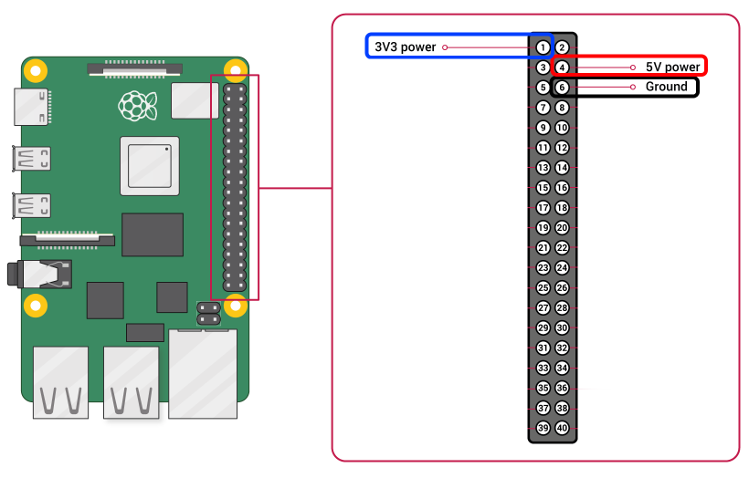

# Подготовка Raspberry Pi

::: warning ПРИМЕЧАНИЕ
Эта страница оставлена здесь в архивных целях. Мы больше не рекомендуем запускать Rocket Pool на Raspberry Pi из-за
возросших требований к оборудованию и производительности при работе валидатора Ethereum.
:::

Это руководство расскажет вам, как запустить ноду Rocket Pool на Raspberry Pi.
Хотя обычно это не рекомендуется в большинстве руководств по стейкингу, мы понимаем, что такой вариант привлекателен, поскольку он гораздо доступнее, чем сборка целого ПК.
С этой целью мы усердно поработали над настройкой и оптимизацией целого ряда параметров и определили конфигурацию, которая, похоже, работает хорошо.

Эта конфигурация будет запускать **полную ноду Execution** и **полную ноду Consensus** на Pi, благодаря чему ваша система будет вносить вклад в здоровье сети Ethereum, одновременно выступая в роли оператора ноды Rocket Pool.

## Предварительная настройка

Чтобы запустить ноду Rocket Pool на Raspberry Pi, вам сначала понадобится работающий Raspberry Pi.
Если у вас уже есть настроенный и работающий — отлично! Вы можете перейти к разделу [Монтирование SSD](#монтирование-ssd).
Только убедитесь, что перед этим у вас **подключён вентилятор**.
Если вы начинаете с нуля, читайте дальше.

### Что вам понадобится

Вот рекомендуемые компоненты, которые вам нужно будет купить, чтобы запустить Rocket Pool на Pi:

- **Raspberry Pi 4 Model B**, модель на **8 ГБ**
  - Примечание: хотя вы _можете_ использовать 4 ГБ с этой конфигурацией, мы настоятельно рекомендуем взять 8 ГБ для спокойствия... это действительно ненамного дороже.
- **Блок питания USB-C** для Pi. Вам нужен такой, который обеспечивает **не менее 3 ампер**.
- **Карта MicroSD**. Она не обязана быть большой, 16 ГБ вполне достаточно, и сейчас они довольно дёшевы... но она должна быть как минимум **Class 10 (U1)**.
- **Адаптер MicroSD в USB** для вашего ПК. Он нужен, чтобы установить операционную систему на карту перед тем, как вставить её в Pi.
  Если в вашем ПК уже есть порт SD, то новый покупать не нужно.
- Несколько **радиаторов**. Вы будете держать Pi под высокой нагрузкой 24/7, и он будет сильно нагреваться.
  Радиаторы помогут избежать троттлинга. В идеале вам нужен набор из 3: один для процессора, один для ОЗУ и один для контроллера USB.
  [Вот хороший пример неплохого набора](https://www.canakit.com/raspberry-pi-4-heat-sinks.html).
- **Корпус**. Здесь есть два пути: с вентилятором и без вентилятора.
  - С вентилятором:
    - **Вентилятор** 40 мм. Как и выше, цель — сохранять прохладу во время работы вашей ноды Rocket Pool.
    - **Корпус с креплением для вентилятора**, чтобы всё это связать воедино.
      Вы также можете взять корпус со встроенными вентиляторами [вроде этого](https://www.amazon.com/Raspberry-Armor-Metal-Aluminium-Heatsink/dp/B07VWM4J4L), чтобы не покупать вентиляторы отдельно.
  - Без вентилятора:
    - **Безвентиляторный корпус**, который действует как один гигантский радиатор, [например этот](https://www.amazon.com/Akasa-RA08-M1B-Raspberry-case-Aluminium/dp/B081VYVNTX).
      Это неплохой вариант, поскольку он бесшумен, но ваш Pi **будет** довольно горячим — особенно во время первоначальной синхронизации блокчейна.
      Спасибо пользователю Discord Ken за то, что указал нам это направление!
  - Как правило, мы рекомендуем вариант **с вентилятором**, поскольку мы будем значительно разгонять Pi.

Многое из этого можно купить в комплекте для удобства — например, [Canakit предлагает набор](https://www.amazon.com/CanaKit-Raspberry-8GB-Starter-Kit/dp/B08956GVXN) с множеством включённых компонентов.
Однако вы, возможно, сможете купить всё дешевле, если приобретёте детали по отдельности (а если у вас есть оборудование, вы можете [распечатать собственный корпус для Pi на 3D-принтере](https://www.thingiverse.com/thing:3793664).)

Другие компоненты, которые вам понадобятся:

- **Твердотельный накопитель USB 3.0+**. Общая рекомендация — **накопитель на 2 ТБ**.
  - [Samsung T5](https://www.amazon.com/Samsung-T5-Portable-SSD-MU-PA2T0B/dp/B073H4GPLQ) — отличный пример накопителя, который, как известно, работает хорошо.
  - :warning: Использование SATA SSD с адаптером SATA-USB **не рекомендуется** из-за [проблем вроде этой](https://www.raspberrypi.org/forums/viewtopic.php?f=28&t=245931).
    Если вы пойдёте этим путём, мы включили тест производительности, которым вы можете воспользоваться, чтобы проверить, будет ли он работать, в разделе [Тестирование производительности SSD](#тестирование-производительности-ssd).
- **Кабель Ethernet** для доступа в интернет. Он должен быть как минимум категории **Cat 5e**.
  - Запуск ноды через Wi-Fi **не рекомендуется**, но если у вас нет другого выбора, вы можете сделать это вместо использования кабеля Ethernet.
- **ИБП**, который будет служить источником питания, если у вас когда-нибудь пропадёт электричество.
  Pi действительно потребляет немного энергии, поэтому даже небольшой ИБП продержится какое-то время, но обычно чем больше, тем лучше. Берите настолько большой ИБП, насколько можете себе позволить.
  Кроме того, мы рекомендуем **подключить к нему ваш модем, роутер и другое сетевое оборудование** — нет особого смысла поддерживать работу Pi, если ваш роутер отключится.

В зависимости от вашего местоположения, распродаж, вашего выбора SSD и ИБП, а также от того, сколько из этих вещей у вас уже есть, вы, вероятно, потратите **примерно от $200 до $500** на полную конфигурацию.

### Как сделать работу вентилятора тише

Когда вы получите вентилятор, по умолчанию вам, вероятно, предложат подключить его к 5-вольтовому пину GPIO, как показано на картинке ниже.
У вентилятора будет разъём с двумя отверстиями; чёрное должно идти на GND (пин 6), а красное — на +5v (пин 4).


Однако, по нашему опыту, из-за этого вентилятор работает очень громко и быстро, что на самом деле не требуется.
Если вы хотите сделать его тише, сохраняя при этом охлаждение, попробуйте подключить его к пину 3,3 В (Пин 1, синий) вместо пина 5 В.
Это значит, что на вашем вентиляторе чёрный контакт по-прежнему пойдёт на GND (пин 6), но теперь красный контакт пойдёт на +3.3v (пин 1).

Если у вашего вентилятора разъём, в котором два отверстия расположены рядом и вы не можете их разделить, вы можете вставить [перемычки вроде этих](https://www.amazon.com/GenBasic-Female-Solderless-Breadboard-Prototyping/dp/B077N7J6C4) между ним и пинами GPIO на Pi.

### Установка операционной системы

Существует несколько разновидностей ОС Linux, которые поддерживают Raspberry Pi.
В этом руководстве мы будем придерживаться **Ubuntu 20.04**.
Ubuntu — проверенная временем ОС, используемая по всему миру, а 20.04 является (на момент написания) последней из версий с долгосрочной поддержкой (LTS), что означает, что она будет получать патчи безопасности очень долгое время.
Если вы предпочитаете другой дистрибутив Linux, например Raspbian, не стесняйтесь следовать существующим руководствам по установке для него — только имейте в виду, что это руководство создано для Ubuntu, поэтому не все инструкции могут соответствовать вашей ОС.

Замечательные ребята из Canonical написали [прекрасное руководство о том, как установить образ Ubuntu Server на Pi](https://ubuntu.com/tutorials/how-to-install-ubuntu-on-your-raspberry-pi#1-overview).

Следуйте **шагам с 1 по 4** приведённого выше руководства для настройки Server.
В качестве образа операционной системы выберите `Ubuntu Server 20.04.2 LTS (RPi 3/4/400) 64-bit server OS with long-term support for arm64 architectures`.

Если вы решите, что хотите десктопный интерфейс (чтобы можно было пользоваться мышью и перетаскивать окна), вам нужно будет выполнить и шаг 5.
Мы советуем не делать этого и остановиться на серверном образе, поскольку десктопный интерфейс добавит дополнительную нагрузку и вычислительную работу вашему Pi при относительно небольшой пользе.
Однако, если вы твёрдо намерены запустить десктоп, мы рекомендуем выбрать вариант Xubuntu.
Он довольно нетребователен к ресурсам и очень удобен для пользователя.

Когда это будет сделано, вы готовы начать подготовку Ubuntu к запуску ноды Rocket Pool.
Вы можете использовать локальный терминал на нём или подключиться по SSH со своего настольного компьютера / ноутбука, как предлагает руководство по установке.
Процесс будет одинаковым в любом случае, так что делайте так, как вам удобнее.

Если вы не знакомы с `ssh`, ознакомьтесь с руководством [Введение в Secure Shell](../ssh).

::: warning ПРИМЕЧАНИЕ
На этом этапе вам следует _серьёзно рассмотреть_ настройку роутера так, чтобы IP-адрес вашего Pi был **статическим**.
Это значит, что ваш Pi будет иметь один и тот же IP-адрес всегда, поэтому вы всегда сможете подключиться к нему по SSH, используя этот IP-адрес.
В противном случае возможно, что IP вашего Pi в какой-то момент изменится, и приведённая выше команда SSH перестанет работать.
Вам придётся зайти в конфигурацию роутера, чтобы узнать новый IP-адрес вашего Pi.

Каждый роутер отличается, поэтому вам нужно будет свериться с документацией вашего роутера, чтобы узнать, как назначить статический IP-адрес.
:::

## Монтирование SSD

Как вы могли догадаться, после выполнения приведённых выше инструкций по установке основная ОС будет работать с карты microSD.
Она далеко не настолько велика и не настолько быстра, чтобы хранить все данные блокчейнов Execution и Consensus, и вот тут-то и пригодится SSD.
Чтобы использовать его, нам нужно настроить на нём файловую систему и смонтировать его к Pi.

### Подключение SSD к портам USB 3.0

Начните с подключения SSD к одному из портов USB 3.0 на Pi. Это **синие** порты, а не чёрные:


Чёрные — это медленные порты USB 2.0; они годятся только для аксессуаров вроде мышей и клавиатур.
Если ваша клавиатура подключена к синим портам, отключите её и подключите сейчас к чёрным.

### Форматирование SSD и создание нового раздела

::: warning
Этот процесс сотрёт всё на вашем SSD.
Если у вас уже есть раздел с данными, ПРОПУСТИТЕ ЭТОТ ШАГ, потому что вы собираетесь всё удалить!
Если вы никогда раньше не использовали этот SSD и он полностью пуст, тогда выполните этот шаг.
:::

Выполните эту команду, чтобы найти расположение вашего диска в таблице устройств:

```shell
sudo lshw -C disk
  *-disk
       description: SCSI Disk
       product: Portable SSD T5
       vendor: Samsung
       physical id: 0.0.0
       bus info: scsi@0:0.0.0
       logical name: /dev/sda
       ...
```

Важное, что вам нужно, — это часть `logical name: /dev/sda`, точнее, её фрагмент **`/dev/sda`**.
Будем называть это **расположением устройства** вашего SSD.
В этом руководстве мы будем использовать `/dev/sda` в качестве расположения устройства — у вас, вероятно, будет то же самое, но подставляйте то, что показывает эта команда, в остальных инструкциях.

Теперь, когда мы знаем расположение устройства, давайте отформатируем его и создадим на нём новый раздел, чтобы мы могли им пользоваться.
Ещё раз, **эти команды удалят всё, что уже есть на диске!**

Создайте новую таблицу разделов:

```shell
sudo parted -s /dev/sda mklabel gpt unit GB mkpart primary ext4 0 100%
```

Отформатируйте новый раздел в файловой системе `ext4`:

```shell
sudo mkfs -t ext4 /dev/sda1
```

Добавьте ему метку (это необязательно, но забавно):

```shell
sudo e2label /dev/sda1 "Rocket Drive"
```

Убедитесь, что это сработало, выполнив приведённую ниже команду, которая должна показать вывод вроде того, что вы видите здесь:

```shell
sudo blkid
...
/dev/sda1: LABEL="Rocket Drive" UUID="1ade40fd-1ea4-4c6e-99ea-ebb804d86266" TYPE="ext4" PARTLABEL="primary" PARTUUID="288bf76b-792c-4e6a-a049-cb6a4d23abc0"
```

Если вы видите всё это, значит всё в порядке. Скопируйте вывод `UUID="..."` и сохраните его куда-нибудь временно, потому что он понадобится вам через минуту.

### Оптимизация нового раздела

Далее давайте немного настроим новую файловую систему, чтобы оптимизировать её для работы валидатора.

По умолчанию ext4 резервирует 5% своего пространства для системных процессов.
Поскольку нам это не нужно на SSD, ведь он просто хранит данные цепочек Execution и Consensus, мы можем это отключить:

```shell
sudo tune2fs -m 0 /dev/sda1
```

### Монтирование и включение автомонтирования

Чтобы использовать диск, вам нужно смонтировать его в файловую систему.
Создайте новую точку монтирования где угодно (мы будем использовать `/mnt/rpdata` в качестве примера, можете использовать её же):

```shell
sudo mkdir /mnt/rpdata
```

Теперь смонтируйте новый раздел SSD в эту папку:

```shell
sudo mount /dev/sda1 /mnt/rpdata
```

После этого папка `/mnt/rpdata` будет указывать на SSD, так что всё, что вы записываете в эту папку, будет храниться на SSD.
Именно здесь мы будем хранить данные цепочек Execution и Consensus.

Теперь давайте добавим его в таблицу монтирования, чтобы он монтировался автоматически при запуске.
Помните `UUID` из команды `blkid`, которую вы использовали ранее?
Вот где он пригодится.

```shell
sudo nano /etc/fstab
```

Это откроет интерактивный редактор файлов, который поначалу будет выглядеть так:

```
LABEL=writable  /        ext4   defaults        0 0
LABEL=system-boot       /boot/firmware  vfat    defaults        0       1
```

Используйте клавиши со стрелками, чтобы перейти к нижней строке, и добавьте эту строку в конец:

```
LABEL=writable  /        ext4   defaults        0 0
LABEL=system-boot       /boot/firmware  vfat    defaults        0       1
UUID=1ade40fd-1ea4-4c6e-99ea-ebb804d86266       /mnt/rpdata     ext4    defaults        0       0
```

Замените значение в `UUID=...` на значение с вашего диска, затем нажмите `Ctrl+O` и `Enter` для сохранения, затем `Ctrl+X` и `Enter` для выхода.
Теперь SSD будет автоматически монтироваться при перезагрузке. Отлично!

### Тестирование производительности SSD

Прежде чем двигаться дальше, вам следует проверить скорость чтения/записи вашего SSD и то, сколько операций ввода-вывода в секунду (IOPS) он может обработать.
Если ваш SSD слишком медленный, он не будет хорошо работать для ноды Rocket Pool, и вы со временем начнёте терять деньги.

Для проверки мы воспользуемся программой под названием `fio`. Установите её так:

```shell
sudo apt install fio
```

Далее перейдите в точку монтирования вашего SSD:

```shell
cd /mnt/rpdata
```

Теперь выполните эту команду, чтобы протестировать производительность SSD:

```shell
sudo fio --randrepeat=1 --ioengine=libaio --direct=1 --gtod_reduce=1 --name=test --filename=test --bs=4k --iodepth=64 --size=4G --readwrite=randrw --rwmixread=75
```

Вывод должен выглядеть так:

```
test: (g=0): rw=randrw, bs=(R) 4096B-4096B, (W) 4096B-4096B, (T) 4096B-4096B, ioengine=libaio, iodepth=64
fio-3.16
Starting 1 process
test: Laying out IO file (1 file / 4096MiB)
Jobs: 1 (f=1): [m(1)][100.0%][r=63.9MiB/s,w=20.8MiB/s][r=16.4k,w=5329 IOPS][eta 00m:00s]
test: (groupid=0, jobs=1): err= 0: pid=205075: Mon Feb 15 04:06:35 2021
  read: IOPS=15.7k, BW=61.5MiB/s (64.5MB/s)(3070MiB/49937msec)
   bw (  KiB/s): min=53288, max=66784, per=99.94%, avg=62912.34, stdev=2254.36, samples=99
   iops        : min=13322, max=16696, avg=15728.08, stdev=563.59, samples=99
  write: IOPS=5259, BW=20.5MiB/s (21.5MB/s)(1026MiB/49937msec); 0 zone resets
...
```

Вас интересуют строки, начинающиеся с `read:` и `write:` под строкой `test:`.

- Ваше **чтение** должно иметь IOPS не менее **15k** и пропускную способность (BW) не менее **60 MiB/s**.
- Ваша **запись** должна иметь IOPS не менее **5000** и пропускную способность не менее **20 MiB/s**.

Это характеристики Samsung T5, который мы используем и который работает очень хорошо.
Мы также протестировали более медленный SSD с IOPS чтения 5k и IOPS записи 1k, и ему очень трудно поспевать за consensus layer.
Если вы используете SSD медленнее приведённых выше характеристик, будьте готовы к тому, что вы можете увидеть много пропущенных аттестаций.
Если ваш соответствует им или превосходит их, то всё в порядке и можно двигаться дальше.

::: tip ПРИМЕЧАНИЕ
Если ваш SSD не соответствует приведённым выше характеристикам, хотя должен, возможно, вы сможете исправить это обновлением прошивки.
Например, с этим столкнулось сообщество Rocket Pool при использовании Samsung T7.
Два таких накопителя прямо из коробки показывали всего 3,5K IOPS чтения и 1,2K IOPS записи.
После применения всех доступных обновлений прошивки производительность вернулась к цифрам, показанным в примере выше.
Проверьте сайт поддержки вашего производителя на наличие последней прошивки и убедитесь, что ваш диск обновлён — возможно, вам придётся обновлять прошивку несколько раз, пока обновления не закончатся.
:::

И последнее, но не менее важное: удалите тестовый файл, который вы только что создали:

```shell
sudo rm /mnt/rpdata/test
```

## Настройка пространства подкачки

У Pi есть 8 ГБ (или 4 ГБ, если вы выбрали этот путь) ОЗУ.
Для нашей конфигурации этого будет более чем достаточно.
С другой стороны, добавить немного больше никогда не помешает.
Сейчас мы добавим то, что называется **пространством подкачки (swap space)**.
По сути, это значит, что мы будем использовать SSD как «резервную ОЗУ» на случай, если что-то пойдёт совсем не так и у Pi закончится обычная оперативная память.
SSD далеко не так быстр, как обычная ОЗУ, поэтому, если система начнёт задействовать пространство подкачки, это её замедлит, но она не рухнет полностью и ничего не сломается.
Считайте это дополнительной страховкой, которая вам (скорее всего) никогда не понадобится.

### Создание файла подкачки

Первый шаг — создать новый файл, который будет служить вашим пространством подкачки.
Решите, сколько вы хотите использовать — разумным началом будет 8 ГБ, так что у вас будет 8 ГБ обычной ОЗУ и 8 ГБ «резервной ОЗУ», итого 16 ГБ.
Для максимальной надёжности вы можете сделать его 24 ГБ, так что у вашей системы будет 8 ГБ обычной ОЗУ и 24 ГБ «резервной ОЗУ», итого 32 ГБ, но это, вероятно, избыточно.
К счастью, поскольку у вашего SSD есть 1 или 2 ТБ пространства, выделение от 8 до 24 ГБ под файл подкачки незначительно.

Ради этого руководства давайте выберем хорошую золотую середину — скажем, 16 ГБ пространства подкачки при общем объёме ОЗУ 24 ГБ.
Просто подставляйте любое нужное вам число по ходу дела.

Введите это, что создаст новый файл с именем `/mnt/rpdata/swapfile` и заполнит его 16 ГБ нулей.
Чтобы изменить объём, просто измените число в `count=16` на нужное. **Обратите внимание, что это займёт много времени, но это нормально.**

```shell
sudo dd if=/dev/zero of=/mnt/rpdata/swapfile bs=1G count=16 status=progress
```

Далее установите права так, чтобы только пользователь root мог читать и записывать в него (в целях безопасности):

```shell
sudo chmod 600 /mnt/rpdata/swapfile
```

Теперь пометьте его как файл подкачки:

```shell
sudo mkswap /mnt/rpdata/swapfile
```

Далее включите его:

```shell
sudo swapon /mnt/rpdata/swapfile
```

Наконец, добавьте его в таблицу монтирования, чтобы он автоматически загружался при перезагрузке Pi:

```shell
sudo nano /etc/fstab
```

Добавьте новую строку в конец, чтобы файл выглядел так:

```
LABEL=writable  /        ext4   defaults        0 0
LABEL=system-boot       /boot/firmware  vfat    defaults        0       1
UUID=1ade40fd-1ea4-4c6e-99ea-ebb804d86266       /mnt/rpdata     ext4    defaults        0       0
/mnt/rpdata/swapfile                            none            swap    sw              0       0
```

Нажмите `Ctrl+O` и `Enter` для сохранения, затем `Ctrl+X` и `Enter` для выхода.

Чтобы убедиться, что он активен, выполните эти команды:

```shell
sudo apt install htop
htop
```

Ваш вывод должен выглядеть так вверху:


Если второе число в последней строке с меткой `Swp` (то, что после `/`) не равно нулю, значит всё в порядке.
Например, если показано `0K / 16.0G`, то ваше пространство подкачки было успешно активировано.
Если показано `0K / 0K`, значит это не сработало, и вам нужно проверить, правильно ли вы выполнили предыдущие шаги.

Нажмите `q` или `F10`, чтобы выйти из `htop` и вернуться в терминал.

### Настройка Swappiness и Cache Pressure

По умолчанию Linux охотно использует много пространства подкачки, чтобы снять часть нагрузки с ОЗУ системы.
Мы этого не хотим. Мы хотим, чтобы система использовала всю ОЗУ до последней секунды, прежде чем полагаться на SWAP.
Следующий шаг — изменить то, что называется «swappiness» системы, то есть насколько охотно она использует пространство подкачки.
Существует много споров о том, какое значение здесь устанавливать, но мы обнаружили, что значение 6 работает достаточно хорошо.

Мы также хотим уменьшить «cache pressure», которое определяет, насколько быстро Pi удаляет кэш своей файловой системы.
Поскольку при нашей конфигурации у нас будет много свободной ОЗУ, мы можем установить значение «10», что оставит кэш в памяти на некоторое время, снижая дисковый ввод-вывод.

Чтобы установить их, выполните эти команды:

```shell
sudo sysctl vm.swappiness=6
sudo sysctl vm.vfs_cache_pressure=10
```

Теперь внесите их в файл `sysctl.conf`, чтобы они применялись повторно после перезагрузки:

```shell
sudo nano /etc/sysctl.conf
```

Добавьте эти две строки в конец:

```shell
vm.swappiness=6
vm.vfs_cache_pressure=10
```

Затем сохраните и выйдите, как вы делали раньше (`Ctrl+O`, `Ctrl+X`).

## Разгон Pi

По умолчанию процессор на 1,5 ГГц, с которым поставляется Pi, — довольно способное маленькое устройство.
По большей части вы сможете нормально валидировать с ним.
Однако мы заметили, что в редких случаях ваш клиент-валидатор застревает на некоторых задачах, и ему просто не хватает мощности, чтобы поспевать за обязанностями по аттестации вашего валидатора.
Когда это происходит, вы увидите нечто подобное в [обозревателе beaconcha.in](https://beaconcha.in) (более подробно описано в руководстве [Мониторинг производительности вашей ноды](../performance) далее):


Дистанция включения, равная 8, означает, что отправка этой аттестации заняла очень много времени, и вы получите небольшой штраф за опоздание.
В идеале все они должны быть равны 0.
Хотя это и редкость, такое действительно происходит при работе на стандартных настройках.

Однако есть способ смягчить это: разгон.
Разгон — безусловно, самый простой способ выжать дополнительную производительность из процессора вашего Pi и предотвратить эти неприятные большие дистанции включения.
Откровенно говоря, стандартная частота процессора 1,5 ГГц действительно маловата.
Вы можете значительно её увеличить с помощью разгона, и, в зависимости от того, насколько далеко вы зайдёте, сделать это можно вполне безопасно.

Разогнать Pi очень просто — это сводится к изменению нескольких чисел в текстовом файле.
Значение имеют два числа: первое — это **частота ядра (core clock)**, которая напрямую определяет, насколько быстро работает процессор ARM.
Второе — **повышение напряжения (overvoltage)**, которое определяет напряжение, подаваемое на процессор ARM.
Более высокие частоты обычно требуют более высокого напряжения, но процессор Pi может выдержать довольно существенное дополнительное напряжение без заметных повреждений.
Он может износиться чуть быстрее, но речь всё равно идёт о годах, и к тому времени выйдет Pi 5, так что реального вреда нет!

Скорее, настоящая проблема с повышением напряжения в том, что **более высокое напряжение ведёт к более высоким температурам**.
Этот раздел поможет вам увидеть, насколько сильно нагревается ваш Pi под высокой нагрузкой, чтобы вы не зашли слишком далеко.

::: warning
Хотя разгон на тех уровнях, которые мы собираемся использовать, довольно безопасен и надёжен, вы находитесь во власти так называемой «кремниевой лотереи».
Каждый процессор немного отличается на микроскопическом уровне, и некоторые из них просто разгоняются лучше других.
Если вы разгоните слишком сильно, ваша система может стать **нестабильной**.
Нестабильные Pi страдают от всевозможных последствий — от постоянных перезагрузок до полного зависания.
**В худшем случае вы можете повредить карту microSD и вам придётся переустанавливать всё с нуля!**

**Следуя приведённым здесь рекомендациям, вы должны принять тот факт, что идёте на этот риск.**
Если для вас это того не стоит, пропустите оставшуюся часть этого раздела.
:::

## Тестирование стандартной конфигурации

Перед разгоном вам следует оценить, на что способен ваш Pi в стандартной, «из коробки», конфигурации.
Есть три ключевых момента, на которые стоит обратить внимание:

1. **Производительность** (насколько быстро ваш Pi считает)
2. **Температура** под нагрузкой (насколько сильно он нагревается)
3. **Стабильность** (как долго он работает до сбоя)

По ходу дела мы получим статистику по всем трём.

### Производительность

Для измерения производительности вы можете использовать LINPACK.
Мы соберём его из исходников.

```shell
cd ~
sudo apt install gcc
wget http://www.netlib.org/benchmark/linpackc.new -O linpack.c
...
cc -O3 -o linpack linpack.c -lm
...
sudo mv linpack /usr/local/bin
rm linpack.c
```

Теперь запустите его так:

```shell
linpack
Enter array size (q to quit) [200]:
```

Просто нажмите `enter`, чтобы оставить значение по умолчанию 200, и дайте ему поработать.
Когда он закончит, вывод будет выглядеть так:

```
Memory required:  315K.


LINPACK benchmark, Double precision.
Machine precision:  15 digits.
Array size 200 X 200.
Average rolled and unrolled performance:

    Reps Time(s) DGEFA   DGESL  OVERHEAD    KFLOPS
----------------------------------------------------
     512   0.70  85.64%   3.76%  10.60%  1120802.516
    1024   1.40  85.70%   3.74%  10.56%  1120134.749
    2048   2.81  85.71%   3.73%  10.56%  1120441.752
    4096   5.62  85.69%   3.74%  10.57%  1120114.452
    8192  11.23  85.67%   3.74%  10.59%  1120277.186
```

Вам нужно смотреть на последнюю строку, в столбец `KFLOPS`.
Это число (1120277.186 в приведённом выше примере) отражает производительность ваших вычислений.
Само по себе оно ничего не значит, но даёт нам хорошую отправную точку для сравнения с разогнанной производительностью.
Назовём это **стандартными KFLOPS**.

### Температура

Далее давайте нагрузим Pi и понаблюдаем за его температурой под высокой нагрузкой.
Сначала установите этот пакет, который предоставит инструмент `vcgencmd`, способный выводить сведения о Pi:

```shell
sudo apt install libraspberrypi-bin
```

После установки перезагрузите Pi (это необходимо для применения некоторых новых разрешений).
Далее установите программу под названием **stressberry**.
Это будет наш инструмент для тестирования.
Установите её так:

```shell
sudo apt install stress python3-pip
pip3 install stressberry
source ~/.profile
```

::: tip ПРИМЕЧАНИЕ
Если stressberry выдаёт ошибку о невозможности прочитать информацию о температуре или невозможности открыть экземпляр `vchiq`, вы можете исправить это следующей командой:

```shell
sudo usermod -aG video $USER
```

Затем выйдите из системы и войдите снова, перезапустите SSH-сессию или перезагрузите машину и попробуйте ещё раз.
:::

Далее запустите её так:

```shell
stressberry-run -n "Stock" -d 300 -i 60 -c 4 stock.out
```

Это запустит новый стресс-тест с именем «Stock» на 300 секунд (5 минут) с 60 секундами охлаждения до и после теста, на всех 4 ядрах Pi.
Вы можете поиграть с этими значениями времени, если хотите, чтобы тест шёл дольше или было больше времени на охлаждение, но для меня это работает как быстрый и грубый стресс-тест.
Результаты будут сохранены в файл с именем `stock.out`.

Во время основной фазы теста вывод будет выглядеть так:

```
Current temperature: 41.3°C - Frequency: 1500MHz
Current temperature: 41.3°C - Frequency: 1500MHz
Current temperature: 41.8°C - Frequency: 1500MHz
Current temperature: 40.9°C - Frequency: 1500MHz
Current temperature: 41.8°C - Frequency: 1500MHz
```

По сути, это говорит вам, насколько горячим станет Pi.
При 85 °C Pi фактически начнёт троттлить себя и снижать тактовую частоту, чтобы не перегреться.
К счастью, поскольку вы добавили радиатор и вентилятор, вы не должны даже близко подойти к этому!
При этом мы обычно стараемся держать температуру ниже 65 °C ради общего состояния системы.

Если вы хотите следить за температурой системы во время обычной работы по валидации, вы можете сделать это с помощью `vcgencmd`:

```shell
vcgencmd measure_temp
temp=34.0'C
```

### Стабильность

Тестирование стабильности разгона сводится к ответу на три вопроса:

- Включается ли Pi и доходит ли до приглашения входа / запуска SSH-сервера?
- Зависает ли он или перезагружается случайным образом во время обычной работы?
- Зависает ли он или перезагружается случайным образом под высокой нагрузкой?

Чтобы разгон был действительно стабильным, ответы должны быть **да, нет и нет**.
Есть несколько способов проверить это, но самый простой на данном этапе — просто запустить `stressberry` на очень долгое время.
Насколько долго — полностью на ваше усмотрение: чем дольше он идёт, тем больше вы можете быть уверены, что система стабильна.
Некоторые просто запускают 5-минутный тест выше и считают, что этого достаточно, если он его выдержал; другие запускают на полчаса; третьи — на 8 часов и даже больше.
Как долго его запускать — это личное решение, которое вам нужно принять исходя из вашей собственной терпимости к риску.

Чтобы изменить время работы, просто измените параметр `-d`, указав количество секунд, которое должен идти тест.
Например, если вы решили, что полчаса — то, что надо, вы можете указать `-d 1800`.

## Ваш первый разгон — 1800 МГц (лёгкий)

Первый разгон, который мы сделаем, относительно «лёгкий» и надёжный, но всё же даёт неплохой прирост вычислительной мощности.
Мы поднимемся со стандартных 1500 МГц до 1800 МГц — ускорение на 20%!

Откройте этот файл:

```shell
sudo nano /boot/firmware/usercfg.txt
```

Добавьте эти две строки в конец:

```shell
arm_freq=1800
over_voltage=3
```

Затем сохраните файл и перезагрузитесь.

Эти настройки увеличат тактовую частоту процессора на 20%, а также поднимут напряжение процессора с 0,88 В до 0,93 В (каждая единица `over_voltage` увеличивает его на 0,025 В).
Эта настройка должна быть достижима для любого Pi 4B, поэтому ваша система должна перезагрузиться и через несколько мгновений предоставить приглашение входа или доступ по SSH.
Если этого не произойдёт и ваш Pi перестанет отвечать или войдёт в цикл загрузки, вам придётся его сбросить — читайте об этом в следующем разделе.

### Сброс после нестабильного разгона

Если ваш Pi перестаёт отвечать или постоянно перезагружается снова и снова, вам нужно снизить разгон.
Чтобы это сделать, выполните следующие шаги:

1. Выключите Pi.
2. Извлеките карту microSD.
3. Подключите карту к другому компьютеру с Linux через адаптер microSD.
   \*ПРИМЕЧАНИЕ: Это **обязательно должен быть** другой компьютер с Linux. Не сработает, если вы подключите её к машине с Windows, потому что Windows не может читать файловую систему `ext4`, которую использует SD-карта!\*\*
4. Смонтируйте карту на другом компьютере.
5. Откройте `<точка монтирования SD>/boot/firmware/usercfg.txt`.
6. Уменьшите значение `arm_freq` или увеличьте значение `over_voltage`. _ПРИМЕЧАНИЕ: **не поднимайтесь выше over_voltage=6.** Более высокие значения не поддерживаются гарантией Pi и создают риск деградации процессора быстрее, чем вам, возможно, хотелось бы._
7. Размонтируйте SD-карту и извлеките её.
8. Вставьте карту обратно в Pi и включите его.

Если Pi работает — отлично! Продолжайте ниже.
Если нет, повторите весь процесс с ещё более консервативными настройками.
В худшем случае вы можете просто полностью удалить строки `arm_freq` и `over_voltage`, чтобы вернуться к стандартным настройкам.

### Тестирование 1800 МГц

После входа в систему запустите `linpack` снова, чтобы проверить новую производительность.
Вот пример с нашего тестового Pi:

```
linpack
Enter array size (q to quit) [200]:
...
    Reps Time(s) DGEFA   DGESL  OVERHEAD    KFLOPS
----------------------------------------------------
     512   0.59  85.72%   3.75%  10.53%  1338253.832
    1024   1.18  85.72%   3.75%  10.53%  1337667.003
    2048   2.35  85.72%   3.75%  10.53%  1337682.272
    4096   4.70  85.73%   3.75%  10.53%  1337902.437
    8192   9.40  85.71%   3.76%  10.53%  1337302.722
   16384  18.80  85.72%   3.75%  10.52%  1337238.504
```

Снова возьмите столбец `KFLOPS` в последней строке.
Чтобы сравнить его со стандартной конфигурацией, просто разделите два числа:
`1337238.504 / 1120277.186 = 1.193668`

Отлично! Это прирост производительности на 19,4%, чего и следовало ожидать, поскольку мы работаем на 20% быстрее.
Теперь давайте проверим температуры с новыми настройками частоты и напряжения:

```shell
stressberry-run -n "1800_ov3" -d 300 -i 60 -c 4 1800_ov3.out
```

Вы должны увидеть вывод вроде этого:

```
Current temperature: 47.2°C - Frequency: 1800MHz
Current temperature: 48.7°C - Frequency: 1800MHz
Current temperature: 47.7°C - Frequency: 1800MHz
Current temperature: 47.7°C - Frequency: 1800MHz
Current temperature: 47.7°C - Frequency: 1800MHz
```

Неплохо, примерно на 6° горячее, чем при стандартных настройках, но всё ещё значительно ниже порога, на котором мы лично остановились бы.

Здесь вы можете провести более длительный тест стабильности, если вам так спокойнее, или двигаться дальше и поднять планку ещё выше.

## Переходим к 2000 МГц (средний)

Следующий рубеж — 2000 МГц. Это прирост тактовой частоты на 33,3%, что довольно существенно.
Большинство людей считают это отличным балансом между производительностью и стабильностью, поэтому на этом и останавливаются.

Наша рекомендация для этого уровня — начать с таких настроек:

```shell
arm_freq=2000
over_voltage=5
```

Это поднимет напряжение ядра до 1,005 В.
Попробуйте это с тестами `linpack` и `stressberry`.
Если система их выдержит, то всё в порядке. Если она зависает или случайно перезагружается, вам следует увеличить напряжение:

```shell
arm_freq=2000
over_voltage=6
```

Это выводит напряжение ядра на 1,03 В, что является максимумом, до которого можно дойти, не аннулируя гарантию.
Обычно это работает для большинства Pi.
Если не работает, то вместо дальнейшего увеличения напряжения **вам следует снизить тактовую частоту и попробовать снова.**

Для справки, вот цифры с нашего прогона на 2000:

```
linpack
Enter array size (q to quit) [200]:
...
    Reps Time(s) DGEFA   DGESL  OVERHEAD    KFLOPS
----------------------------------------------------
     512   0.53  85.76%   3.73%  10.51%  1482043.543
    1024   1.06  85.74%   3.73%  10.53%  1481743.724
    2048   2.12  85.74%   3.72%  10.54%  1482835.055
    4096   4.24  85.73%   3.74%  10.53%  1482189.202
    8192   8.48  85.74%   3.73%  10.53%  1482560.117
   16384  16.96  85.74%   3.73%  10.53%  1482441.146
```

Это ускорение на 32,3%, что соответствует нашим ожиданиям. Неплохо!

Вот наши температуры:

```
Current temperature: 54.0°C - Frequency: 2000MHz
Current temperature: 54.5°C - Frequency: 2000MHz
Current temperature: 54.0°C - Frequency: 2000MHz
Current temperature: 54.5°C - Frequency: 2000MHz
Current temperature: 55.5°C - Frequency: 2000MHz
```

Прирост ещё на 7 градусов, но всё ещё ниже нашего порога в 65 °C.

## Переходим к 2100 МГц (тяжёлый)

Следующий шаг представляет собой солидное **ускорение на 40%** по сравнению со стандартной конфигурацией.

**ПРИМЕЧАНИЕ: Не все Pi способны на это, оставаясь при `over_voltage=6`.
Попробуйте, и если не получится, вернитесь к 2000 МГц.**

Конфигурация будет выглядеть так:

```shell
arm_freq=2100
over_voltage=6
```

Для справки, вот наши результаты:

```
linpack
Enter array size (q to quit) [200]:
...
    Reps Time(s) DGEFA   DGESL  OVERHEAD    KFLOPS
----------------------------------------------------
     512   0.50  85.68%   3.76%  10.56%  1560952.508
    1024   1.01  85.68%   3.76%  10.56%  1554858.509
    2048   2.01  85.70%   3.74%  10.56%  1561524.482
    4096   4.03  85.72%   3.73%  10.55%  1560152.447
    8192   8.06  85.72%   3.73%  10.54%  1561078.999
   16384  16.11  85.73%   3.73%  10.54%  1561448.736
```

Это ускорение на 39,4%!

Вот наши температуры:

```
Current temperature: 59.4°C - Frequency: 2100MHz
Current temperature: 58.9°C - Frequency: 2100MHz
Current temperature: 58.4°C - Frequency: 2100MHz
Current temperature: 59.4°C - Frequency: 2100MHz
Current temperature: 58.9°C - Frequency: 2100MHz
```

Чуть меньше 60 °C, так что запас есть.

## Переходим к 2250 МГц (экстремальный)

Это настройка, на которой мы запускаем наши Pi, и она стабильна уже более года на момент написания.
Тем не менее, **пользователей предостерегают от разгона до таких значений** — убедитесь, что вы провели тщательные тесты стабильности и у вас достаточный температурный запас, прежде чем делать это рабочей конфигурацией вашей ноды!

Наша конфигурация:

```shell
arm_freq=2250
over_voltage=10
```

Вот наши результаты:

```
    Reps Time(s) DGEFA   DGESL  OVERHEAD    KFLOPS
----------------------------------------------------
    1024   0.95  85.69%   3.85%  10.47%  1650081.294
    2048   1.91  85.64%   3.91%  10.45%  1646779.068
    4096   3.84  85.41%   4.15%  10.44%  1637706.598
    8192   7.75  85.50%   4.03%  10.46%  1620589.096
   16384  15.34  85.43%   4.13%  10.44%  1638067.854
```

Это на 46% быстрее стандартной конфигурации!

OV10 — это максимум, до которого стандартная прошивка позволяет дойти Pi, а 2250 МГц — самая высокая частота, на которой мы смогли надёжно работать в продакшене.

Температуры в стресс-тесте поднимаются вот до таких значений:

```
Current temperature: 70.6°C - Frequency: 2251MHz
Current temperature: 71.1°C - Frequency: 2251MHz
Current temperature: 71.1°C - Frequency: 2251MHz
Current temperature: 71.1°C - Frequency: 2251MHz
Current temperature: 71.1°C - Frequency: 2251MHz
```

Но во время фактической валидации они, как правило, остаются ниже 60 °C, что для нас приемлемо.

## Следующие шаги

И на этом ваш Pi настроен, работает и готов запускать Rocket Pool!
Переходите к разделу [Выбор клиентов ETH](../eth-clients).
