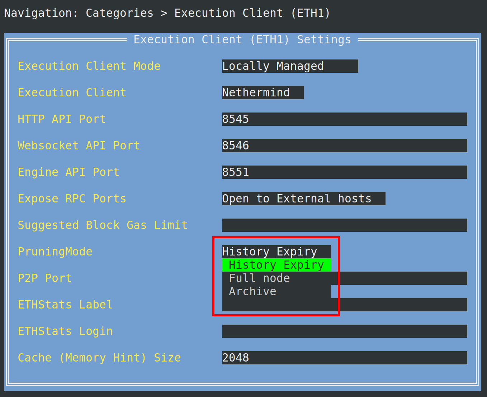

import { Tab, Tabs } from "@rspress/core/theme";

# Execution İstemcisi Geçmiş Sona Erdirme

Execution istemcileri, zincir verilerinin yönetilebilir bir boyutta kalması için eski blok gövdelerini ve makbuzlarını atabilir. Bunu Smartnode'un **Pruning Mode** ayarı (Execution Client → Pruning Mode) denetler.

**Rolling History Expiry** varsayılan seçenektir. Nethermind, Besu, Reth ve Erigon, yaklaşık bir yıldan eski gövdeleri ve makbuzları atar. Geth bu modu henüz uygulamamaktadır ve bunun yerine Prague öncesi geçmiş sona erdirmeyi kullanır.

Diğer seçenekler:

- **History Expiry** — yalnızca _merge öncesi_ gövdeleri ve makbuzları atar (kısmi [EIP-4444](https://eips.ethereum.org/EIPS/eip-4444) sona erdirme). Erigon yalnızca merge öncesi sona erdirmeyi desteklemez.
- **Full node** — gövdeler ve makbuzlar dahil olmak üzere olağan tam node verilerini saklar. Erigon'un tam node modu makbuzları saklar.
- **Archive** — geçmişi ve geçmiş durumu saklar (bu çok daha fazla disk gerektirir).

Kısmi geçmiş sona erdirmeye ilişkin bu genel bakışı okuyabilirsiniz: https://blog.ethereum.org/2025/07/08/partial-history-exp

::: tip NOT

Yeni kurulumlar zaten Rolling History Expiry kullanmaktadır. Daha önce farklı bir Pruning Mode seçtiyseniz, TUI'de **Rolling History Expiry** seçeneğini seçin ve değişikliğin geçerli olması için Execution istemcisini **yeniden senkronize edin**.

- **Nethermind, Reth ve Erigon** — modu değiştirdikten sonra yeniden senkronize edin (`rocketpool service resync-eth1`).
- **Geth** — `rocketpool service prune-eth1` ile budayın veya yeniden senkronize edin; Geth bir yıllık kayan sona erdirme yerine hâlâ Prague öncesi sona erdirmeyi kullanır.
- **Besu** — çevrimiçi kalır.

:::

Merge öncesi geçmişi kaldırmak için aşağıdaki adımlar yalnızca Docker modu node'ları içindir. Hybrid modda veya Native modda harici bir istemci kullanıyorsanız, lütfen Execution istemciniz tarafından sağlanan dokümantasyona bakın.

Ayarlar Yöneticisini açarak başlayın:

```shell
rocketpool service config
```

Execution Client budama modunu değiştirmek için `Execution Client (ETH1)` menüsüne gidin ve `Pruning Mode` açılır menüsünde `History Expiry` ayarını seçin

Daha fazla geçmiş saklamak için bir nedeniniz yoksa **Rolling History Expiry** seçeneğini seçin.



Seçimi yaptıktan sonra, ana menüye dönmek için `escape` tuşuna basın, ardından `Review Changes and Save` düğmesini vurgulamak için `tab` tuşuna basın. Devam etmek için `enter` tuşuna basın. Execution istemci ayarlarınızdaki değişiklikleri önizlemek için bir menü sunulacaktır.


Ayarları kaydetmek ve Ayarlar Yöneticisinden çıkmak için `Save Settings` üzerinde `enter` tuşuna basın, ardından `rocketpool_eth1` container'ınızı yeniden başlatmak için `y` girin.

```shell
Your changes have been saved!
The following containers must be restarted for the changes to take effect:
	rocketpool_eth1
Would you like to restart them automatically now? [y/n]
```

Bu noktadan itibaren, adımlar hangi Execution istemcisini kullandığınıza bağlı olarak farklılık gösterir:

<div className="p-3">
  <Tabs>

        <Tab label="Nethermind">
        Nethermind node'ları merge öncesi geçmişi kaldırmak için tam bir yeniden senkronizasyon gerektirir. `History Expiry` ayarını kaydettikten ve `eth1` container'ınızı yeniden başlattıktan sonra Execution istemcinizi yeniden senkronize etmelisiniz.

        ::: warning UYARI
        Yapılandırılmış bir yedek node'unuz yoksa, node'unuz yeniden senkronizasyon sırasında doğrulamayı durduracaktır. Bir yedek node, birincil node'unuzun budama veya yeniden senkronizasyon sırasında attestation ve blok önermeye devam etmesini sağlayacaktır. Bir yedek node'u nasıl yapılandıracağınızı öğrenmek için [buraya](/tr/node-staking/fallback) tıklayın.
        :::

        Execution istemcinizi yeniden senkronize etmek için aşağıdaki komutu kullanın:
        ```shell
        rocketpool service resync-eth1
        ```

        Hazırsınız! Node artık merge öncesi verileri depolamayacak ve 2 TB'lık bir sürücüye bir node sığdırmanın fizibilitesini önemli ölçüde artıracaktır.
        Aşağıdaki komutu kullanarak ilerlemeyi izlemenizi öneririz.
        ```shell
        rocketpool service logs eth1
        ```

    </Tab>

    <Tab label="Geth">

        Geth node'ları merge öncesi geçmişi kaldırmak için çevrimdışı bir budama gerektirir. `History Expiry` ayarını kaydettikten ve `eth1` container'ınızı yeniden başlattıktan sonra Execution istemcinizi budamalısınız. Alternatif olarak merge öncesi geçmişi kaldırmak için tam bir yeniden senkronizasyon yapmayı seçebilirsiniz.

        ::: tip NOT
        Tam bir yeniden senkronizasyon yapmak yerine budamayı öneririz. Yeni bir Geth veritabanıyla baştan başlamak isterseniz veya budama ile ilgili bir sorununuz varsa, `rocketpool service resync-eth1` kullanarak Execution istemcisini yeniden senkronize edebilirsiniz. Her iki seçenek de merge öncesi geçmişin sona ermesiyle sonuçlanmalıdır.
        :::

        ::: warning UYARI
        Yapılandırılmış bir yedek node'unuz yoksa, node'unuz budama veya yeniden senkronizasyon sırasında doğrulamayı durduracaktır. Bir yedek node, birincil node'unuzun budama veya yeniden senkronizasyon sırasında attestation ve blok önermeye devam etmesini sağlayacaktır. Bir yedek node'u nasıl yapılandıracağınızı öğrenmek için [buraya](/tr/node-staking/fallback) tıklayın.
        :::

        Execution istemcinizi budamak için lütfen aşağıdaki komutu çalıştırın:
        ```shell
        rocketpool service prune-eth1
        ```
        Budama hakkında daha fazla bilgi edinmek için [buraya](/tr/node-staking/pruning#budamayı-başlatma) tıklayabilirsiniz.

        Hazırsınız! Node artık merge öncesi verileri depolamayacak ve 2 TB'lık bir sürücüye bir node sığdırmanın fizibilitesini önemli ölçüde artıracaktır.
        Aşağıdaki komutu kullanarak ilerlemeyi izlemenizi öneririz.
        ```shell
        rocketpool service logs eth1
        ```

    </Tab>

    <Tab label="Besu">

        Hazırsınız! Besu node'ları attestation ve blok önermeye devam ederken çevrimiçi bir budama gerçekleştirecektir.
        Node artık merge öncesi verileri depolamayacak ve 2 TB'lık bir sürücüye bir node sığdırmanın fizibilitesini önemli ölçüde artıracaktır.
        Aşağıdaki komutu kullanarak ilerlemeyi izlemenizi öneririz.
        ```shell
        rocketpool service logs eth1
        ```

    </Tab>

    <Tab label="Reth">

        Hazırsınız! Reth node'ları attestation ve blok önermeye devam ederken çevrimiçi bir budama gerçekleştirecektir.
        Mainnet'te Rolling History Expiry seçiliyken Reth, ilk başlatmada resmî kayan geçmiş anlık görüntüsünü indirir.
        Node artık merge öncesi verileri depolamayacak ve 2 TB'lık bir sürücüye bir node sığdırmanın fizibilitesini önemli ölçüde artıracaktır.
        Aşağıdaki komutu kullanarak ilerlemeyi izlemenizi öneririz.
        ```shell
        rocketpool service logs eth1
         ```

    </Tab>

    <Tab label="Erigon">
        Erigon node'ları Rolling History Expiry'yi uygulamak için tam bir yeniden senkronizasyon gerektirir. Pruning Mode ayarını kaydettikten ve `eth1` container'ınızı yeniden başlattıktan sonra Execution istemcinizi yeniden senkronize etmelisiniz.

        Execution istemcinizi yeniden senkronize etmek için aşağıdaki komutu kullanın:
        ```shell
        rocketpool service resync-eth1
        ```

        Hazırsınız! Node, yaklaşık bir yıldan eski gövdeleri ve makbuzları atacaktır.
        Yeniden senkronizasyon sırasında Rescue Node kullanmanızı ve aşağıdaki komutla ilerlemeyi izlemenizi öneririz.
        ```shell
        rocketpool service logs eth1
        ```

    </Tab>

  </Tabs>
</div>
