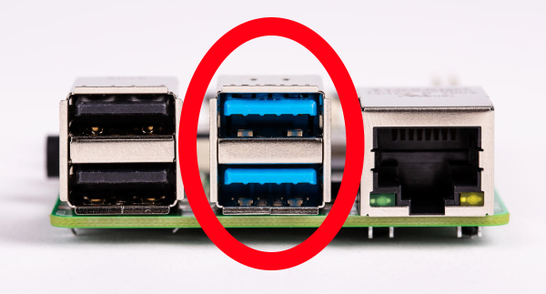
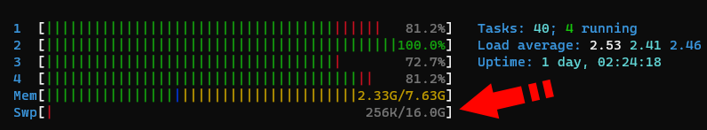

# 准备 Raspberry Pi

::: warning 注意
此页面已保留在此处用于存档目的。由于运行 Ethereum 验证器的硬件和性能
要求增加，我们不再建议在 Raspberry Pi 上运行 Rocket Pool。
:::

本指南将引导您了解如何使用 Raspberry Pi 运行 Rocket Pool 节点。
虽然在大多数质押指南中通常不建议这样做，但我们认识到这很有吸引力，因为它是一个比建立整个 PC 更实惠的选择。
为此，我们努力调整和优化一系列设置，并确定了一个似乎运行良好的配置。

此设置将在 Pi 上运行**完整的执行节点**和**完整的共识节点**，使您的系统为 Ethereum 网络的健康做出贡献，同时充当 Rocket Pool 节点运营商。

## 初步设置

要在 Raspberry Pi 上运行 Rocket Pool 节点，您首先需要有一个正常工作的 Raspberry Pi。
如果您已经有一个正在运行的 - 太好了！您可以跳到[挂载 SSD](#挂载-ssd)部分。
在继续之前，请确保您已**安装了风扇**。
如果您从头开始，那么请继续阅读。

### 您需要什么

以下是在 Pi 上运行 Rocket Pool 需要购买的推荐组件：

- **Raspberry Pi 4 Model B**，**8 GB 型号**
  - 注意：虽然您*可以*使用 4 GB 型号进行此设置，但我们强烈建议您使用 8 GB 以获得安心……它真的不贵多少。
- Pi 的 **USB-C 电源**。您需要一个至少提供 **3 安培**的电源。
- 一张 **MicroSD 卡**。它不需要很大，16 GB 就绰绰有余，而且现在相当便宜……但它应该至少是 **Class 10 (U1)**。
- 用于您 PC 的 **MicroSD 转 USB** 适配器。这是必需的，以便您可以在将卡装入 Pi 之前将操作系统安装到卡上。
  如果您的 PC 已经有 SD 卡槽，那么您不需要再买新的。
- 一些**散热片**。您将让 Pi 全天候在高负载下运行，它会变得很热。
  散热片将有助于避免降频。理想情况下您需要一套 3 个：一个用于 CPU，一个用于内存，一个用于 USB 控制器。
  [这里有一套不错的示例](https://www.canakit.com/raspberry-pi-4-heat-sinks.html)。
- 一个**机箱**。这里有两种选择：带风扇和无风扇。
  - 带风扇：
    - 一个 40mm **风扇**。与上面相同，目标是在运行 Rocket Pool 节点时保持凉爽。
    - 一个**带风扇安装位的机箱**，把这一切结合在一起。
      您也可以购买带集成风扇的机箱[比如这款](https://www.amazon.com/Raspberry-Armor-Metal-Aluminium-Heatsink/dp/B07VWM4J4L)，这样就不必单独购买风扇了。
  - 无风扇：
    - 一个充当巨大散热片的**无风扇机箱**，[比如这款](https://www.amazon.com/Akasa-RA08-M1B-Raspberry-case-Aluminium/dp/B081VYVNTX)。
      这是个不错的选择，因为它是静音的，但您的 Pi **会**变得相当热 - 尤其是在初始区块链同步过程中。
      感谢 Discord 用户 Ken 为我们指明了这个方向！
  - 作为一般规则，我们建议选择**带风扇**的方案，因为我们将对 Pi 进行大幅超频。

为了方便，您可以把很多这些东西打包购买 - 例如，[Canakit 提供了一个套件](https://www.amazon.com/CanaKit-Raspberry-8GB-Starter-Kit/dp/B08956GVXN)，其中包含许多组件。
不过，如果您分开购买零件，可能会更便宜（而且如果您有设备，您可以[3D 打印自己的 Pi 机箱](https://www.thingiverse.com/thing:3793664)。）

您还需要的其他组件：

- 一个 **USB 3.0+ 固态硬盘**。一般建议是 **2 TB 硬盘**。
  - [Samsung T5](https://www.amazon.com/Samsung-T5-Portable-SSD-MU-PA2T0B/dp/B073H4GPLQ) 是一个已知运行良好的绝佳示例。
  - :warning: **不建议**使用带 SATA 转 USB 适配器的 SATA SSD，因为会出现[这样的问题](https://www.raspberrypi.org/forums/viewtopic.php?f=28&t=245931)。
    如果您选择这条路，我们在[测试 SSD 性能](#测试-ssd-的性能)部分提供了一个性能测试，您可以用它来检查是否可行。
- 用于互联网访问的**以太网线**。它应至少达到 **Cat 5e** 规格。
  - **不建议**通过 Wi-Fi 运行节点，但如果您没有其他选择，您可以用它代替以太网线。
- 一个 **UPS**，在您停电时充当电源。
  Pi 的功耗确实不大，所以即使是小型 UPS 也能坚持一段时间，但通常越大越好。选择您能负担得起的最大 UPS。
  另外，我们建议您也**将调制解调器、路由器和其他网络设备连接到它上面** - 如果您的路由器断电了，让 Pi 继续运行也没多大意义。

根据您所在的位置、促销活动、您选择的 SSD 和 UPS，以及您已经拥有多少这些东西，您可能最终会为一套完整的配置花费**大约 200 到 500 美元**。

### 让风扇运行更安静

当您拿到风扇时，默认情况下您可能会被指示将其连接到 5v GPIO 引脚，如下图所示。
风扇会有一个带两个孔的连接器；黑色的应接到 GND（引脚 6），红色的应接到 +5v（引脚 4）。


然而，根据我们的经验，这会让风扇运行得非常响亮和快速，而这其实并不必要。
如果您想让它更安静的同时仍保持凉爽，请尝试将其连接到 3.3v 引脚（引脚 1，蓝色的那个）而不是 5v 引脚。
这意味着在您的风扇上，黑色接点仍然接到 GND（引脚 6），但现在红色接点要接到 +3.3v（引脚 1）。

如果您的风扇连接器的两个孔并排且无法分开，您可以在它和 Pi 的 GPIO 引脚之间加入[像这样的跳线](https://www.amazon.com/GenBasic-Female-Solderless-Breadboard-Prototyping/dp/B077N7J6C4)。

### 安装操作系统

有几种支持 Raspberry Pi 的 Linux 操作系统。
在本指南中，我们将坚持使用 **Ubuntu 20.04**。
Ubuntu 是一个久经考验、全球广泛使用的操作系统，而 20.04（在撰写本文时）是最新的长期支持（LTS）版本，这意味着它将在很长一段时间内持续获得安全补丁。
如果您更愿意使用 Raspbian 等其他 Linux 版本，请随意按照该系统现有的安装指南操作 - 只是请记住，本指南是为 Ubuntu 编写的，因此并非所有说明都能与您的操作系统匹配。

Canonical 的优秀团队编写了[一份关于如何将 Ubuntu Server 镜像安装到 Pi 上的精彩指南](https://ubuntu.com/tutorials/how-to-install-ubuntu-on-your-raspberry-pi#1-overview)。

按照上述指南的**第 1 步到第 4 步**进行 Server 设置。
对于操作系统镜像，您需要选择 `Ubuntu Server 20.04.2 LTS (RPi 3/4/400) 64-bit server OS with long-term support for arm64 architectures`。

如果您决定需要桌面界面（这样您可以使用鼠标并拖动窗口），您还需要执行第 5 步。
我们建议您不要这样做，而是坚持使用服务器镜像，因为桌面界面会给您的 Pi 增加一些额外的开销和处理工作，而收益相对较小。
不过，如果您坚持要运行桌面，那么我们建议选择 Xubuntu 选项。
它对资源的占用相当轻量，而且非常用户友好。

完成后，您就可以开始准备 Ubuntu 来运行 Rocket Pool 节点了。
您可以使用它上面的本地终端，也可以按照安装指南的建议从您的台式机/笔记本电脑通过 SSH 登录。
无论哪种方式，过程都是一样的，所以怎么方便怎么来。

如果您不熟悉 `ssh`，请查看 [Secure Shell 入门](../ssh)指南。

::: warning 注意
此时，您应当_认真考虑_配置路由器，使您的 Pi 的 IP 地址成为**静态**的。
这意味着您的 Pi 将永远拥有相同的 IP 地址，因此您始终可以使用该 IP 地址通过 SSH 登录。
否则，您的 Pi 的 IP 有可能在某个时刻发生变化，上面的 SSH 命令将不再有效。
您必须进入路由器的配置界面才能找出 Pi 的新 IP 地址。

每个路由器都不一样，因此您需要查阅路由器的文档以了解如何分配静态 IP 地址。
:::

## 挂载 SSD

正如您可能已经了解到的，按照上述安装说明操作后，核心操作系统将从 microSD 卡运行。
它远不足以容纳所有执行层和共识层的区块链数据，速度也不够快，这就是 SSD 派上用场的地方。
要使用它，我们必须为其设置文件系统并将其挂载到 Pi 上。

### 将 SSD 连接到 USB 3.0 端口

首先将您的 SSD 插入 Pi 的某个 USB 3.0 端口。这些是**蓝色**端口，不是黑色的：



黑色的是速度较慢的 USB 2.0 端口；它们只适合鼠标和键盘等配件。
如果您的键盘插在蓝色端口上，请现在把它拔出来插到黑色端口上。

### 格式化 SSD 并创建新分区

::: warning
此过程将擦除您 SSD 上的所有内容。
如果您已经有一个存有数据的分区，请跳过此步骤，因为您即将删除所有内容！
如果您以前从未使用过这块 SSD 且它完全是空的，那么请执行此步骤。
:::

运行此命令以查找您的磁盘在设备表中的位置：

```shell
sudo lshw -C disk
  *-disk
       description: SCSI Disk
       product: Portable SSD T5
       vendor: Samsung
       physical id: 0.0.0
       bus info: scsi@0:0.0.0
       logical name: /dev/sda
       ...
```

您需要的重点是 `logical name: /dev/sda` 这部分，或者更确切地说，其中的 **`/dev/sda`** 部分。
我们将其称为您 SSD 的**设备位置**。
在本指南中，我们将使用 `/dev/sda` 作为设备位置 - 您的可能也是一样的，但在后续说明中请用该命令显示的内容进行替换。

现在我们知道了设备位置，让我们格式化它并在上面创建一个新分区，这样我们才能真正使用它。
再次提醒，**这些命令将删除磁盘上已有的所有内容！**

创建一个新的分区表：

```shell
sudo parted -s /dev/sda mklabel gpt unit GB mkpart primary ext4 0 100%
```

使用 `ext4` 文件系统格式化新分区：

```shell
sudo mkfs -t ext4 /dev/sda1
```

为它添加一个标签（您不必这样做，但这很有趣）：

```shell
sudo e2label /dev/sda1 "Rocket Drive"
```

运行下面的命令确认操作成功，它应该显示类似这里所示的输出：

```shell
sudo blkid
...
/dev/sda1: LABEL="Rocket Drive" UUID="1ade40fd-1ea4-4c6e-99ea-ebb804d86266" TYPE="ext4" PARTLABEL="primary" PARTUUID="288bf76b-792c-4e6a-a049-cb6a4d23abc0"
```

如果您看到了这些内容，那就没问题了。请把 `UUID="..."` 的输出临时保存到某处，因为您一会儿就会用到它。

### 优化新分区

接下来，让我们稍微调整一下新的文件系统，为验证器活动进行优化。

默认情况下，ext4 会为系统进程保留 5% 的空间。
由于我们在 SSD 上不需要这个（因为它只存储执行层和共识层的链数据），我们可以禁用它：

```shell
sudo tune2fs -m 0 /dev/sda1
```

### 挂载并启用自动挂载

为了使用该驱动器，您必须将其挂载到文件系统。
在任意位置创建一个新的挂载点（我们这里以 `/mnt/rpdata` 为例，您可以直接使用它）：

```shell
sudo mkdir /mnt/rpdata
```

现在，将新的 SSD 分区挂载到该文件夹：

```shell
sudo mount /dev/sda1 /mnt/rpdata
```

之后，文件夹 `/mnt/rpdata` 将指向 SSD，因此您写入该文件夹的任何内容都将存放在 SSD 上。
这就是我们将要存储执行层和共识层链数据的地方。

现在，让我们把它添加到挂载表中，以便它在启动时自动挂载。
还记得您之前使用的 `blkid` 命令得到的 `UUID` 吗？
这就是它派上用场的地方。

```shell
sudo nano /etc/fstab
```

这将打开一个交互式文件编辑器，一开始看起来是这样的：

```
LABEL=writable  /        ext4   defaults        0 0
LABEL=system-boot       /boot/firmware  vfat    defaults        0       1
```

使用方向键移动到最后一行，并在末尾添加这一行：

```
LABEL=writable  /        ext4   defaults        0 0
LABEL=system-boot       /boot/firmware  vfat    defaults        0       1
UUID=1ade40fd-1ea4-4c6e-99ea-ebb804d86266       /mnt/rpdata     ext4    defaults        0       0
```

将 `UUID=...` 中的值替换为您磁盘上的值，然后按 `Ctrl+O` 和 `Enter` 保存，再按 `Ctrl+X` 和 `Enter` 退出。
现在 SSD 将在您重启时自动挂载。很好！

### 测试 SSD 的性能

在继续之前，您应该测试 SSD 的读/写速度以及它每秒可以处理多少 I/O 请求（IOPS）。
如果您的 SSD 太慢，那么它就无法很好地运行 Rocket Pool 节点，随着时间推移您会亏钱。

要测试它，我们将使用一个名为 `fio` 的程序。像这样安装它：

```shell
sudo apt install fio
```

接下来，进入您 SSD 的挂载点：

```shell
cd /mnt/rpdata
```

现在，运行此命令来测试 SSD 性能：

```shell
sudo fio --randrepeat=1 --ioengine=libaio --direct=1 --gtod_reduce=1 --name=test --filename=test --bs=4k --iodepth=64 --size=4G --readwrite=randrw --rwmixread=75
```

输出应该如下所示：

```
test: (g=0): rw=randrw, bs=(R) 4096B-4096B, (W) 4096B-4096B, (T) 4096B-4096B, ioengine=libaio, iodepth=64
fio-3.16
Starting 1 process
test: Laying out IO file (1 file / 4096MiB)
Jobs: 1 (f=1): [m(1)][100.0%][r=63.9MiB/s,w=20.8MiB/s][r=16.4k,w=5329 IOPS][eta 00m:00s]
test: (groupid=0, jobs=1): err= 0: pid=205075: Mon Feb 15 04:06:35 2021
  read: IOPS=15.7k, BW=61.5MiB/s (64.5MB/s)(3070MiB/49937msec)
   bw (  KiB/s): min=53288, max=66784, per=99.94%, avg=62912.34, stdev=2254.36, samples=99
   iops        : min=13322, max=16696, avg=15728.08, stdev=563.59, samples=99
  write: IOPS=5259, BW=20.5MiB/s (21.5MB/s)(1026MiB/49937msec); 0 zone resets
...
```

您需要关注的是 `test:` 行下方以 `read:` 和 `write:` 开头的那几行。

- 您的**读取** IOPS 应至少为 **15k**，带宽（BW）至少为 **60 MiB/s**。
- 您的**写入** IOPS 应至少为 **5000**，带宽至少为 **20 MiB/s**。

这些是我们使用的 Samsung T5 的规格，它运行得非常好。
我们还测试过一块较慢的 SSD，读取 IOPS 为 5k，写入 IOPS 为 1k，它很难跟上共识层的节奏。
如果您使用的 SSD 比上述规格慢，请做好可能会看到大量漏掉的证明的准备。
如果您的达到或超过这些规格，那就万事俱备，可以继续了。

::: tip 注意
如果您的 SSD 本应达到上述规格却没有达到，您也许可以通过固件更新来解决。
例如，Rocket Pool 社区在使用 Samsung T7 时就遇到过这种情况。
其中两块刚开箱的硬盘只显示 3.5K 读取 IOPS 和 1.2K 写入 IOPS。
在应用了所有可用的固件更新后，性能又回到了上述示例中显示的数值。
请查看您制造商的支持网站以获取最新固件，并确保您的硬盘是最新的 - 您可能需要多次更新固件，直到没有更多更新为止。
:::

最后但同样重要的是，删除您刚刚创建的测试文件：

```shell
sudo rm /mnt/rpdata/test
```

## 设置交换空间

Pi 有 8 GB（如果您选择了那条路则是 4 GB）内存。
对于我们的配置，这已经绰绰有余。
话又说回来，多加一点也无妨。
我们现在要做的是添加所谓的**交换空间（swap space）**。
本质上，这意味着我们将把 SSD 用作"备用内存"，以防出现极其严重的问题导致 Pi 耗尽常规内存。
SSD 远不如常规内存快，所以如果系统动用了交换空间，速度会变慢，但不会完全崩溃并搞坏一切。
把这看作一份额外的保险，您（很可能）永远也用不上。

### 创建交换文件

第一步是创建一个新文件作为您的交换空间。
决定您想使用多少 - 8 GB 是个合理的起点，这样您就有 8 GB 常规内存和 8 GB"备用内存"，总共 16 GB。
为了极度保险，您可以设为 24 GB，这样您的系统就有 8 GB 常规内存和 24 GB"备用内存"，总共 32 GB，但这可能有点过头了。
幸运的是，由于您的 SSD 有 1 或 2 TB 的空间，分配 8 到 24 GB 给交换文件微不足道。

为了本次演练，让我们选一个不错的折中方案 - 比如说 16 GB 交换空间，总内存达到 24 GB。
在操作过程中把数字替换成您想要的即可。

输入以下命令，它将创建一个名为 `/mnt/rpdata/swapfile` 的新文件并用 16 GB 的零填充它。
要更改容量，只需把 `count=16` 中的数字改成您想要的值。**请注意这会花很长时间，但这没关系。**

```shell
sudo dd if=/dev/zero of=/mnt/rpdata/swapfile bs=1G count=16 status=progress
```

接下来，设置权限，使只有 root 用户可以读写它（出于安全考虑）：

```shell
sudo chmod 600 /mnt/rpdata/swapfile
```

现在，把它标记为交换文件：

```shell
sudo mkswap /mnt/rpdata/swapfile
```

接下来，启用它：

```shell
sudo swapon /mnt/rpdata/swapfile
```

最后，把它添加到挂载表中，以便在 Pi 重启时自动加载：

```shell
sudo nano /etc/fstab
```

在末尾添加一行新内容，使文件看起来像这样：

```
LABEL=writable  /        ext4   defaults        0 0
LABEL=system-boot       /boot/firmware  vfat    defaults        0       1
UUID=1ade40fd-1ea4-4c6e-99ea-ebb804d86266       /mnt/rpdata     ext4    defaults        0       0
/mnt/rpdata/swapfile                            none            swap    sw              0       0
```

按 `Ctrl+O` 和 `Enter` 保存，然后按 `Ctrl+X` 和 `Enter` 退出。

要验证它是否已激活，请运行以下命令：

```shell
sudo apt install htop
htop
```

您的输出顶部应该是这样的：


如果标有 `Swp` 的最后一行中的第二个数字（`/` 之后的那个）不为零，那么一切就绪。
例如，如果它显示 `0K / 16.0G`，那么您的交换空间已成功激活。
如果它显示 `0K / 0K`，那就是没有生效，您需要确认前面的步骤是否正确执行。

按 `q` 或 `F10` 退出 `htop` 返回终端。

### 配置 Swappiness 和 Cache Pressure

默认情况下，Linux 会积极使用大量交换空间，以减轻系统内存的压力。
我们不希望这样。我们希望它在依赖 SWAP 之前把所有内存都用到最后一刻。
下一步是更改系统的所谓"swappiness"，也就是它使用交换空间的积极程度。
关于该值应设为多少存在很多争论，但我们发现设为 6 效果足够好。

我们还想调低"cache pressure"，它决定 Pi 删除文件系统缓存的速度。
由于在我们的配置下会有大量空闲内存，我们可以把它设为"10"，这会让缓存在内存中保留一段时间，减少磁盘 I/O。

要设置这些值，请运行以下命令：

```shell
sudo sysctl vm.swappiness=6
sudo sysctl vm.vfs_cache_pressure=10
```

现在，把它们写入 `sysctl.conf` 文件，以便重启后重新应用：

```shell
sudo nano /etc/sysctl.conf
```

在末尾添加这两行：

```shell
vm.swappiness=6
vm.vfs_cache_pressure=10
```

然后像之前一样保存并退出（`Ctrl+O`、`Ctrl+X`）。

## 超频 Pi

默认情况下，Pi 自带的 1.5 GHz 处理器是一个相当有能力的小设备。
在大多数情况下，您应该可以用它顺利完成验证。
不过我们注意到，在极少数情况下，您的验证器客户端会卡在某些工作上，而它没有足够的马力跟上验证器的证明职责。
发生这种情况时，您会在 [beaconcha.in 浏览器](https://beaconcha.in)上看到类似这样的内容（稍后在[监控节点性能](../performance)指南中会有更详细的说明）：


包含距离为 8 意味着发送该证明花了很长时间，您会因迟到而受到轻微惩罚。
理想情况下，它们都应该是 0。
虽然罕见，但在默认设置下运行时确实会发生这种情况。

不过，有一种方法可以缓解这些问题：超频。
超频是目前为止从 Pi 的 CPU 中榨取额外性能并防止那些讨厌的高包含距离的最简单方法。
坦率地说，默认的 1.5 GHz CPU 频率确实性能不足。
您可以通过超频大幅提升它，而且根据您超频的程度，还可以做得相当安全。

超频 Pi 非常简单 - 只需更改文本文件中的一些数字。
有两个数字很重要：第一个是**核心频率（core clock）**，它直接决定 ARM CPU 的运行速度。
第二个是**过压（overvoltage）**，它决定输入到 ARM CPU 的电压。
更高的频率通常需要更高的电压，但 Pi 的 CPU 可以承受相当多的额外电压而不会产生明显损伤。
它可能会磨损得稍快一些，但我们说的仍然是以年计的时间，到那时 Pi 5 都出来了，所以没有真正的损害！

相反，过压真正的隐患在于**更高的电压会导致更高的温度**。
本节将帮助您了解 Pi 在高负载下会有多热，以免您把它推得太远。

::: warning
虽然在我们将要采用的水平上超频相当安全可靠，但您仍受制于所谓的"硅片彩票"。
每个 CPU 在微观层面都略有不同，其中一些就是比其他的更容易超频。
如果您超频过头/过猛，那么您的系统可能会变得**不稳定**。
不稳定的 Pi 会遭遇各种后果，从不断重启到完全死机。
**在最坏的情况下，您可能会损坏 microSD 卡，不得不从头重新安装一切！**

**遵循此处的指导，您必须接受自己正在承担该风险这一事实。**
如果您觉得不值得，那就跳过本节的其余部分。
:::

## 对默认配置进行基准测试

在超频之前，您应该先摸清 Pi 在默认的、开箱即用的配置下能做到什么。
有三个关键指标需要关注：

1. **性能**（您的 Pi 计算速度有多快）
2. 负载下的**温度**（它会变得多热）
3. **稳定性**（它在崩溃前能运行多久）

我们将在过程中获取这三项的统计数据。

### 性能

要衡量性能，您可以使用 LINPACK。
我们将从源代码构建它。

```shell
cd ~
sudo apt install gcc
wget http://www.netlib.org/benchmark/linpackc.new -O linpack.c
...
cc -O3 -o linpack linpack.c -lm
...
sudo mv linpack /usr/local/bin
rm linpack.c
```

现在像这样运行它：

```shell
linpack
Enter array size (q to quit) [200]:
```

只需按 `enter` 保持默认值 200，然后让它运行。
完成后，输出将如下所示：

```
Memory required:  315K.


LINPACK benchmark, Double precision.
Machine precision:  15 digits.
Array size 200 X 200.
Average rolled and unrolled performance:

    Reps Time(s) DGEFA   DGESL  OVERHEAD    KFLOPS
----------------------------------------------------
     512   0.70  85.64%   3.76%  10.60%  1120802.516
    1024   1.40  85.70%   3.74%  10.56%  1120134.749
    2048   2.81  85.71%   3.73%  10.56%  1120441.752
    4096   5.62  85.69%   3.74%  10.57%  1120114.452
    8192  11.23  85.67%   3.74%  10.59%  1120277.186
```

您需要看的是最后一行的 `KFLOPS` 列。
这个数字（上例中的 1120277.186）代表您的计算性能。
它本身没有任何意义，但它为我们提供了一个与超频后性能进行比较的良好基准。
我们把它称为**默认 KFLOPS**。

### 温度

接下来，让我们给 Pi 施加压力，观察它在高负载下的温度。
首先，安装这个软件包，它会提供一个名为 `vcgencmd` 的工具，可以打印 Pi 的详细信息：

```shell
sudo apt install libraspberrypi-bin
```

安装完成后，重启 Pi（这是应用某些新权限所必需的）。
接下来，安装一个名为 **stressberry** 的程序。
这将是我们的基准测试工具。
像这样安装它：

```shell
sudo apt install stress python3-pip
pip3 install stressberry
source ~/.profile
```

::: tip 注意
如果 stressberry 报错说无法读取温度信息或无法打开 `vchiq` 实例，您可以用以下命令修复：

```shell
sudo usermod -aG video $USER
```

然后注销并重新登录、重启 SSH 会话，或者重启机器再试一次。
:::

接下来，像这样运行它：

```shell
stressberry-run -n "Stock" -d 300 -i 60 -c 4 stock.out
```

这将运行一个名为"Stock"的新压力测试，持续 300 秒（5 分钟），测试前后各有 60 秒的冷却时间，在 Pi 的全部 4 个核心上运行。
如果您希望它运行更久或有更多冷却时间，可以调整这些时间参数，但这对我来说是一个快速粗略的压力测试。
结果将保存到名为 `stock.out` 的文件中。

在测试的主阶段，输出将如下所示：

```
Current temperature: 41.3°C - Frequency: 1500MHz
Current temperature: 41.3°C - Frequency: 1500MHz
Current temperature: 41.8°C - Frequency: 1500MHz
Current temperature: 40.9°C - Frequency: 1500MHz
Current temperature: 41.8°C - Frequency: 1500MHz
```

这基本上告诉您 Pi 会变得多热。
在 85 °C 时，Pi 实际上会开始自我降频，降低时钟速度以免过热。
幸运的是，因为您加装了散热片和风扇，您应该完全达不到这个温度！
话虽如此，为了系统的整体健康，我们通常尽量把温度保持在 65 °C 以下。

如果您想在正常验证运行期间监控系统温度，可以使用 `vcgencmd`：

```shell
vcgencmd measure_temp
temp=34.0'C
```

### 稳定性

测试超频的稳定性涉及回答以下三个问题：

- Pi 能否开机并进入登录提示符/启动 SSH 服务器？
- 它在正常运行期间是否会随机死机或重启？
- 它在高负载下是否会随机死机或重启？

要让超频真正稳定，答案必须是**是、否、否**。
有几种方法可以测试这一点，但现阶段最简单的就是长时间运行 `stressberry`。
运行多久完全取决于您 - 运行时间越长，您就越能确定系统是稳定的。
有些人只跑上面的 5 分钟测试，扛过去就算合格；有些人跑半小时；还有些人跑 8 小时甚至更久。
运行多久是一个个人决定，您需要根据自己的风险承受能力来做出选择。

要更改运行时间，只需修改 `-d` 参数，填入您希望测试运行的秒数。
例如，如果您认为半小时比较合适，可以使用 `-d 1800`。

## 您的第一次超频 - 1800 MHz（轻度）

我们要做的第一次超频相对"轻度"且可靠，但仍能带来不错的算力提升。
我们将从默认的 1500 MHz 提升到 1800 MHz - 提速 20%！

打开这个文件：

```shell
sudo nano /boot/firmware/usercfg.txt
```

在末尾添加这两行：

```shell
arm_freq=1800
over_voltage=3
```

然后保存文件并重启。

这些设置会将 CPU 频率提高 20%，同时也会将 CPU 电压从 0.88v 提升到 0.93v（每一级 `over_voltage` 设置提升 0.025v）。
任何 Pi 4B 都应该能达到这个设置，所以您的系统应该会重启，并在片刻之后提供登录提示符或 SSH 访问。
如果没有，并且您的 Pi 停止响应或进入启动循环，您就必须重置它 - 请阅读下一节了解方法。

### 超频不稳定后的重置

如果您的 Pi 停止响应，或者反复不断地重启，那么您需要降低超频幅度。
要这样做，请按以下步骤操作：

1. 关闭 Pi。
2. 取出 microSD 卡。
3. 使用 microSD 适配器把卡插入另一台 Linux 电脑。
   \*注意：这**必须是**另一台 Linux 电脑。如果您把它插入 Windows 机器是行不通的，因为 Windows 无法读取 SD 卡使用的 `ext4` 文件系统！\*\*
4. 在另一台电脑上挂载该卡。
5. 打开 `<SD 挂载点>/boot/firmware/usercfg.txt`。
6. 降低 `arm_freq` 的值，或提高 `over_voltage` 的值。_注意：**不要超过 over_voltage=6。** 更高的值不在 Pi 的保修范围内，并且有让 CPU 老化速度快于您所能接受程度的风险。_
7. 卸载 SD 卡并取出。
8. 把卡插回 Pi 并开机。

如果 Pi 能正常工作，那就太好了！继续往下看。
如果不行，请用更保守的设置重复整个过程。
最坏的情况下，您可以完全删除 `arm_freq` 和 `over_voltage` 这两行，恢复到默认设置。

### 测试 1800 MHz

登录后，再次运行 `linpack` 测试新的性能。
这是我们测试用 Pi 的一个示例：

```
linpack
Enter array size (q to quit) [200]:
...
    Reps Time(s) DGEFA   DGESL  OVERHEAD    KFLOPS
----------------------------------------------------
     512   0.59  85.72%   3.75%  10.53%  1338253.832
    1024   1.18  85.72%   3.75%  10.53%  1337667.003
    2048   2.35  85.72%   3.75%  10.53%  1337682.272
    4096   4.70  85.73%   3.75%  10.53%  1337902.437
    8192   9.40  85.71%   3.76%  10.53%  1337302.722
   16384  18.80  85.72%   3.75%  10.52%  1337238.504
```

同样，取最后一行的 `KFLOPS` 列。
要与默认配置比较，只需把两个数字相除：
`1337238.504 / 1120277.186 = 1.193668`

好了！这是 19.4% 的性能提升，考虑到我们的运行速度快了 20%，这在意料之中。
现在让我们检查一下在新的频率和电压设置下的温度：

```shell
stressberry-run -n "1800_ov3" -d 300 -i 60 -c 4 1800_ov3.out
```

您应该会看到这样的输出：

```
Current temperature: 47.2°C - Frequency: 1800MHz
Current temperature: 48.7°C - Frequency: 1800MHz
Current temperature: 47.7°C - Frequency: 1800MHz
Current temperature: 47.7°C - Frequency: 1800MHz
Current temperature: 47.7°C - Frequency: 1800MHz
```

还不错，比默认设置高约 6°，但仍远低于我们个人会喊停的阈值。

如果您觉得放心，可以在这里运行更长时间的稳定性测试，或者继续把频率推得更高。

## 进阶到 2000 MHz（中度）

下一个里程碑是 2000 MHz。这代表时钟速度提升 33.3%，相当可观。
大多数人认为这是性能与稳定性之间的绝佳平衡，因此他们就止步于此。

我们对这一级别的建议是从以下设置开始：

```shell
arm_freq=2000
over_voltage=5
```

这会把核心电压提升到 1.005v。
用 `linpack` 和 `stressberry` 测试来试试。
如果它扛过去了，那就万事俱备。如果它死机或随机重启，那您应该提高电压：

```shell
arm_freq=2000
over_voltage=6
```

这会把核心电压提升到 1.03v，这是在不使保修失效的前提下能达到的上限。
这通常对大多数 Pi 都有效。
如果无效，与其继续提高电压，**您应该降低时钟速度再试一次。**

供参考，这是我们 2000 MHz 运行的数据：

```
linpack
Enter array size (q to quit) [200]:
...
    Reps Time(s) DGEFA   DGESL  OVERHEAD    KFLOPS
----------------------------------------------------
     512   0.53  85.76%   3.73%  10.51%  1482043.543
    1024   1.06  85.74%   3.73%  10.53%  1481743.724
    2048   2.12  85.74%   3.72%  10.54%  1482835.055
    4096   4.24  85.73%   3.74%  10.53%  1482189.202
    8192   8.48  85.74%   3.73%  10.53%  1482560.117
   16384  16.96  85.74%   3.73%  10.53%  1482441.146
```

这是 32.3% 的提速，与我们的预期一致。不错！

这是我们的温度：

```
Current temperature: 54.0°C - Frequency: 2000MHz
Current temperature: 54.5°C - Frequency: 2000MHz
Current temperature: 54.0°C - Frequency: 2000MHz
Current temperature: 54.5°C - Frequency: 2000MHz
Current temperature: 55.5°C - Frequency: 2000MHz
```

又上升了 7 度，但仍低于我们 65 °C 的阈值。

## 进阶到 2100 MHz（重度）

下一步相比默认配置代表着扎实的 **40% 提速**。

**注意：并非所有 Pi 都能在保持 `over_voltage=6` 的情况下做到这一点。
试试看，如果不行，就回到 2000 MHz。**

配置将如下所示：

```shell
arm_freq=2100
over_voltage=6
```

供参考，这是我们的结果：

```
linpack
Enter array size (q to quit) [200]:
...
    Reps Time(s) DGEFA   DGESL  OVERHEAD    KFLOPS
----------------------------------------------------
     512   0.50  85.68%   3.76%  10.56%  1560952.508
    1024   1.01  85.68%   3.76%  10.56%  1554858.509
    2048   2.01  85.70%   3.74%  10.56%  1561524.482
    4096   4.03  85.72%   3.73%  10.55%  1560152.447
    8192   8.06  85.72%   3.73%  10.54%  1561078.999
   16384  16.11  85.73%   3.73%  10.54%  1561448.736
```

这是 39.4% 的提速！

这是我们的温度：

```
Current temperature: 59.4°C - Frequency: 2100MHz
Current temperature: 58.9°C - Frequency: 2100MHz
Current temperature: 58.4°C - Frequency: 2100MHz
Current temperature: 59.4°C - Frequency: 2100MHz
Current temperature: 58.9°C - Frequency: 2100MHz
```

刚好不到 60 °C，所以还有充足的余量。

## 进阶到 2250 MHz（极限）

这是我们自己的 Pi 所运行的设置，在撰写本文时已稳定运行一年多。
不过，**仍然提醒用户谨慎超频到这么高** - 在把它作为您节点的生产配置之前，请确保您做过充分的稳定性测试并有足够的散热余量！

我们的配置是：

```shell
arm_freq=2250
over_voltage=10
```

这是我们的结果：

```
    Reps Time(s) DGEFA   DGESL  OVERHEAD    KFLOPS
----------------------------------------------------
    1024   0.95  85.69%   3.85%  10.47%  1650081.294
    2048   1.91  85.64%   3.91%  10.45%  1646779.068
    4096   3.84  85.41%   4.15%  10.44%  1637706.598
    8192   7.75  85.50%   4.03%  10.46%  1620589.096
   16384  15.34  85.43%   4.13%  10.44%  1638067.854
```

这比默认配置快 46%！

OV10 是默认固件允许 Pi 达到的上限，而 2250 MHz 是我们能够在生产环境中可靠运行的最高频率。

压力测试中的温度会升到这么高：

```
Current temperature: 70.6°C - Frequency: 2251MHz
Current temperature: 71.1°C - Frequency: 2251MHz
Current temperature: 71.1°C - Frequency: 2251MHz
Current temperature: 71.1°C - Frequency: 2251MHz
Current temperature: 71.1°C - Frequency: 2251MHz
```

但在实际验证过程中，温度往往保持在 60 °C 以下，这对我们来说是可以接受的。

## 下一步

至此，您的 Pi 已经启动运行，准备好运行 Rocket Pool 了！
请继续前往[选择您的 ETH 客户端](../eth-clients)部分。
