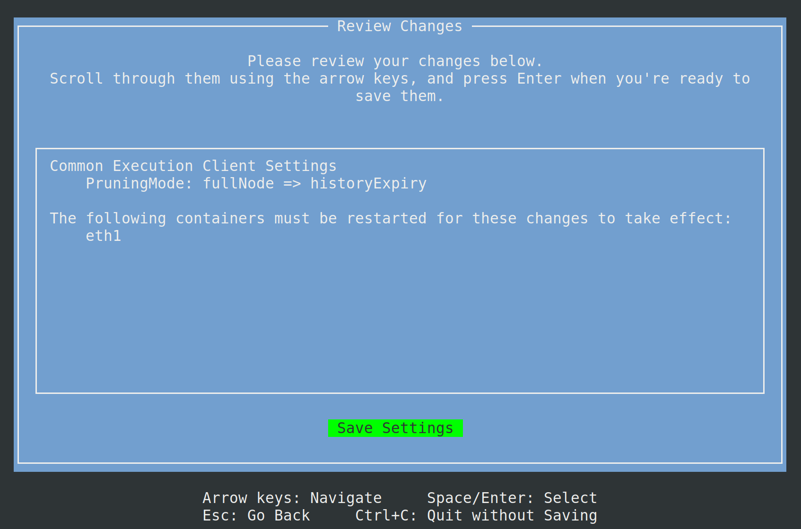

import { Tab, Tabs } from "@rspress/core/theme";

# 过期合并前历史记录

根据 [EIP-4444](https://eips.ethereum.org/EIPS/eip-4444)，所有执行客户端现在都支持部分历史记录过期。从 Smartnode 版本 `v1.17.0` 开始，用户可以通过删除合并前的区块历史记录来大幅减少节点的存储要求。欢迎查看此博客文章以了解有关部分历史记录过期的更多信息：https://blog.ethereum.org/2025/07/08/partial-history-exp

::: tip 注意

    请记住，删除合并前历史记录的步骤取决于您节点选择的执行客户端：
    - Nethermind 用户需要完全重新同步才能删除合并前历史记录。
    - Geth 用户可以使用 `rocketpool service prune-eth1` 命令或进行完全重新同步。
    - Besu 和 Reth 用户可以在节点继续验证的同时执行在线修剪。

:::

以下删除合并前历史记录的步骤仅适用于 Docker 模式节点。如果您在混合模式或原生模式下使用外部客户端，请参阅执行客户端提供的文档。

首先打开设置管理器：

```shell
rocketpool service config
```

要更改执行客户端修剪模式，请转到 `Execution Client (ETH1)` 菜单，并在 `Pruning Mode` 下拉菜单中选择 `History Expiry` 设置


完成选择后，按 `escape` 返回主菜单，然后按 `tab` 突出显示 `Review Changes and Save` 按钮。按 `enter` 键继续。您将看到一个菜单，用于预览对执行客户端设置的更改。



在 `Save Settings` 上按 `enter` 键以保存并退出设置管理器，然后输入 `y` 以重新启动您的 `rocketpool_eth1` 容器。

```shell
Your changes have been saved!
The following containers must be restarted for the changes to take effect:
	rocketpool_eth1
Would you like to restart them automatically now? [y/n]
```

从这一点开始，步骤会根据您使用的执行客户端而有所不同：

<div className="p-3">
  <Tabs>

        <Tab label="Nethermind">
        Nethermind 节点需要完全重新同步才能删除合并前历史记录。保存 `History Expiry` 设置并重新启动 `eth1` 容器后，您必须重新同步执行客户端。

        ::: warning 警告
        如果您没有配置备用节点，您的节点将在重新同步期间停止验证。备用节点将允许您的主节点在修剪或重新同步期间继续验证和提议区块。点击[此处](/zh/node-staking/fallback)了解如何配置备用节点。
        :::

        使用以下命令重新同步您的执行客户端：
        ```shell
        rocketpool service resync-eth1
        ```

        一切就绪！节点将不再存储合并前数据，大大提高了将节点安装在 2 TB 驱动器上的可行性。我们建议使用以下命令监控进度。
        ```shell
        rocketpool service logs eth1
        ```

    </Tab>

    <Tab label="Geth">

        Geth 节点需要离线修剪才能删除合并前历史记录。保存 `History Expiry` 设置并重新启动 `eth1` 容器后，您必须修剪执行客户端。或者，您可以选择进行完全重新同步以删除合并前历史记录。

        ::: tip 注意
        我们建议修剪而不是进行完全重新同步。如果您希望从全新的 Geth 数据库开始或在修剪时遇到问题，可以使用 `rocketpool service resync-eth1` 重新同步执行客户端。两种选择都应该会导致合并前历史记录过期。
        :::

        ::: warning 警告
        如果您没有配置备用节点，您的节点将在修剪或重新同步期间停止验证。备用节点将允许您的主节点在修剪或重新同步期间继续验证和提议区块。点击[此处](/zh/node-staking/fallback)了解如何配置备用节点。
        :::

        请运行以下命令来修剪您的执行客户端：
        ```shell
        rocketpool service prune-eth1
        ```
        您可以点击[此处](/zh/node-staking/pruning#starting-a-prune)了解有关修剪的更多信息。

        一切就绪！节点将不再存储合并前数据，大大提高了将节点安装在 2 TB 驱动器上的可行性。我们建议使用以下命令监控进度。
        ```shell
        rocketpool service logs eth1
        ```

    </Tab>

    <Tab label="Besu">

        一切就绪！Besu 节点将在继续验证和提议区块的同时执行在线修剪。节点将不再存储合并前数据，大大提高了将节点安装在 2 TB 驱动器上的可行性。我们建议使用以下命令监控进度。
        ```shell
        rocketpool service logs eth1
        ```

    </Tab>

    <Tab label="Reth">

        一切就绪！Reth 节点将在继续验证和提议区块的同时执行在线修剪。节点将不再存储合并前数据，大大提高了将节点安装在 2 TB 驱动器上的可行性。我们建议使用以下命令监控进度。
        ```shell
        rocketpool service logs eth1
         ```

    </Tab>

  </Tabs>
</div>
